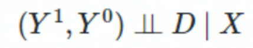
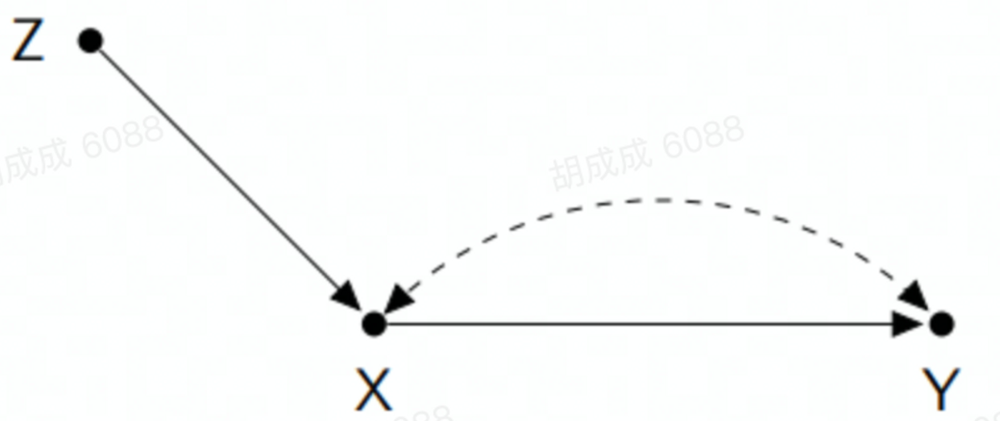
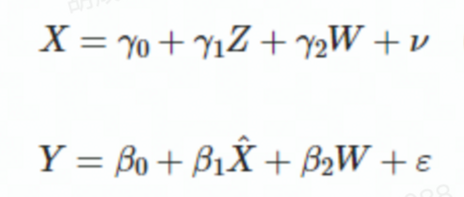
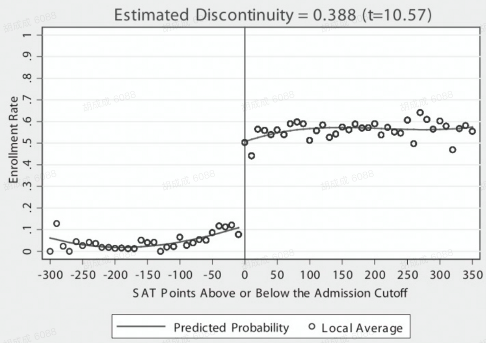
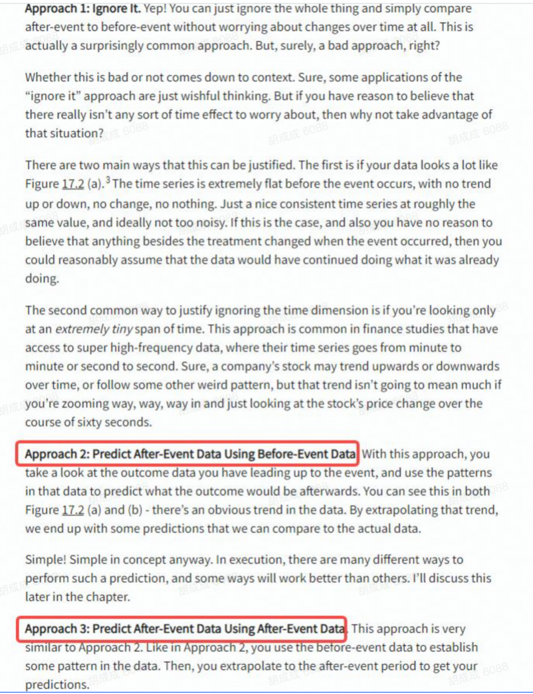
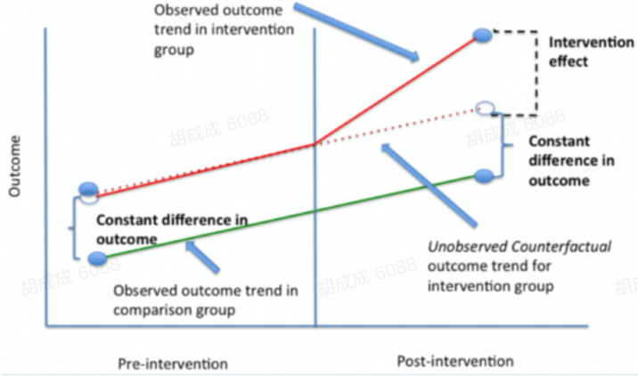

# ATE常用估计方法
这里主要讨论比较传统的计量方法，用于估计ATE或者CATE。

这里主要的思路可以概括成：构造尽可能可信的反事实，逼近随机实验。具体学习这类方法可以参考：[The Effect](https://theeffectbook.net/introduction.html) 或者 [Causal Inference The Mixtape](https://mixtape.scunning.com/)

## A/B实验

随机实验是因果推断的Gold Standard，在业界这个方法应用最普遍，基本上能做实验的时候我们都倾向于做实验，Randomization is like magic，自动保证了因果推断的可识别。

### A/B实验的前提和挑战

虽然实验方法很好用，但这个方法也有它的依赖假设，最重要的就是**SUTVA（Stable Unit Treatment Value Assumption）**，或者更准确地说这里面的第一条no interference的假设，**如果用户之间不独立，那么实验结果就不能很好地衡量因果效应，甚至如何要去定义因果效应都需要相应调整**。在实际业务场景里，不满足这个前提的情况很常见，比如微信或FB的社交场景、滴滴或Airbnb的双边市场以及**广告侧常见的预算挤占问题**等。

### What A/B test can't do？

1. 目标确定时可以告诉我们两条路哪个更好一些，但没办法我们告诉路在何方；
2. 实验没办法直接回答因果机制的问题：观测到的指标diff只能说明策略改动的效果是什么样的，**不能直接说明这个效果是怎么来的，中间过程是什么样的**，如果想了解中介变量或者说机制，可能需要单独设计实验来做，在中介变量不能直接操纵的情况下会比较困难。这个话题和因果发现也有些关系，因果发现要比衡量因果效应难很多，我们这系列课程不会涉及因果发现的话题。
3. Effect of cause and cause of effect ：和上面类似，这不是实验特有的问题，实际上我们介绍的各种估计方法都是在估计effect of cause，而不会涉及cause of effect 即对一个现象、结果做归因的问题。

## 回归

> When it comes to identifying causal effects, regression is the most common way of estimating the relationship between two variables while controlling for others, allowing you to close back doors with those controls.

为什么用回归可以得到因果关系呢？或者说什么情况下回归系数代表我们对因果效应的估计呢？

先看最简单的情况，在随机试验下，我们可以用一个二分变量来代表实验组或者对照组，然后用**实验的结果指标Y和Treatment D做一个回归，这时D的回归系数就等于实验和对照组的人均diff，也就是我们要估计的ATE**；类似地，在非实验场景下，如果满足Conditional Independence或者说因果图的后门法则，那么：

相比于随机实验是多了协变量X，如果X是离散变量，我们可以类似随机实验算组间差异的方法来算不同细分条件下的差异，然后加权得到ATE，但假如X是连续变量，细分的方法就不可用，这时我们就可以用回归的方法来估计因果效应（这里引入了回归里function form的假设）：**Y=β0+β1D+β2X**

理论上这个方法不限于简单的线性回归，因为本质上我们想估计的是给定X下，D取不同值时Y的取值之差，我们可以引入各种复杂的模型比如机器学习的方法来估计。

在实际应用时，由于Conditional Independence这个假设太强，直接基于回归估计因果效应的方法大家一般不是很认可。

### 回归依赖的假设

**Exogeneity**：**残差项与X不相关，等同于Conditional Independence或者说因果图上的关闭后门**；另外需要注意的是回归系数估计的是在整体上的一个均值，但不同人群的权重可能不同，存在异质性效果时，这个估计量的含义可能不太清晰。

其他假设主要影响方差的估计，这里忽略。

更多细节：[参考](https://theeffectbook.net/ch-StatisticalAdjustment.html)

## 匹配和加权/Matching and Weighting

相比于回归，**Matching**是另一种关闭后门、实现Conditional Independence的做法，思路是将实验组中每一个样本都在对照组中找到与其相匹配的样本点，从而进行比较，这里的重点就是如何定义**相似**，围绕这点就会有不同的匹配方法。另外，**Matching也可以视为weighting的一种，比如精确匹配可以认为是匹配上的样本权重为1，匹配不上的为0，以及根据距离匹配的时候还可以离得近的权重大一些，远的权重小一些等。**

### Exact Matching【离散特征】

一个比较直观的想法是，我们对样本点的特征进行一一匹配。举个例子🌰，假如协变量是离散变量，那就可以找一个取值一模一样的对照组样本来匹配。在条件允许的情况下，这个方法匹配出来的效果最为精确。然而这个方法自身也会有很多问题：

首先，**这个方法要求实验组和对照组的人有足够多的重合度**，否则会丢弃太多样本。这个非常容易理解，比如如果所有女生都在实验组，所有男生都在对照组，这个方法就失效了。

其次，这个方法要求衡量用户的**特征是低维且离散的**，比如性别、受教育程度等三五个维度即可。维度多的话一般很难做到精准匹配。

最后，如果有**confounder没有被观测到，那匹配也解决不了，就会导致匹配不准，估计结果就会有偏差**。

### Coarsened Exact Matching (CEM)【连续特征分段离散化】

那么当用户具有连续的特征怎么办呢，比如年收入，年龄等等，我们可以精确匹配的方法上做一些小小的改动：**先将连续变量分段，处理成离散变量，再进行精确匹配。**

举个例子🌰，年收入这个特征可以从0到正无穷的范围之内取任意值，这样导致我们很难给实验组的用户在对照组中找到合适与之匹配的用户。因此我们先将年收入分段，变成0-10万元，10-50万元，50-100万元，100-500万元，500-1000万元，1000万元以上这六个分段，再将实验组和对照组的用户在这些分段上进行精确匹配。

这两种方法从**本质上说都是分层的方法**：先按照特征将用户划成有限个层，认为层内的样本，无论是对照组还是实验组的，都是同质可比的。通过这种方式消除选择偏差。

### Mahalanobis Distance Matching (MDM)【距离匹配】

CEM是应对连续特征的一种方法，另一种方法是引入一个定义样本距离的方法，最常用的是马氏距离，这个方法也被称作Mahalanobis Distance Matching。

MDM方法先定义了两个用户之间的距离，为实验组中的每个样本在对照组中寻找距离最短的样本点来做匹配。和精确匹配的思路不同，精确匹配只匹配完全相同的两个样本点，即只接受距离为0的样本点之间进行匹配，而MDM可以容忍距离不为0的匹配存在。这提高了方法应用的效率，减少了因为无法匹配而造成了样本损失。

MDM或者其他按距离来匹配的方法的一个问题是curse of dimensionality，一旦维度变多，样本之间的距离就会都很远，想选离得近的来匹配就比较困难。

### Propensity Score Matching (PSM)【高维特征降维】

**倾向分匹配**本质上是一种**降维方法**：将高维用户特征映射到一维的倾向分上，很多时候这就是一个逻辑回归。

倾向分，顾名思义，是**用户被treat的倾向概率**，即 **P(T = 1|X)**。我们先利用实验组和对照组中所有的样本点来train倾向分和用户特征之间的模型，再根据这个模型的预估结果进行匹配：可以是分层匹配也可以用近邻匹配。

倾向分匹配的优点是解决了高维特征的问题，但由于引入一个倾向分的模型，所以会有各种模型相关的问题。

### Matching有效的假设

Conditional Independence Assumption：前面已介绍；

Common Support：前面已介绍；

Balance：**指匹配后的样本的协变量分布应该和干预组一样**。

### Inverse Probability Weighting

**weighting**其实是一类方法，这里不会展开，只介绍IPW这一种做法，在Matching这部分引入IPW的动机和前面介绍过的Estimand以及常见的因果效应有关。**匹配的做法是给每一个treatment unit找一个或多个对照组样本，这样匹配之后做简单均值差对应的估计量是ATT，即接受treatment的这部分人的因果效应，假如我们想知道的是ATE，那就需要引入加权的做法，也就是IPW**.

假如我们已经计算出了倾向值，IPW的做法就是给每一个样本赋予1/Propensity Score的权重，这样就使得干预组和对照组的人群分布变成一样的整体人群分布，这样估计的因果效应也就是ATE了，不过在倾向值得分太小的部分会存在权重的极值，这时需要做一些截断的处理。

更多细节：[参考](https://theeffectbook.net/ch-Matching.html)

## IV/Instrumental Variable

**工具变量**指的是一类变量Z，它只通过影响X来影响Y，本身不能直接影响Y，这是计量里非常非常流行的一种混合了识别和估计的方法。

当我们想要衡量X对Y的影响，但又无法直接测量时，可以借助工具变量Z来完成，一般用Two-stage least squares/2SLS来进行估计。

经过变换，可以发现X的系数等于 Cov(Z,Y)/Cov(Z,X)。

### IV的假设

- Relevance of the instrument：Z需要对X有比较明显的影响，可以看到估计时Cov(Z,X)出现在分母上，如果这个影响很小，估计的方差就非常大；
- Validity of the instrument/exclusion restriction：Z不能通过影响其他变量来影响Y，否则这个估计也会有问题，这点相对更难论证。
- Monotonicity：如果用因果图的视角看上图会发现其实X对Y的因果效应是不可识别的，但因果图的识别策略都是非参数的，实际上工具变量要有用额外需要一个假设，一般称为monotonicity或者linearity，指的是Z对X的影响需要是单调的。

### IV的适用性问题

[案例](https://osf.io/preprints/socarxiv/9qj4f)

IV的方法在计量里很流行，但在业界应用很少，主要有两个原因：

- 虽然实验干预似乎是一个天然的IV，但实际上很难论证干预和Y之间没有其他中介变量；
- 如果我们只能干预Z无法干预X，那么估计X对Y的影响价值不大，不如直接关注Z对Y的影响，这才是我们能操纵能获得的收益。这里涉及到第二节讲的估计量的概念，IV的估计量被称为“局部处理效应”（LATE：local average treatment effect）或者叫“依从者平均因果作用”（CACE：complier average causal effect），这也是IV方法的一个重要局限，如果我们关注的不是这个估计量，那么IV的方法就不好用。

更多细节：[参考](https://theeffectbook.net/ch-InstrumentalVariables.html)

## Regression Discontinuity/断点回归

这同样是计量里非常常见的一种方法，核心思想**当存在某种外部干预依赖某个变量的cutoff点时**，断点附近的样本可以视为是可比的，通过比较这部分样本的差别就可以估计出局部的因果效应。

这里需要注意三个概念：

- Running variable.或者叫forcing variable，是决定某个unit是否接受干预的一个连续变量，比如医生量血压，如果血压高于135就给你开降压药，这时血压就是running variable，录取分数线类似。
- 断点/Cutoff.，断点是running variable里决定unit是否接受干预的那个值，比如上面的血压135或者录取线。
- 带宽/Bandwidth，断点两侧多大的区域可以被视为相似？

### Regression Discontinuity的适用性

依赖于断点两侧的样本基本一样，类似随机分组，需要对业务场景的理解来论证这个假设是否合理；

断点回归只能估计断点附近的因果效应，要外推到其他人群上需要更多假设。

更多细节：[参考](https://theeffectbook.net/ch-RegressionDiscontinuity.html)

## Event Study：时间序列数据

很多时候我们面临的是时间序列数据，在某个时间点实施了某个干预，我们有干预前后的数据，然后需要去衡量干预的效果，这时常用的方法有哪些呢？

更多细节：[参考](https://theeffectbook.net/ch-EventStudies.html)

### DID/Difference-in-Differences

**How it works**

看图说话：相比于直接比较前后，消除了时间趋势的影响。

**平行趋势假设/Parallel Trends Assumption**

这个方法的核心假设是干预组和对照组随时间的趋势是一致的，但这是个本质上无法检验的假设，对pre_trend的验证可以提升我们的信心，但无法代替post_trend是否一致的假设。

另外比较tricky的一点是平行趋势假设对指标的变换很敏感，比如有时我们会对某类指标做log变化，但平行趋势可能在某一变换下成立另一变换下不成立，实际上有人认为这个假设本质上是个functional form assumption，如果我们允许任意复杂的变化，那任何trend都可以在某种变换后变成平行的。

更多细节：[参考](https://theeffectbook.net/ch-DifferenceinDifference.html)

### 合成控制/Synthetic Control

某种程度上合成控制是DID和Matching方法的结合，其思想是通过对 对照组样本加权构造一个和干预样本可比的对象，并把这个虚拟对照组在干预后的变现视为干预样本的反事实，由此构建了两种潜在结果的对比。**这个方法一般适用于干预样本很少或者只有一个的情况**。

与DID的区别：

- 合成控制利用matching来消除干预前的差别，而DID是通过回归来调整的，而DID+matching时matching的目标是倾向值类似，而**合成控制里matching的目的是消除干预前差异。**
- 合成控制需要很长周期的干预前数据。
- 匹配后，干预组和对照组应该基本没有干预前差异，这可以通过把结果变量作为匹配变量来实现。

核心假设和DID类似：pre_treatment时期对照组样本和干预样本的关系在post_treatment时期同样存在（假如干预样本没接受treatment，其表现应该类似于合成的虚拟样本）。

## 检验: 如何得出靠谱的推断结果，减少滥用

现在我们经常会做各种因果推断的项目，这时我们要问我们自己是否相信自己得出的结果? 是不是用了 PSM + 我们的结果就可信了? 

对于这个问题，第一点是需要更透明地传达出推论所依赖的假设，第二点是需要在做完估计后做一些检验或者叫做敏感性分析，现在的各种项目里比较少涉及这部分，之后需要加强。具体做法我了解不多，只简单引用下 dowhy 里对这类做法的介绍:

- **添加随机共同原因**: 当我们将一个独立的随机变量作为一个共同原因添加到数据集后，估计方法是否改变了它的估计？(提示: 不应该这样)
- **安慰剂治疗**: 当我们用一个独立的随机变量代替真正的治疗变量时，估计的因果效应会发生什么变化？(提示: 效果应该为零)
- **虚拟结果**: 当我们用一个独立的随机变量代替真实的结果变量时，估计的因果效应会发生什么变化？(提示: 效果应该为零)
- **模拟结果**: 当我们基于最接近给定数据集的已知数据生成过程用模拟数据集替换数据集时，估计的因果效应会发生什么变化？(提示: 它应该与数据生成过程中的效果参数相匹配)
- **添加未观察到的常见原因**: 当我们在数据集中添加一个与治疗和结果相关的额外常见原因(混杂因素)时，效果评估有多敏感？(提示: 不应该太敏感)
- **数据子集验证**: 当我们用随机选择的子集替换给定的数据集时，估计的效果是否会发生显著变化？(提示: 不应该这样)
- **引导验证**: 当我们用来自同一数据集的引导样本替换给定的数据集时，估计的效果是否会发生显著变化？(提示: 不应该这样)
