# 基本概念

## 概念简介

### Bias&Variance（偏差与方差）

**bias** ：度量了某种学习算法的平均估计结果所能逼近学习目标的程度；（一个高的偏差意味着一个坏的匹配）

**variance** ：则度量了在面对同样规模的不同训练集时分散程度。（一个高的方差意味着一个弱的匹配，数据比较分散）

### Information Bias（信息偏差）

一般可以归为数据收集过程中，对因变量和自变量产生的系统偏差，可能**导致目标分类错误**，影响估计量。

误差量级取决于分类错误的类型，一般分为2类：

1）Non-differential (random) misclassification；

2）Differential (non-random) misclassification；一般情况下，后者对结果的影响更大。

### Selection Bias（选择偏差）

是引起**伯克森（Berkson）悖论**的原因。选择性偏差指的是在研究过程中**因样本选择的非随机性而导致得到的结论存在偏差**；“**selection bias comes from conditioning on common effect** ”；

如果我们分析一家公司员工的社交能力和专业素养，会发现这两个变量是负相关的。因为这家公司的员工都是被录用的，因此社交能力和专业素养至少有一项是好的，如果社交能力差，那么专业素养一定好，反之，专业素养差，则社交能力一定好，因此两个变量负相关。而根据我们的假设，社交能力和专业素养在总体中是不相关的。

### Confounding Bias（混淆偏差）

是引起**辛普森悖论**的原因。由于**一个或者多个confounding factor（混淆因子）的影响，掩盖或夸大事件之间的关系**，从而使两者之间的真正联系被错误的估计造成Confounding（混淆）。

- Confounding factor：混淆因子，研究的暴露因素和研究事件之外的因素（第三因子、外部因素）；
  - 满足：1）此因素与研究有关系，2）并且与研究的暴露因素有关，3）该因素不是导致研究事件的中间环节或者中间变量。
- Surrogate Confounders：代理混淆变量，与混淆因子密切相关，能够引起混淆变量；如：年龄、文化程度、经济状况等。

## 因果关系

本质上就是推断因果的一门学科，研究一个系统DAG里面不同Components之间的因果关系的发现以及因果大小的量化，这个系统可以大到整个宇宙，小到我们的某一个激励场景。

现阶段大部分的机器学习方法都是基于**相关性**，只是简单的在学习输入 T 和输出 Y 之间的一个函数关系，传统机器学习是在一个庞大的函数空间里面去找这个最优的关系，现在的深度学习是在具有某种特殊结构或者形式的函数空间里面去寻找而已，加上优化方法以及算力的升级和标注数据的增多，使得我们可以学到更优的 T 到 Y 的函数关系。

### 定义

- **Unit**：策略或者动作作用的最小单元，记为X
- **Treatment**：可能的策略、动作、干预等，记为T
- **Outcome**：策略作用后的结果，记为Y
- **Potential Outcome**：每一种干预T=t下，unit的可能结果，记为Y(t)

### Why：我们为什么需要因果关系？

相关≠因果/correlation does not imply causation

相关不一定因果

类似的，不仅相关不意味着因果，因果也并不意味着相关，比如X和Y对Z的影响刚好互相抵消，那从数据中可能看到X和Z的相关系数为0，但并不表明X对Z就不存在因果关系，比如下图的例子：

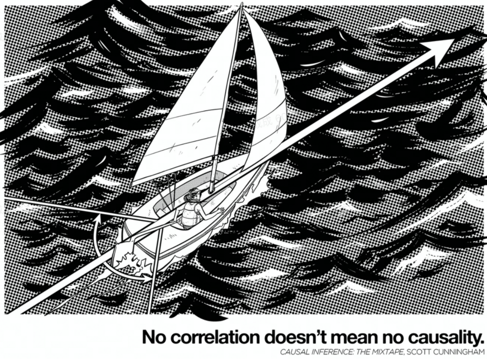

**那因果关系有什么用？我知道相关是不是就够了？**

一句话回答：**基于相关的推断**能帮助你做出准确度很高的**预测**，但**不能直接指导决策**；而**因果关系可以用来指导业务决策**！

先来一个栗子:

假如你是微软 Office团队的数据分析师，从你们的用户行为数据中你注意到那些使用 Word 时遇到过 Bug 的用户的留存率特别高，这可能是预估用户使用和留存率的很有用的特征，但假如目标是想要提升用户的留存，你不会考虑去增加 Word 的 Bug 数量。类似地，在我们产品的用户里，点击过反感甚至举报按钮的用户的活跃和留存也会高于没点击过的，但我们并不想通过增加 dislike 或 report 的方式来提升用户留存。

再来一个业务中更为常见的、稍微复杂一点的例子。

很多公司经常需要对可能流失的用户做干预，以降低流失率。但因为资源有限，所以一般做法是拿过去的流失客户做样本，训练一个识别客户流失概率的模型，再针对最容易流失的客户做干预。

但这种做法并不一定是高效的。原因很简单，虽然我们很好地完成了预测客户流失率的任务，但是预测本身并不是我们的目的啊！请回忆一下，真正的目的应该是为了通过干预，降低用户流失率。因此，我们需要去干预的是留存提升空间最大的客户群体，而这部分客户未必是最容易流失的。换句话说，要想实现有效的干预，就不能一味依赖之前那套准确预测流失率的算法，而是要想办法找到干预后最有效果的客户。当然，靠通常的预测算法，不一定能找到你真正需要的那部分群体。

再补充一点：一般来说，同一份数据可以对应多种不同的数据生成过程，只从数据本身无法判断真正的数据生成过程。不知道数据生成过程，也一样可以做预测。比如我们耳熟能详的日心说和地心说模型。两个模型都是用来预测天体轨迹的，且托勒密提出的地心说模型预测精度非常高。但这不影响它的原理（想要解释的事实/机制）完全错误。

上面的几个例子其实都在说同一件事情：现实中我们面临的很多决策问题，不能简单地靠预测模型来回答！

在实践中，数据分析师的很多工作都是辅助决策。而且不止数据分析师，凡是需要从数据中得到结论的工作者，都经常需要超越简单的相关关系，去努力搞清楚事物之间的因果联系，这样才能做出高质量的决策。

### What：什么是因果关系？

因果关系的定义：**用反事实理解因果**

在了解因果关系的重要性之后，是时候回答那个早就该解决的问题了——到底什么是因果关系？

让我们先把哲学上那些复杂的定义放到一边，只关注因果关系最实用的（最有助于你工作的）那部分定义。

一句话回答：因果关系试图回答的是what-if的问题。即**假如其他一切不变，只改变X，如果Y的取值发生了改变，则认为X-Y有因果关系，更准确地说是X导致了Y**。

“其他一切不变”这一前提需要我们去想象一个**反事实**的场景。在常用的因果模型里，这被称为**潜在结果（Potential Outcome Model）**。

这次我们用做手术来举个例子。设 X 为“是否接受手术”，Y 为“个体一年后是否存活”，那么每个个体都有两个潜在结果：接受手术后的结果，以及不接受手术后的结果。这两种结果之间的差别就是手术和存活间的因果关系。

但现实中，我们只能观察到个体的某一个潜在结果，所以个体粒度的因果关系是不能确定的。这个难题被称作因果推断的根本难题，本质上是一个**缺失数据（missing data）的问题**。

换句话说，假设我们全知全能，能看到平行宇宙中的一切选择，知晓每个个体在不同处理方式下的结果，那就很容易知道 X-Y 之间的因果关系。

了解因果关系的定义后，可以用一副图解释因果关系和相关关系的区别：

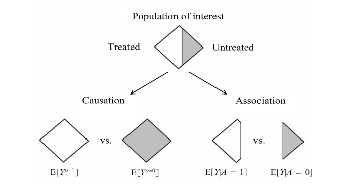

### How：如何衡量因果关系？

**A/B实验：Gold Standard of Causal Inference**

如果我们不关注**个体粒度的因果关系**，**只关注整体的平均因果效应**，那**A/B实验**可以完美地满足我们的需求！

那么，为什么随机分流的A/B实验可以跨越数据缺失的障碍呢？一句话回答：因为**随机可以保证两组用户的潜在结果一致**。

**随机试验的实质在于分配机制（即用户分流）与潜在结果无关**。现实中，影响每个人潜在结果的因素数不胜数，其中很多还观测不到。但我们不需要再为此担心了，因为随机分组本身保证了用户分组和潜在结果无关。换言之，实验组/对照组是可交换的，这样每组的潜在结果可以认为是整体的潜在因果，因此可以直接对比得出因果效应（假设样本量接近无限，忽略抽样方差）。

这就是各家互联网公司都特别重视A/B实验的原因。比起其他方法，A/B实验让我们有机会把握因果效应，从而帮助做出业务决策。虽然到处都说“数据驱动”，但不是有数据就能驱动！A/B实验获取的结果数据才能更好地驱动业务。不然，数据驱动的决策也可能是很糟糕的决策。

**如何从观察数据中推断因果关系？以辛普森悖论为例**

随机实验虽好，但不是所有场景都可行，比如想衡量吸烟对肺癌的影响，但不能强制一部分去吸烟。这时候该怎么办？我们有可能从观测数据中推断出因果关系吗？

一句话回答：可能，但并不容易。

**辛普森悖论：同样的数据为何会得出相反的结论？**

为了说明观测性推断的困难以及其中假设和业务理解的重要性，我们介绍下因果推断最常用的一个案例：辛普森悖论——为什么同样的数据有可能得出截然相反的结论呢？

下图的数据展示了不同性别的病人在吃药和不吃药后，分别有多少人获得康复。

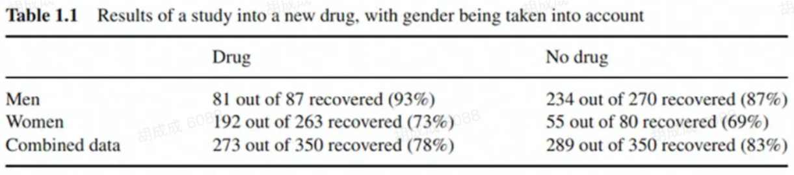

现在你是医生。你需要根据以上的数据，得出病人是否应该吃药的结论。这时你应该分性别来看数据，还是应该直接看最后一行的汇总数据呢？

也许你的直觉告诉你，需要看分性别的数据。你得出了应该吃药的结论，因为无论男/女，吃药的病人康复率都高于不吃药组，这时汇总的数据只是吃药组/不吃药组性别比例不一致所带来的干扰。

现在让我们稍微改变一下条件。还是同样的数据，只是把原本的性别分类变成了血压分类。表格的纵列展示的是病人吃药/不吃药后测量的血压情况。

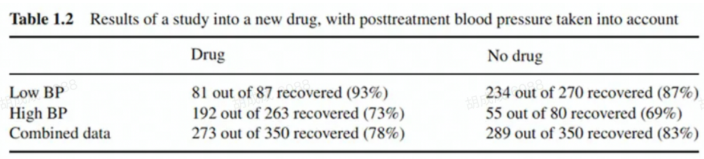

现在你该看分组数据还是汇合数据呢？你会改变你之前的判断吗？答案是这次该看汇合数据，得出不该吃药的结论。

明明是同样的数据，为什么却得出了不一样的结论？什么时候应该看总体，什么时候又要分维度看数据呢？这就涉及到我们应该如何从数据中识别因果关系，如何应用我们对业务的理解来得到准确的结论。

**DAG：把假设可视化呈现**

Directed Acyclic Graph （有向无环图）是把假设可视化呈现的一种工具。它能帮助我们判断什么情况下可以识别因果关系，以及如何识别因果关系。 

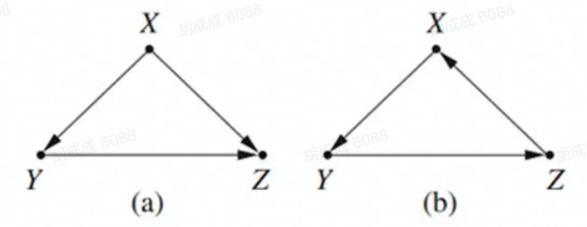

以用户点击dislike为例：（左上的a图）设Y是点击dislike，Z是留存，X是其他变量（比如用户本身的活跃度等）。简单起见，我们认为除了X没有其他变量同时影响Y和Z，这种情况下要计算Y-Z之间的因果关系，就需要控制X，即在X固定的情况下看Y-Z之间的关系。

**用DAG看辛普森悖论**

让我们再回到刚才的吃药问题。在第一份数据中，性别其实是一个**混杂变量（吃药不会影响性别，但性别会影响是否吃药和是否康复）**。这时，我们应该分性别看数据。

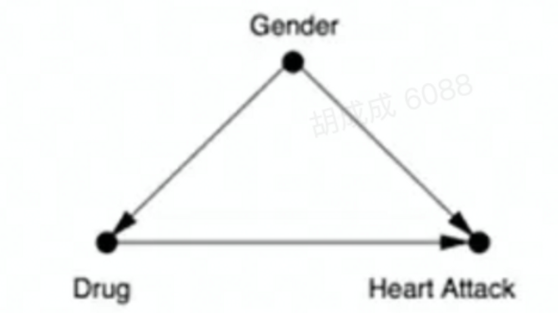

而在第二份数据中，血压是药物发生作用的**中介变量（吃药可能导致血压变化，从而影响是否康复）**。所以这时要判断吃药对康复的影响，就应该看整体数据，而不应该分血压看数据。

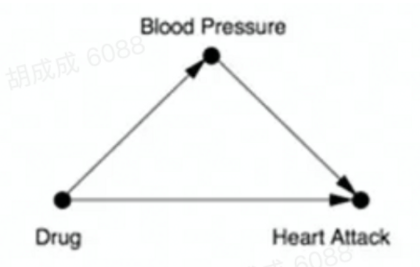

在更多的实际问题中，因果关系可能没有这么简单明确。比如Google做过一项关于性别薪酬不平等的研究，他们的结论是在同样的职位上，女性的薪酬更高一些。

这样的结论合理吗？如果我们认为性别会影响获得管理职位的可能性，那限制同职位来比较的做法就是不对的。

**DAG是假设的可视化**，它使得假设更清晰，推理过程更明确。如果没有假设，我们无法直接从数据得出应该控制哪些变量。就像前文提到的那样（还记得可怜的托勒密吗），产出同一份数据的过程可能性多种多样，不同的数据生成过程要求控制不同的变量来得到因果关系。因此如果只从数据出发，我们不可能知道哪一种做法是对的。

**假设/业务理解的重要性：**

**因果推断的前提是比较同样或者说可比较的对象**。在随机试验中，这一点是通过随机分流实现的；但在观测数据里没有随机这么好的条件，需要用别的办法。

这时最重要的是从已有的知识出发，得出可信的假设，即哪些因素会影响到我们关心的X和Y；再根据这些假设建立因果模型，以推断因果关系。比如冰淇淋销售量和游泳溺水的人数相关，如果我们确定同时影响两者的变量只有温度，那就可以比较同样温度下两者是否仍然相关，由此得出因果关系。

在实际工作中，**这些假设就是我们对业务的理解**，这是好的数据分析工作的前提。**要用业务来解释数据，而不是用数据来解释数据。**

### 从数据中得到正确因果关系的大敌：两种Bias

#### 混杂偏差（Confounding Bias）：Common Causes

混杂偏差很常见，也比较容易被发现。这种偏差主要出现在**有些变量不容易或不能被观察到**的场景中。

比如通过分析那些通过广告下载游戏的人群，我们发现近期有过多次下载转化的用户在单个游戏中的留存低于只转化一次的人群。那是否意味着对已下载游戏的用户不出其他游戏广告，就能提升这些用户在游戏里的留存呢？

有可能，但不一定。因为有过多次下载游戏的用户和只有一次的用户在用户特征上不一样，而这会影响留存。只看观测数据还不足以帮助我们判断这个策略的效果，因为不能直接找出可比较的用户。但我们还有随机实验可以帮我们回答这个问题，类似的现象还有在广告有过点击或转化行为的用户活跃和留存更高，但这不足以说明广告的点击或转化行为可以提高用户活跃。

#### 选择偏差（Selection Bias）：Conditioning on Common Effects

曾经是高考作文题的幸存者偏差，就是选择偏差的一种。

下面是两个案例。

案例一：简历越好，能力越差？

假设在招聘中，是否通过面试取决于简历和能力。两者都不行的话会被刷掉，两者都很好的公司又付不起工资，因此也不会录用。那么最终通过面试被雇佣的人是经过选择后的一小部分，这部分人里**简历和能力的负相关就是选择偏差导致的，不足以指导决策**。

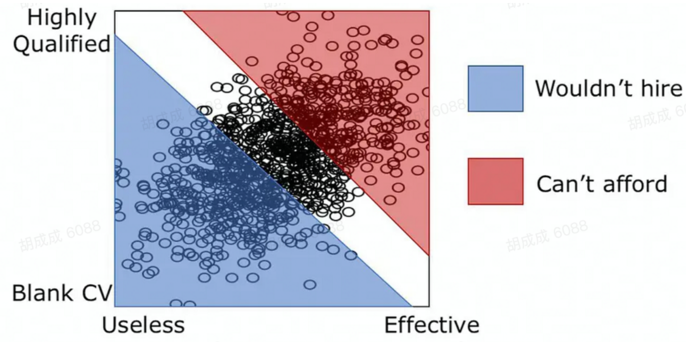

案例二：颜值越高，智商越低？

下图里 X代表颜值Y代表智商，Z代表是否结婚：我们假设智商+ 颜值 大于某个数字的人会选择结婚的话，那虽然在整个人群里，颜值和智商没什么相关性，但分是否结婚来看数据，就会发现颜值和智商的负相关，背后的逻辑和上一个案例一样。

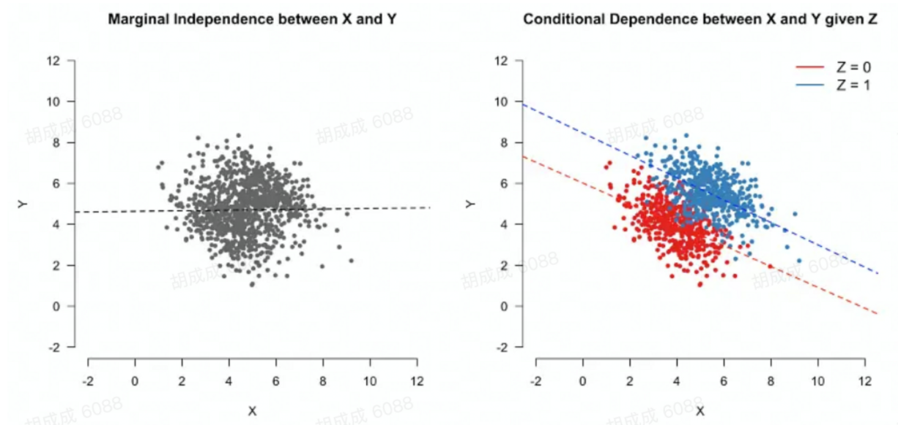

生活中的选择偏差随处可见，比如新奇的科学发现大概率不能被重复，比如演技与颜值的负相关。在广告系统里，我们看到的后验数据会受到各种因素的影响，因此一定不要忘记选择偏差的影响。

举一个广告业务场景的例子，广告的出价（比如多少钱一个下载）和转化率（点击过广告的用户有多少下载了）的关系，在看到的数据里可能是负相关的，但这不是因为出价和转化率间有因果关系，而是能投放出来的计划要么是出价够高要么转化率够高，只有这样的广告才可能胜出并投放出来。我们常说后验数据有偏，也是在说投放出来的数据不是全部数据。这对我们的数据分析是很大的挑战，因为我们无法知道没投出来的后验数据。

## Estimand & Identification

### What is Your Estimand?

> The need for defining model-free estimands is one of the most important insights from modern causal inference.
>
> Not defining a clear question or set of assumptions is by far the largest source of catastrophic errors in any data analysis. Why? Because no matter what you do with the data, if you didn't have a clear question to begin with, whatever answer you've arrived at is completely meaningless. You'll often see analyses that start with "we took the data and did linear regression; here we report the coefficients and confidence intervals". Without specifying a concrete goal, how can we judge what these coefficients are supposed to mean? Without a clear description of modeling assumptions, how can we know that the confidence intervals actually have their promised level of coverage? You could have infinite data and still get it all wrong: don't forget that data science is about science and not just data.

为什么需要关注**Estimand**呢？举个栗子，假如要衡量给抖音用户发100元的券激励用户投放抖+的效果，通过AB实验我们得到数据发券的用户平均抖+消耗提升10元，小A认为效果就是10元，而小B细看数据发现实验数据中只有5%的用户使用了券，基于所有消耗提升都来自实际使用了券的用户这一假设，小B算出这些用户的消耗平均提升了10/5% = 200元，并认为这就是券的效果，那么小A和小B哪个是对的呢？这取决于我们想衡量的到底是什么？是所有发券用户的消耗提升还是那些会使用券的用户的消耗提升，这个目标是业务决定的，如果业务目标是提升平台整体的消耗，那么就应该关注小A的估计结果，如果没分讲清楚要衡量的目标就披露说估计的数字是XX元，那很难判断做得对不对、好不好。在实际的分析场景里，这种不区分ATT和ATE的情况并不罕见，如果我们只关注具体的估计方法有时会忘了我们真正想估计的量是什么，并得出错误的结论。

甚至不只是因果推断，在一般的分析里我们也经常说不要上来就说数据是什么样，要想说清楚要回答什么问题，这样才能判断应该用什么样的数据经过什么样的处理来回答，如果不知道要回答啥问题，就没办法评价这个分析做得好不好，**Estimand可以理解为我们的出发点，我们试图要回答的问题本身，至于我们具体是用回归系数还是两组均值diff来估计它都是更后面的事情。**

#### 理论估计量和经验估计量

- Estimand: the quantity to be estimated
- Estimate: the approximation of the estimand using a finite data sample
- Estimator: the method or formula for arriving at the estimate for an estimand

理论估计量会涉及**不可观测**的数据，比如我们想知道同一人群在不同策略下的收益区别，而**经验统计量只能依赖可观测的数据**。举个栗子来说，假设理论上我们想知道的是所有人接受治疗和不接受治疗后潜在结果diff的均值，这是我们的**estimand**，这个定义里就涉及了不可观测的部分，我们实际用的估计方法可以是一个随机实验，用实验组用户的平均后果作为人群接受治疗平均效果的无偏估计，这样实验观测到的人均diff就可以作为ATE的无偏估计，计算两组的人均diff是一个**estimator**，实际的计算结果即我们的**estimate**。

#### Estimand的两个部分

理论统计量包括两个部分：个体效果 & 目标人群。

- 个体效果：**可以是个体的某个潜在结果或者两个潜在结果的差异，它决定了我们关注的是否为因果关系以及是的话需要考虑哪些反事实**。
- 目标人群：**我们关心的个体效果是对哪些人群来说的**。
- 二者合起来构成理论估计量，这也是如果我们拥有所有数据时想要知道的东西。

> The theoretical estimand has two components. The first is a unit-specific quantity, which could be a realized outcome (whether person i is employed), a potential outcome (whether person i would be employed if they received job training), or a difference in potential outcomes (the effect of job training on the employment of person i). It could also be a potential outcome that
>
> would be realized under intervention to more than one variable (whether person i would be employed if they received job training and child care), thus unlocking numerous new causal questions. The unit-specific quantity clarifies whether the research goal is causal, and if so what counterfactual intervention is being considered. The second component of the theoretical estimand is the target population: over whom do we aggregate that unit-specific quantity? The unit-specific quantity and target population combine to define the theoretical estimand: the thing we would like to know if we had data for the full population in all factual or counterfactual worlds of interest.

推荐的因果推断流程：

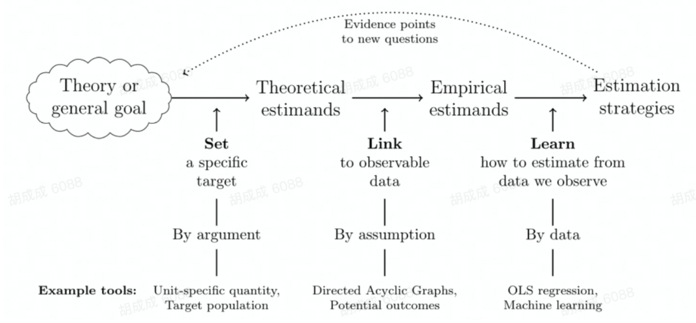

#### 常见因果效应

- **Average Treatment Effect**. The average treatment effect across the population.
- **Average Treatment on the Treated**. The average treatment effect among those who actually received the treatment in your study.
- **Conditional Average Treatment Effect**. The average treatment effect among those with certain values of certain variables (for example, the average treatment effect among women).
- **Heterogeneous Treatment Effect**. A treatment effect that differs from individual to individual.
- **Intent-to-Treat**. The average treatment effect of assigning treatment, in a context where not everyone who is assigned to receive treatment receives it (and maybe some people not assigned to treatment get it anyway).
- **Local Average Treatment Effect**. A weighted average treatment effect where the weights are based on how much more treatment an individual would get if assigned to treatment than if they weren’t assigned to treatment.

一般我们关心ATE，即**平均处理效应**，但对应的population不一定是总人群，比如药物开发的时候，可能target人群只是 患某种疾病的人，对总人群计算ATE可能没啥意义。比如广告的lift study里我理解是在衡量ATT，比如在投放无忧的场景下，由于只会有很少的客户会申请并最终拿到贷款，估算的ATE和ATT会差别很大，我们需要的是ATE还是ATT取决于我们想回答什么问题。

### Identification

#### What is “identification“?

The combination of some data and an aching desire for an answer does not ensure that a reasonable answer can be extracted from a given body of data.

**识别指的是依赖给定的数据是否足以得出预期结论**，而这与统计波动、抽样不确定性不同。这么说比较抽象，我们看一下Manski举的例子：

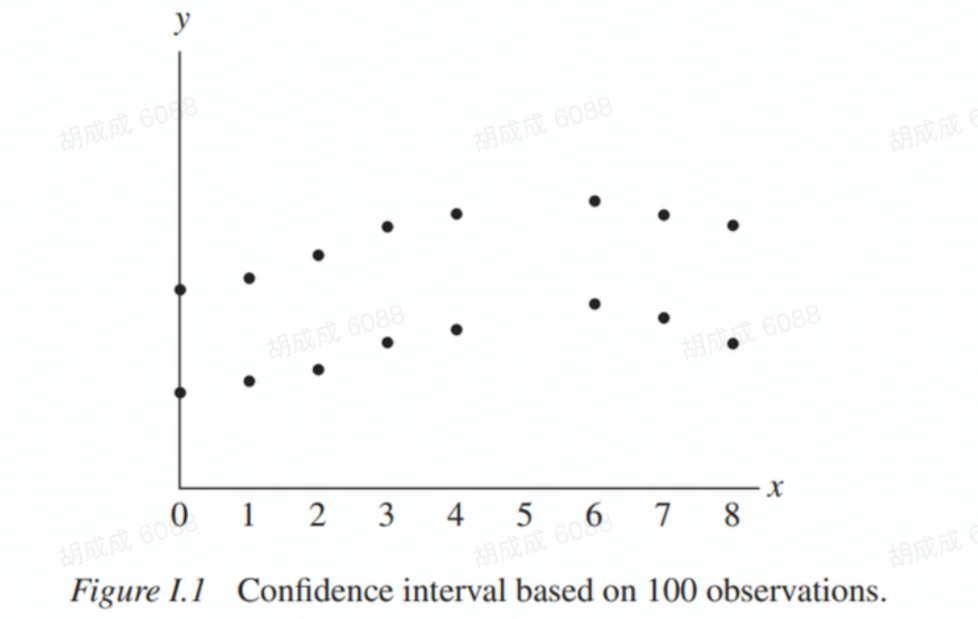

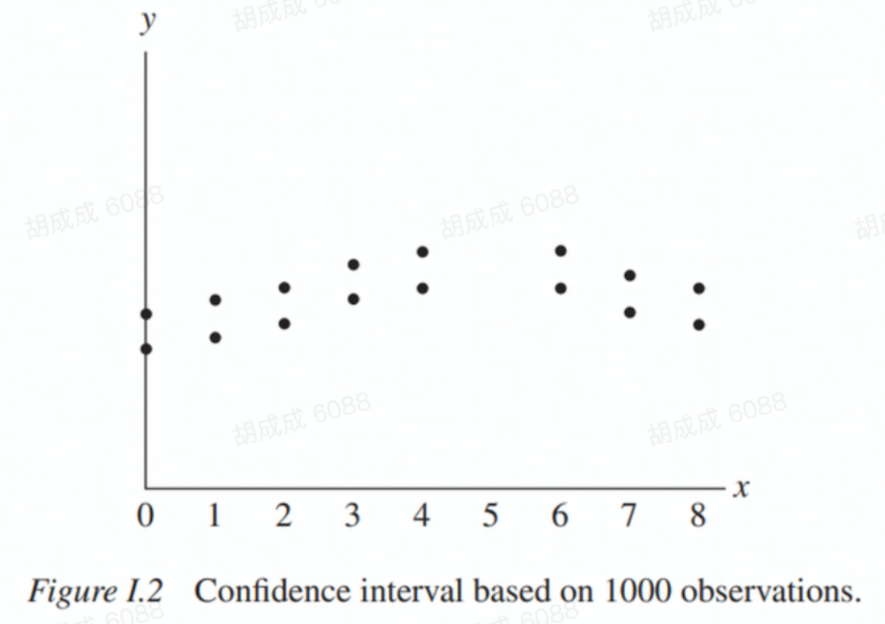

Manski说的识别问题更一般性，我们关注的是因果效应是否可识别，即从给定数据里能否得出因果效应的估计。如果识别条件不满足的话，用Pearl的话来说 “the danger exists that the desired quantity will not be discernible unambiguously from the data – even when infinitely many samples are taken”，即这类样本再多也没用，需要的是不同类型的数据。

为了进一步说明在实际场景中如何运用**识别策略**，先介绍下常见的两种因果推断框架。

#### 潜在结果模型【RCM】

最主流的因果推断框架：Neyman-Rubin Causal model，因果关系被定义成两种潜在结果之差，数学表达一般写成：

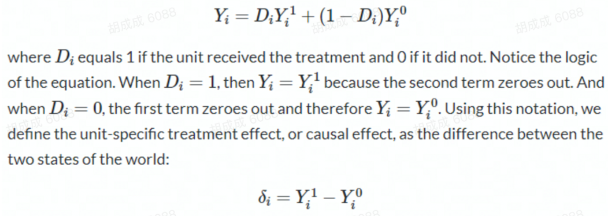

在这个框架下，定义个体粒度的因果关系依赖的最重要的假设是**SUTVA（Stable Unit Treatment Value Assumption）**：

- no interference【无干预性】：**每个个体的潜在结果只与自己的treatment有关**；
- consistency【一致性】：**no different versions of a treatment**.

实际上这两个假设是很强的，比如新冠这种传染病，你是否打疫苗 是影响其他人受感染的可能的，这就违反了第一个前提，在社交网络中，这个假设都是不满足的；而第二个假设实际上是说只有一种treatment，以第一节里面提到的手术为例，假如一个医术精湛的名医和一个庸医做同一个手术的差异很大，那要衡量手术的效果就要限定是什么样的手术而不能一概而论。

体粒度的因果效应不可能直接观测到，我们一般要估计的是ATE（average treatment effect）。因此，因果效应的问题就在于怎么从可获取的数据特别是观测数据中去识别和估计因果效应。

**Under what conditions is the ATE identified?**

依赖两个重要假设

- **no unmeasured confounders/Ignorability/Exogeneity/Conditional Independence Assumption (CIA)**，即**给定一组可观测的协变量X的前提下 treatment D和潜在结果 Y条件独立**；
- **Positivity/Common Support**：即无论协变量具体取值多少，**treatment D = 1的概率在（0，1）之间**，这也不难理解，要计算因果效应，首先要有variation，如果treatment取值没变化，那就没有可用来对照的样本了，这时相关性都无从谈起更不用说因果了。

我们先看下随机试验的场景，这种情况下协变量为空集，潜在结果和干预天然独立，因此可直接识别因果效应，而在观测性数据里，要求在给定的协变量下干预就像是随机实验一样（as good as random）。

当上述前提成立的情况下，我们可以从数据中来估算因果效应。

**三条假设总结：**

1. Stable Unit Treatment Value Assumption (SUTVA)：每组{样本，干预}对应的潜在结果都是固定的， 不受其他{样本，干预}的干扰。
2. Unconfoundedness Assumption：没有未知的混杂因子，协变量x一样的样本被分配到的干预种类是随机的。
3. Positivity Assumption：没有X使得干预种类是决定性的，也就是带有任何值的样本都可能受到任何一种干预。

#### 结构因果模型SCM 和因果图【SCM】

**SCM(Structural Causal Models)**，也被叫做Causal diagrams/Causal graphs流派，是由UCLA 计算机系的图灵奖获得者Judea Pearl推广开来的。

**DAG(Directed Acyclic Graphs)**

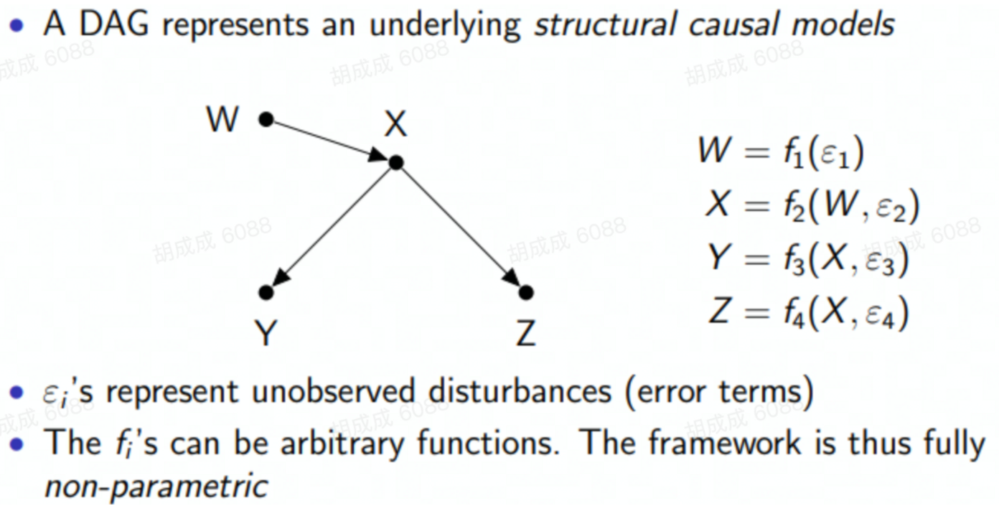

**三类节点和d-separation**

要知道如何从图中判断两个变量是否条件独立，需要先了解三类节点：

Chains: X → Z → Y

- 不做限制时，X、Y是相关的，但给定Z的话，X、Y是独立的，即X、Y之间的路径是通的，但Z会block这个路径；

Forks: X ← Z → Y

- 不做限制时，X、Y是相关的，但给定Z的话，X、Y是独立的，即X、Y之间的路径是通的，但Z会block这个路径；

Colliders: X → Z ← Y

- 不做限制时，X、Y是独立的，但给定Z的话，X、Y是相关的，即X、Y之间的路径本来是不通的，但控制Z会打开这个路径。

两个变量很少只有一条路径相连，我们可以使用d-seperation来判断变量之间是否独立，如果两个节点满足d-seperation，说明变量之间独立。

**d-seperation**：我们说路径p被一系列节点Z block，当且仅当：

- p包含chains A → B → C或者fork A ← B → C ，且B被Z包含，或者
- p包含collider A → B ← C 且 B不被Z包含。

如果X、Y 之间每一条路径都被block的话，则说X、Y 满足d-separated，进而X、Y 之间**独立**。一个栗子：

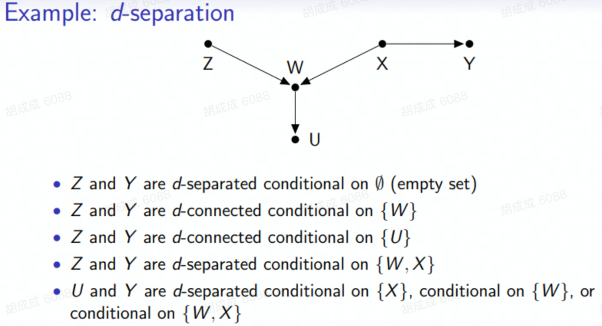

**干预和do算子**

SCM中用**do算子（do-operator）来表述干预这个概念**，P(Y |do(X = x))表示我们认为把X设定为某个值时Y的概率分布，以辛普森悖论为例，设定 X - drug usage；Y - recovery；Z - gender，则因果关系可以定义成：P(Y = 1|do(X = 1)) - P(Y = 1|do(X = 0)).

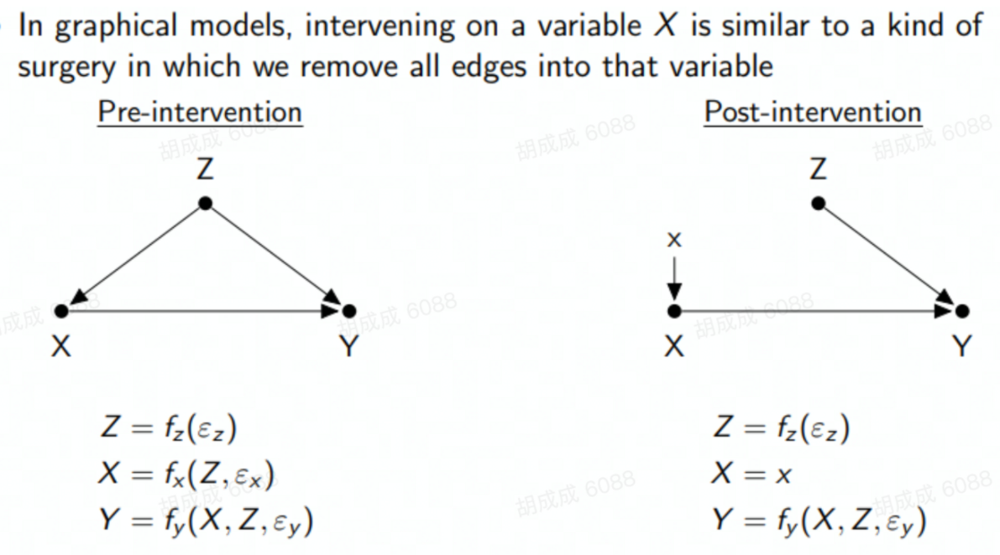

因果推断的问题就变成如何从数据中估计P(y|do(x))，如上图我们已知需要控制Z来衡量X对Y的影响，这就可以把依赖do算子的表达式转换成观测数据：

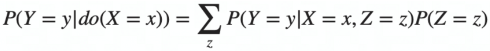

但我们怎么才能一般性知道在因果图中对衡量某个因果效应应该控制哪些变量呢？这就引出了因果图里的识别策略。

**识别策略：后门法则和do演算（do-calculus）**

我们这里主要讨论因果图处理confunding bias的识别策略，selection bias在因果图里会更复杂一些，这里不展开。

因果图里最重要的识别策略叫做“**后门法则**”，即控制所有X的后门路径来衡量X对Y的因果效应：**对于有向无环图中的一组有序变量（X, Y），如果 Z 的任何节点都不是 X 的子节点，并且 Z 阻断了 X 和 Y 之间所有箭头指向 X 的路径，则 Z 满足后门法则。**

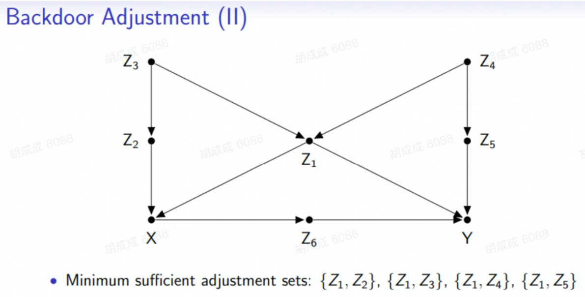

当Z满足后门法则时，因果效应的估计可以改写成：

类似的还有**前门法则**，在 DAG 中，如果节点集合 Z 相对于有序对 (X,Y) 符合

1. Z 切断了所有 X 到 Y 的直接路径；
2. X 到 Z 没有后门路径；
3. 所有 Z 到 Y 的后门路径都被 X 阻断。

则称Z满足前门准则。这时因果效应的估计可以改写成：

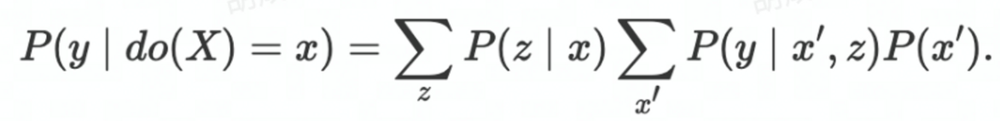

Pearl在The Book of Why里举了一个前门法则的假想例子：

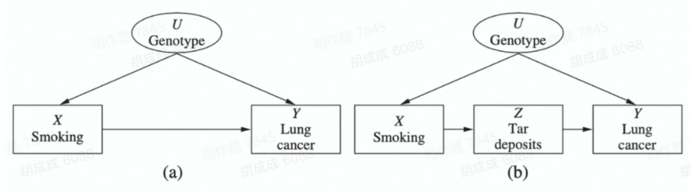

后门法则和前门法则是因果图里识别策略最常见的方法，更一般的识别策略被称作Do-Calculus，它可以告诉我们从给定的因果图里要识别因果效应需要控制的变量集，且这个方法是完备的：即如果该因果效应是可识别的，就存在一系列步骤来把因果效应的公式转变成只包含观测数据，如果do-calculs失败了，则说明此因果效应在当前假设下不可识别。

#### 等价性

Pearl证明了**SCM和Rubin Causal model的等价性**，所以二者虽然路数不同，但在一个框架下可以得到的结果在另一个框架下同样可以得到，只是在不同的场景、学科下受认可的程度不一，理解成本不一样。对我们来说不用拘泥在某一个框架下，主要对我们理解问题、解决问题有帮助即可。

#### 识别离不开假设，这是统计估计和因果推断的区别

**根本就没有因果推理的方法**。这与其说是统计文献的失败，不如说是新思想(如博客文章、低质量的论文)的幼稚普及的失败。正如我所说，推论统计学(对于点估计而言)的过程只关心估计一个概率分布的参数，并量化该估计的抽样分布。这里没有什么“因果”，许多人惊讶地发现，用于“因果”推理的算法实际上与用于做出非因果陈述的算法完全相同。什么使分析成为因果关系与所使用的估计量或算法几乎没有任何关系。这与研究人员是否能够满足某些关于产生观测数据的过程的不可测试的假设有关。把这些事情(**推论统计学和因果识别**)分开放在你的脑海中是很重要的，即使它们必须总是一起工作。
