# Uplift 基础

## 简介

Uplift models用于预测一个treatment的**增量**反馈价值，比如给用户**投放广告后其转化意愿的增量**。我们不可能对同一个用户即treated又controled，但是借助统计和机器学习的知识，可以得到相似的用户大致会怎么反应。每一个用户会获得一个**估计 lift score**，用于指导在不同用户人群上实施差异化策略。（uplift model的目标是估计 **CATE**）

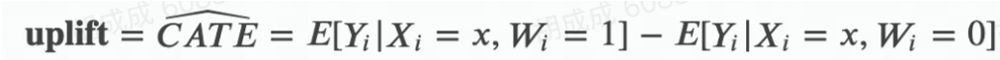

**Response model v.s. Uplift model**

举个🌰：

| 用户 | 转化率 | 投放广告后转化率 | uplift |
| :--: | :----: | :--------------: | :----: |
|  A   |   1%   |       10%        |   9%   |
|  B   |  10%   |       0.1%       |  0.1%  |

- Response model：**看转化概率，**基于Response值——会倾向于给B投广告
- Uplift model：**看转化概率提升，**基于delta_Response/uplift值建模——会倾向于给A投放广告

**注意：Uplift Model是在估计ITE的方法，并不是直接估计ATE！**

## Meta-learner

这里介绍Meta-learner，对对照组和实验组的结局进行建模（线性、树到深度学习都可），利用拟合的模型（base learner）预测ITE, CATE, ATE。

### **S-learner**

把**干预T作为一个0-1分类特征，建立一个模型，计算给定协变量X时不同干预T的 uplift 值**。

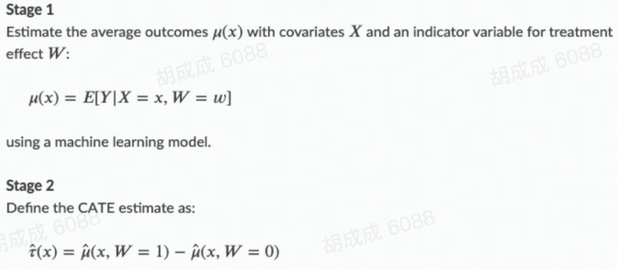

**问题：**

专注于对response本身的预测，而忽略了对delta_response的关注，**multi-treatment不需要额外增加模型**。

当**实验组和对照组ATE差异较小**时，难以学准

**详解：**

“S”是single的意思，是指使用一个预测模型完成uplift估计。具体步骤包括

- **Step1：基于变量X和干预W训练预测模型**
- **Step2：分别估计干预和不干预时的得分，差值即为增量**

【优点】S-Learner简单直观、直接使用既有预测算法；预测仅**依赖一个模型**，避免了多模型的误差累积；更多的数据和特征工程对预测准确率有利。

【缺点】但是该方法**不直接建模uplift**；且需要额外进行特征工程工作(由于模型拟合的是Y，所以若W直接作为一个特征放进去，可能由于对Y的预测能力不足而未充分利用)。

### **T-learner**

对**实验组和对照组分别建模，再计算给定协变量X时 uplift 值**。

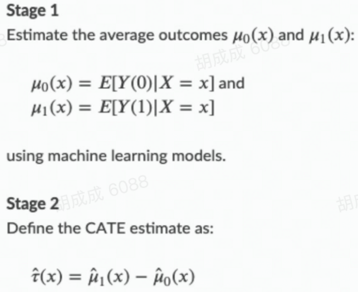

**问题：**

多模型存在**误差累加**；**multi-treatment带来模型的数量增加**；忽略了对delta_response的关注

**详解：**

"T"是Two的意思，是指用两个模型分别建模干预、不干预的情况，取差值作为uplift。具体步骤：

- Step1：对treatment组数据和control组数据分别训练预测模型
- Step2：两个模型分别打分

【优点】T-Learner一样简单直观、直接使用既有预测算法；**将不同的数据集中的增量效果转换为模型间的差异**，不需要太多的特征工程工作；**当有随机试验的数据时该方法作为baseline很方便。**

【缺点】该方法存在**双模型误差累积问题**；同时当数据差异过大时(如数据量、采样偏差等)，对准确率影响较大。

### **X-learner**

X-learner 适合**实验组和对照组样本数量差别较大场景**。

**步骤**

1. 对实验组和对照组分别拟合模型

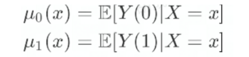

2. 交叉预测：Di表示样本i实际结局和预估结局之间的差

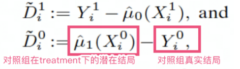

3. fit(D^1~ X^1)，训练实验组模型 τ_1(x)_

   fit(D^0~ X^0)，训练对照组模型 τ_0(x)

4. 对两个结果加权计算CATE，用权重来平衡实验组和对照组的样本量差异：

​		g(x) 为样本x进入实验组的先验概率，可以用协变量估计，可以简化为实验组占比。

**问题：**

- 多模型造成误差累加
- **multi-treatment带来模型的数量增加**

**详解：**

”X“表示交叉的意思，该方法主要解决T-Learner对不同Treatment组与Control组间数据量差异过大情况表现不佳的问题。具体步骤：

- Step1：对Treatment组数据和Control组数据分别训练预测模型
- Step2：计算一组uplift的近似表示的数据集，用treatment组模型预测control组数据，control组模型预测treatment组数据，分别做与Y的差值得到增量的近似
- Step3:以此为目标再训练预测模型，拟合uplift

X-Learner在T-Learner基础上，利用了全量的数据进行预测，主要解决**Treatment组间数据量差异较大的情况**。但流程相对复杂、计算成本较高，有时还会由于多模型误差累积等问题效果不佳。

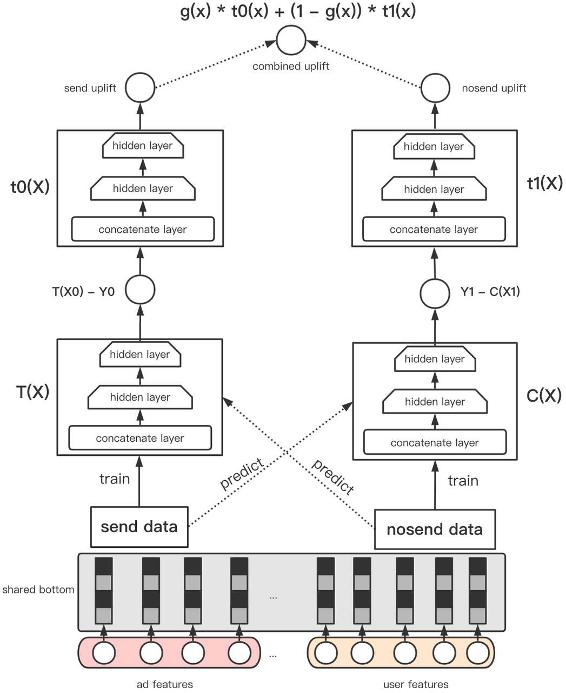

### **R-learner**

定义了一个**损失函数**，以最小化这样的一个损失函数为目标拟合CATE：

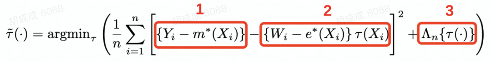

1. 红框(1) 
   - Y为观测到的结果(比如ctr label） 
   - m(x)用日常的机器学习模型拟合label，数据用对照组+实验组训练，描述整体数据的预估均值，红框1就是要**拟合的label**

2. 红框(2) 

   - $$W_i =1|0$$，表示生效treatment或control组 
   - e(x)表示倾向性评分，常用于非随机实验的数据；在流量相同的随机实验中，e(x) = 0.5即可 

   - $$\tau(x)$$则是表示模型预估的uplift，红框2**表示为模型的输出**

3. 红框(3)，正则项 

**问题：**

- **模型精度依赖于m(x), e(x)的精度**；
- **multi-treatment带来模型的数量增加**。

**详解：**

R-Learner的思路是通过将问题转化为定义损失函数(R-loss)的形式进行学习训练，更关注”**残差**“：

Step1：通过交叉验证的方式，每次预测一组，得到整个数据集的**预测结果$$m(x)$$和倾向得分 e(x)**

$$ m(X_i)=E(Y|X_i) $$

$$ e(X_i)=E(W=1|X_i) $$

Step 2: 在cv的其他组最小化损失函数，估计增量。-q(i)表示不在第i组的样本

## Evaluation

在uplift的场景中，我们无法同时观察到一个个体的有treatment和无treatment的情况，所以我们需要通过统计群体的表现来对比模型的优劣。

### Cumulative Uplift Curve

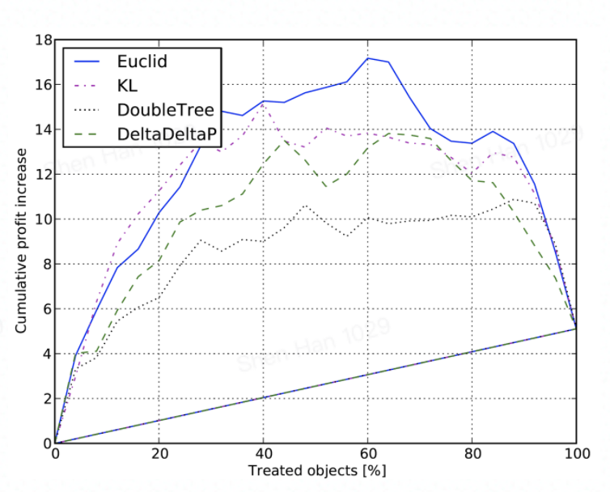

横轴：将用户群体按照模型的预估uplift降序排序，按用户个数的分位数分桶。如上图中，横轴20代表预估uplift排名前20%的用户。

纵轴：x%用户treament之后，能够拿到的revenue收益。

在后期，uplift会下降，这是因为：

- treament有代价

- Sleeping dog is treated

### AUUC( Area Under Uplift Curve )

对于Y取值0-1的问题（比如点击或不点击），可以通过划分分位点的方式，对齐实验组和对照组数据进行间接评估。

- 用估计的uplift score 对测试集样本由高到低排序, 10%, 20%
- 计算G(top φ)：

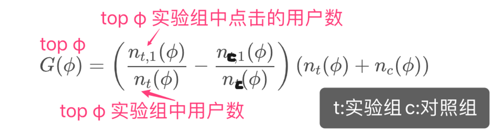

横轴：样本排序，纵轴：G(top φ)，得到uplift curve。用曲线与random line之间的面积作为评价模型表现的指标AUUC。

### Qini curve

类似uplift-curve，对T和C样本不均做了处理，以Treatment组的样本量为准，对Control组做一个缩放，累积绘制的曲线称为Qini 曲线

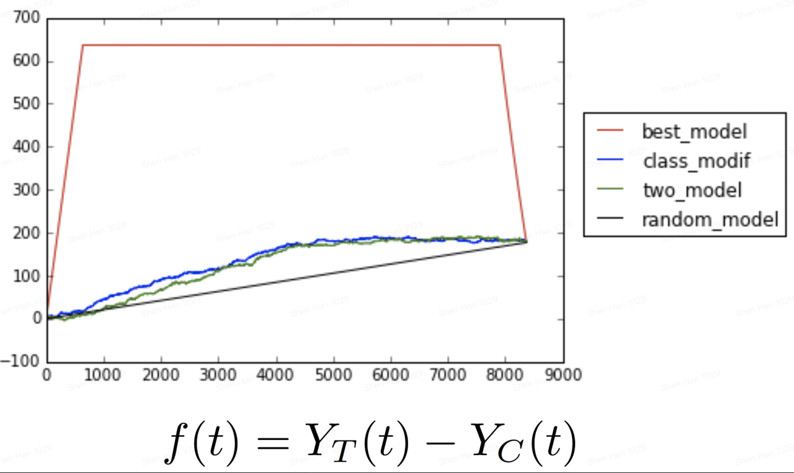

和Cumulative Uplift Curve思路一致，只不过纵轴可以是：

- 实际的转化量，上图就是。 

- 实际转化用户占全部用户的比例，相当于归一化。

更多参考：[Causal Inference and Uplift Modeling A review of the literature](http://proceedings.mlr.press/v67/gutierrez17a/gutierrez17a.pdf)

## Tools

### scikit-uplift

- Doc：https://www.uplift-modeling.com/en/latest/index.html
- Code：https://github.com/maks-sh/scikit-uplift
- Example：[Example](./Tools/scikit-uplift/)

### pylift

- Doc：https://pylift.readthedocs.io/en/latest/
- Code：https://github.com/wayfair/pylift
- Example：[Example](./Tools/pylift/)

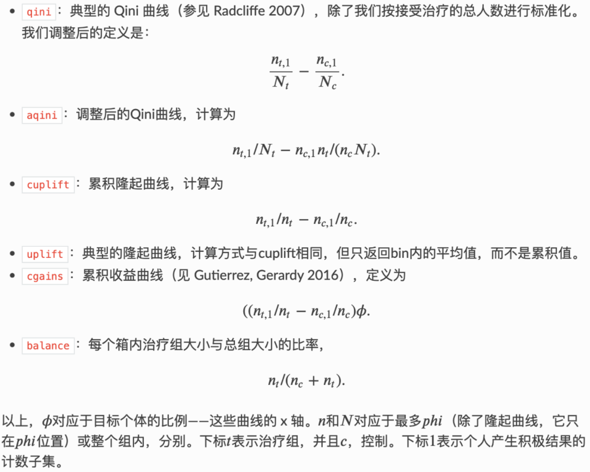

### UpliftML

- Doc：https://upliftml.readthedocs.io/en/latest/
- Code：https://github.com/bookingcom/upliftml

### Causal ML Packet

#### 简介

**[Causal ML](https://github.com/uber/causalml)**是一个 Python 包，它提供了一套使用基于最近研究的机器学习算法的提升建模和因果推理方法。

- **广告活动定位优化**：在广告活动中提高投资回报率的一个重要手段是将广告定位到在给定 KPI（例如参与度或销售量）中会有良好反应的客户群。CATE 通过根据 A/B 实验或历史观察数据在个人层面估计广告曝光的 KPI 影响来识别这些客户。
- **个性化参与**：公司有多种选择与客户互动，例如在追加销售或通信消息渠道中的不同产品选择。可以使用 CATE 来估计每个客户和治疗选项组合的异质治疗效果，以获得最佳的个性化推荐系统。

The package currently supports the following methods

- Tree-based algorithms
  - Uplift tree/random forests on KL divergence, Euclidean Distance, and Chi-Square
  - Uplift tree/random forests on Contextual Treatment Selection
  - Causal Tree - Work-in-progress
- Meta-learner algorithms
  - S-learner
  - T-learner
  - X-learner
  - R-learner
  - Doubly Robust (DR) learner
  - TMLE learner
- Instrumental variables algorithms
  - 2-Stage Least Squares (2SLS)
  - Doubly Robust (DR) IV
- Neural-network-based algorithms
  - CEVAE
  - DragonNet - with `causalml[tf]` installation

#### Reference

1. Radcliffe, Nicholas J., and Patrick D. Surry. "Real-world uplift modelling with significance-based uplift trees." White Paper TR-2011-1, Stochastic Solutions (2011): 1-33.
2. Zhao, Yan, Xiao Fang, and David Simchi-Levi. "Uplift modeling with multiple treatments and general response types." Proceedings of the 2017 SIAM International Conference on Data Mining. Society for Industrial and Applied Mathematics, 2017.
3. Athey, Susan, and Guido Imbens. "Recursive partitioning for heterogeneous causal effects." Proceedings of the National Academy of Sciences 113.27 (2016): 7353-7360.
4. Künzel, Sören R., et al. "Metalearners for estimating heterogeneous treatment effects using machine learning." Proceedings of the national academy of sciences 116.10 (2019): 4156-4165.
5. Nie, Xinkun, and Stefan Wager. "Quasi-oracle estimation of heterogeneous treatment effects." arXiv preprint arXiv:1712.04912 (2017).
6. Bang, Heejung, and James M. Robins. "Doubly robust estimation in missing data and causal inference models." Biometrics 61.4 (2005): 962-973.
7. Van Der Laan, Mark J., and Daniel Rubin. "Targeted maximum likelihood learning." The international journal of biostatistics 2.1 (2006).
8. Kennedy, Edward H. "Optimal doubly robust estimation of heterogeneous causal effects." arXiv preprint arXiv:2004.14497 (2020).
9. Louizos, Christos, et al. "Causal effect inference with deep latent-variable models." arXiv preprint arXiv:1705.08821 (2017).
10. Shi, Claudia, David M. Blei, and Victor Veitch. "Adapting neural networks for the estimation of treatment effects." 33rd Conference on Neural Information Processing Systems (NeurIPS 2019), 2019.

## Paper Reading

**Uplift Modelling/Causal Tree**

1. Nicholas J Radcliffe and Patrick D Surry. Real-world uplift modelling with significance based uplift trees. White Paper TR-2011-1, Stochastic Solutions, 2011.[[文章链接\]](http://stochasticsolutions.com/pdf/sig-based-up-trees.pdf)
2. Rzepakowski, P. and Jaroszewicz, S., 2012. Decision trees for uplift modeling with single and multiple treatments. Knowledge and Information Systems, 32(2), pp.303-327.[[文章链接\]](https://core.ac.uk/download/pdf/81899141.pdf)
3. Yan Zhao, Xiao Fang, and David Simchi-Levi. Uplift modeling with multiple treatments and general response types. Proceedings of the 2017 SIAM International Conference on Data Mining, SIAM, 2017. [[文章链接\]](https://dspace.mit.edu/bitstream/handle/1721.1/119250/draft_May27.pdf?sequence=1&isAllowed=y) [[Github链接\]](https://github.com/uber/causalml)
4. Athey, S., and Imbens, G. W. 2015. Machine learning methods for estimating heterogeneous causal effects. stat 1050(5) [[文章链接\]](https://arxiv.org/pdf/1810.13237.pdf)
5. Athey, S., and Imbens, G. 2016. Recursive partitioning for heterogeneous causal effects. Proceedings of the National Academy of Sciences. [[文章链接\]](https://arxiv.org/pdf/1504.01132.pdf) [[Github链接\]](https://github.com/susanathey/causalTree)
6. C. Tran and E. Zheleva, “Learning triggers for heterogeneous treatment effects,” in Proceedings of the AAAI Conference on Artificial Intelligence, 2019 [[文章链接\]](https://arxiv.org/abs/1902.00087) [[Github链接\]](https://github.com/edgeslab/CTL)

**Forest Based Estimators**

1. Wager, S. & Athey, S. (2018). Estimation and inference of heterogeneous treatment effects using random forests. Journal of the American Statistical Association .
2. M. Oprescu, V. Syrgkanis and Z. S. Wu. Orthogonal Random Forest for Causal Inference. Proceedings of the 36th International Conference on Machine Learning (ICML), 2019 [[文章链接\]](http://proceedings.mlr.press/v97/oprescu19a/oprescu19a.pdf) [[GitHub链接\]](https://github.com/Microsoft/EconML#references)

**Double Machine Learning**

1. V. Chernozhukov, D. Chetverikov, M. Demirer, E. Duflo, C. Hansen, and a. W. Newey. Double Machine Learning for Treatment and Causal Parameters. ArXiv e-prints [[文章链接\]](https://core.ac.uk/download/pdf/81899141.pdf) [[Github链接\]](https://econml.azurewebsites.net/)
2. V. Chernozhukov, M. Goldman, V. Semenova, and M. Taddy. Orthogonal Machine Learning for Demand Estimation: High Dimensional Causal Inference in Dynamic Panels. ArXiv e-prints, December 2017.
3. V. Chernozhukov, D. Nekipelov, V. Semenova, and V. Syrgkanis. Two-Stage Estimation with a High-Dimensional Second Stage. 2018.
4. X. Nie and S. Wager. Quasi-Oracle Estimation of Heterogeneous Treatment Effects. arXiv preprint arXiv:1712.04912, 2017.[[文章连接\]](https://arxiv.org/pdf/1712.04912.pdf)
5. D. Foster and V. Syrgkanis. Orthogonal Statistical Learning. arXiv preprint arXiv:1901.09036, 2019 [[文章链接\]](https://arxiv.org/pdf/1901.09036.pdf)

**Meta Learner**

1. C. Manahan, 2005. A proportional hazards approach to campaign list selection. In SAS User Group International (SUGI) 30 Proceedings.
2. Green DP, Kern HL (2012) Modeling heteroge-neous treatment effects in survey experiments with Bayesian additive regression trees. Public OpinionQuarterly 76(3):491–511.
3. Sören R. Künzel, Jasjeet S. Sekhon, Peter J. Bickel, and Bin Yu. Metalearners for estimating heterogeneous treatment effects using machine learning. Proceedings of the National Academy of Sciences, 2019. [[文章链接\]](https://arxiv.org/pdf/1706.03461.pdf) [[GitHub链接\]](https://github.com/uber/causalm)

**Deep Learning**

1. Fredrik D. Johansson, U. Shalit, D. Sontag.ICML (2016). Learning Representations for Counterfactual Inference [[文章链接\]](https://www.semanticscholar.org/paper/Learning-Representations-for-Counterfactual-Johansson-Shalit/759b00cf35b397eab468935b5d90d04e9ed25549)
2. Shalit, U., Johansson, F. D., & Sontag, D. ICML (2017). Estimating individual treatment effect: generalization bounds and algorithms. Proceedings of the 34th International Conference on Machine Learning [[文章链接\]](https://arxiv.org/abs/1606.03976)
3. Christos Louizos, U. Shalit, J. Mooij, D. Sontag, R. Zemel, M. Welling.NIPS (2017). Causal Effect Inference with Deep Latent-Variable Models [[文章链接\]](https://www.semanticscholar.org/paper/Causal-Effect-Inference-with-Deep-Latent-Variable-Louizos-Shalit/a32a61a6bf23d13a7088f1c77e694ab13bb6c58e)
4. Alaa, A. M., Weisz, M., & van der Schaar, M. (2017). Deep Counterfactual Networks with Propensity-Dropout [[文章链接\]](https://arxiv.org/abs/1706.05966)
5. Shi, C., Blei, D. M., & Veitch, V. NeurIPS (2019). Adapting Neural Networks for the Estimation of Treatment Effects [[文章链接\]](https://arxiv.org/abs/1906.02120) [[Github链接\]](https://github.com/claudiashi57/dragonnet)

**Uber专场**

最早就是uber的博客在茫茫paper的海洋中帮我找到了方向，如今听说它们AI LAB要解散了有些伤感，作为HTE最多star的开源方，它们值得拥有一个part

1. Shuyang Du, James Lee, Farzin Ghaffarizadeh, 2017, Improve User Retention with Causal Learning [[文章连接\]](http://proceedings.mlr.press/v104/du19a/du19a.pdf)
2. Zhenyu Zhao, Totte Harinen, 2020, Uplift Modeling for Multiple Treatments with Cost [[文章连接\]](https://arxiv.org/pdf/1908.05372.pdf)
3. Will Y. Zou, Smitha Shyam, Michael Mui, Mingshi Wang, 2020, Learning Continuous Treatment Policy and Bipartite Embeddings for Matching with Heterogeneous Causal Effects Optimization [[文章链接\]](https://arxiv.org/pdf/2004.09703.pdf)
4. Will Y. Zou,Shuyang Du,James Lee,Jan Pedersen, 2020, Heterogeneous Causal Learning for Effectiveness Optimization in User Marketing [[文章连接\]](https://arxiv.org/pdf/2004.09702.pdf)
