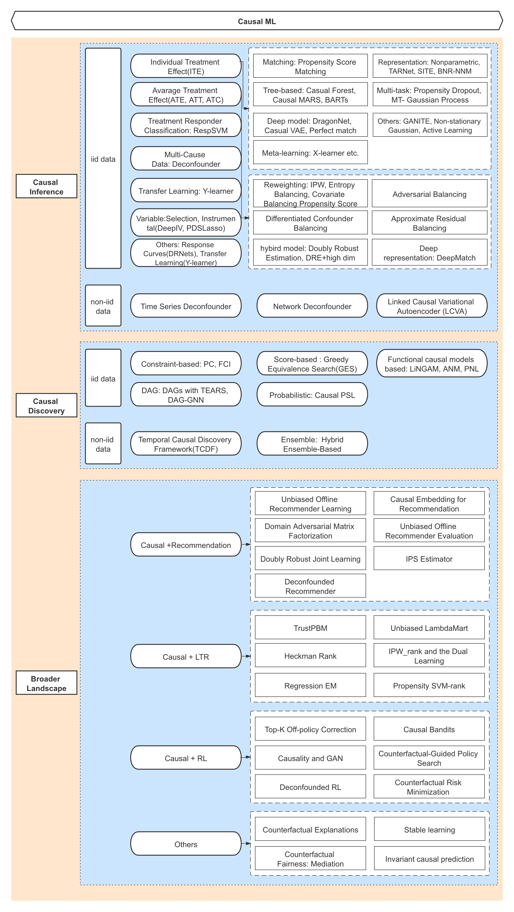

# CausalML

> 从经验出发通过归纳获得知识是常见的途径，然而这样的知识受限于观测，无法产生突破性的成果。当前的机器学习方法倾向于拟合数据，试图完美地学习过去，而不是发现随着时间的推移将持续存在的真实/因果关系。本文首先科普了因果理论的研究方向，科普了一些相关的概念，接着讨论了因果理论和机器学习结合点，最后提出了我们在因果理论上的应用设想。

- 因果理论研究：Causal Inference & Causal Discovery
- 因果和机器学习的结合：Causal RL，Causal LTR，Casual Domain Adaptation，Casual Stable Learning，Mediation等

## Causal inference

Causal inference，预估某行为、因素的影响力或效益，即找到一个衡量变量之间因果关系的参数。根据数据产生途径差异，分为两类：通过有意控制、随机化的实验得到的，能够直接做 causal inference；通过观测数据得到的，后需要额外知道一些先验知识，才能在做 causal inference。适配数据分布差异，解决Selection bias，有很多因果推断的方法：

### Re-weighting Methods

- Propensity score based sample re-weighting：[Labor Market Institutions and the Distribution of Wages](https://www.nber.org/system/files/working_papers/w5093/w5093.pdf)
- [Improving predictive inference under covariate shift by weighting the log-likelihood function](http://scholar.google.com/scholar_url?url=https://citeseerx.ist.psu.edu/viewdoc/download%3Fdoi%3D10.1.1.370.4921%26rep%3Drep1%26type%3Dpdf&hl=zh-CN&sa=X&ei=H7o0YJ7OLPSL6rQPpJaPiAs&scisig=AAGBfm0AG0GfnSfdsiN7zyOaJi2LRBydCQ&nossl=1&oi=scholarr)
- [Robust Importance Weighting for Covariate Shift](https://arxiv.org/pdf/1910.06324.pdf)
- [Reweighting samples under covariate shift using a Wasserstein distance criterion](https://arxiv.org/pdf/2010.09267)

### Stratification Methods

- [Causal inference in statistics, social, and biomedical sciences](http://scholar.google.com/scholar_url?url=http://www.biostat.jhsph.edu/~cfrangak/biostat_causal/syllabus.pdf&hl=zh-CN&sa=X&ei=CcA0YJHYM-eO6rQPiL6fuAo&scisig=AAGBfm0PFnysRIPfSBb95v8Au79yD5VXSg&nossl=1&oi=scholarr)

### Matching Methods

- Distance Matching：
  - [Bias reduction using Mahalanobis metric matching](http://scholar.google.com/scholar_url?url=https://www.jstor.org/stable/2529981&hl=zh-CN&sa=X&ei=bbo0YLjvI8S2ywTe_r_AAg&scisig=AAGBfm3MKmiUhlh24bADfQfOU1WNQAHx3A&nossl=1&oi=scholarr)
  - [Genetic matching for estimating causal effects: A general multivariate matching method for achieving balance in observational studies](https://www.mitpressjournals.org/doi/pdf/10.1162/REST_a_00318)
- PSM
  - [Interval estimation for treatment effects using propensity score matching](http://scholar.google.com/scholar_url?url=https://onlinelibrary.wiley.com/doi/abs/10.1002/sim.2277&hl=zh-CN&sa=X&ei=G7s0YNzhJcS2ywTe_r_AAg&scisig=AAGBfm1mjeBWBZbZPpEWaVxJc-FYzOlcqA&nossl=1&oi=scholarr)
  - [Combining propensity score matching with additional adjustments for prognostic covariates](http://scholar.google.com/scholar_url?url=https://amstat.tandfonline.com/doi/abs/10.1080/01621459.2000.10474233&hl=zh-CN&sa=X&ei=CLs0YP6bPPSL6rQPpJaPiAs&scisig=AAGBfm2HSXq4C4jmeO4mohmNPEymSPFISA&nossl=1&oi=scholarr)
- 更多详见：[(02)-Matching](https://bytedance.feishu.cn/wiki/wikcnMwxEU74S0oGs8FyubH9fuC)

### Tree-based Methods

- [Estimation and Inference of Heterogeneous Treatment Effects using Random Forests](https://arxiv.org/pdf/1510.04342.pdf)
- [Orthogonal Random Forest for Causal Inference](https://arxiv.org/pdf/1806.03467v4.pdf)
- [Modeling heterogeneous treatment effects in survey experiments with Bayesian additive regression trees](http://scholar.google.com/scholar_url?url=https://www.researchgate.net/profile/Donald_Green4/publication/262085259_Modeling_Heterogeneous_Treatment_Effects_in_Survey_Experiments_with_Bayesian_Additive_Regression_Trees/links/56008f9108aeafc8ac8c7728/Modeling-Heterogeneous-Treatment-Effects-in-Survey-Experiments-with-Bayesian-Additive-Regression-Trees.pdf&hl=zh-CN&sa=X&ei=mbs0YKfHDteG6rQP0cetkAs&scisig=AAGBfm1yf_o7P2U4HQAv24HurMdh0Y5z6A&nossl=1&oi=scholarr)
- [Bayesian Regression Tree Models for Causal Inference: Regularization, Confounding, and Heterogeneous Effects](http://scholar.google.com/scholar_url?url=https://projecteuclid.org/download/pdfview_1/euclid.ba/1580461461&hl=zh-CN&sa=X&ei=ibs0YNDuJPSL6rQPpJaPiAs&scisig=AAGBfm1p6x7F81gt5pavh7Ke58aZJbBgHQ&nossl=1&oi=scholarr)

### Representation Learning Methods

- Balanced representation learning: [Estimating individual treatment effect: generalization bounds and algorithms](http://proceedings.mlr.press/v70/shalit17a/shalit17a.pdf)
- Weighted representation learning: [Learning Weighted Representations for Generalization Across Designs](https://arxiv.org/pdf/1802.08598.pdf)
- Domain adaptation + representation learning: [Learning Representations for Counterfactual Inference](http://proceedings.mlr.press/v48/johansson16.pdf)
- 更多详见：[(05)-Representation learning](https://bytedance.feishu.cn/wiki/wikcnNtWHAAtsS1hF5GS5Xtjxwd)

### Multitask learning Methods

- Multi-task Gaussian process: [Bayesian Inference of Individualized Treatment Effects using Multi-task Gaussian Processes](https://arxiv.org/pdf/1704.02801.pdf)
- Multi-task with Propensity-Dropout：[Deep Counterfactual Networks with Propensity-Dropout](http://scholar.google.com/scholar_url?url=https://arxiv.org/pdf/1706.05966&hl=zh-CN&sa=X&ei=Lbc0YP3EKeaKywTEp4b4Cg&scisig=AAGBfm2oZYhSa1R7O34kVVIqk5fTBxOyDg&nossl=1&oi=scholarr)
- 更多详见：[(06)-Multitask learning](https://bytedance.feishu.cn/wiki/wikcn0EVdsoQANYlUHa0DiubD8e)

### Meta-Learning Methods

- S-Learner, T-Learner, X-Learner: [Metalearners for estimating heterogeneous treatment effects using machine learning](https://www.pnas.org/content/pnas/116/10/4156.full.pdf)
- R-Learner: [Quasi-Oracle Estimation of Heterogeneous Treatment Effects](http://scholar.google.com/scholar_url?url=https://arxiv.org/pdf/1712.04912&hl=zh-CN&sa=X&ei=2rY0YKFQ9IvqtA-klo-ICw&scisig=AAGBfm1vQM6QqMq789wZPzCg4WuFtXUSug&nossl=1&oi=scholarr)
- 更多详见：[(04)-Meta learning](https://bytedance.feishu.cn/wiki/wikcnKQoSQAuJIhHENXlBpfeNIe)

## Causal Discovery (Causal Structure Search)

Causal Discovery，从众多观测到/未观测到的变量中找出原因，即给定一组变量，找到他们之间的因果关系。大部分因果发现的方法基于因果图，介绍如下：

### Graphical Models based

- Constraint-based
  - PC：[Causation, Prediction, and Search](https://d1wqtxts1xzle7.cloudfront.net/48264529/Causation_Prediction_and_Search20160823-4240-1h2qhgb.pdf?1471991528=&response-content-disposition=inline%3B+filename%3DCausation_prediction_and_search.pdf&Expires=1614056356&Signature=WaGmyA8x5APWVrducfmUxxpaYlnd6p135LKlS1n4uyHo9kdC9QSFezkFGsZU9XeTTAfWGQ3UnC8NctBPpC9LtNGH~B2vfm4rNAl0P3hRqCGmHsvK3cTq7EAV7GGDltpQnEzT2MoK1Wx6SUFFQ5JiByLRWlTMVCsPPf3HYMAx-1Dl5I~KS6ybaaMbhf4L5U6-yxtKxa3ekghutXdXxX90i0ABIxRZY~61fd9S2n3YgNDIkjn65fU1IpcSpKSvaaQLzGYGBpNaP455cR5T9kKpOoABoAu-QVTLKPhm~SxrWamuQlLyqqjlLUvGfL~flW0inGOIceL2IcYRy4SycaeflQ__&Key-Pair-Id=APKAJLOHF5GGSLRBV4ZA)
  - FCI：[Causation, Prediction, and Search](https://d1wqtxts1xzle7.cloudfront.net/48264529/Causation_Prediction_and_Search20160823-4240-1h2qhgb.pdf?1471991528=&response-content-disposition=inline%3B+filename%3DCausation_prediction_and_search.pdf&Expires=1614056356&Signature=WaGmyA8x5APWVrducfmUxxpaYlnd6p135LKlS1n4uyHo9kdC9QSFezkFGsZU9XeTTAfWGQ3UnC8NctBPpC9LtNGH~B2vfm4rNAl0P3hRqCGmHsvK3cTq7EAV7GGDltpQnEzT2MoK1Wx6SUFFQ5JiByLRWlTMVCsPPf3HYMAx-1Dl5I~KS6ybaaMbhf4L5U6-yxtKxa3ekghutXdXxX90i0ABIxRZY~61fd9S2n3YgNDIkjn65fU1IpcSpKSvaaQLzGYGBpNaP455cR5T9kKpOoABoAu-QVTLKPhm~SxrWamuQlLyqqjlLUvGfL~flW0inGOIceL2IcYRy4SycaeflQ__&Key-Pair-Id=APKAJLOHF5GGSLRBV4ZA)
- Score-based
  - Greedy Equivalence Search(GES)：[Optimal structure identification with greedy search](http://scholar.google.com/scholar_url?url=https://www.jmlr.org/papers/volume3/chickering02b/chickering02b.pdf&hl=zh-CN&sa=X&ei=7n80YK_KAcS2ywTe_r_AAg&scisig=AAGBfm3l3Ym_iXRvrT_Pa6azzL3Yfega6Q&nossl=1&oi=scholarr)
- Functional causal models based
  - Linear, non-Gaussian models：LiNGAM [A linear non- Gaussian acyclic model for causal discovery](http://scholar.google.com/scholar_url?url=https://www.jmlr.org/papers/volume7/shimizu06a/shimizu06a.pdf&hl=zh-CN&sa=X&ei=TIc0YJ6iKdeG6rQP0cetkAs&scisig=AAGBfm3rtlgsrQ54ADHhenfAruoqUwL0lg&nossl=1&oi=scholarr)
  - Non-linear models：non-linear additive noise model (ANM) [Nonlinear causal discovery with additive noise models](http://scholar.google.com/scholar_url?url=https://www.researchgate.net/profile/Joris_Mooij/publication/221619551_Nonlinear_causal_discovery_with_additive_noise_models/links/53d8fcd20cf2631430c38a43.pdf&hl=zh-CN&sa=X&ei=-Ic0YIenIJX0yASbiZCgAQ&scisig=AAGBfm031NSJCdgugzLrWtmlYXPInZSO1g&nossl=1&oi=scholarr) , post-nonlinear causal model(PNL) [On the identifiability of the post-nonlinear causal model](http://scholar.google.com/scholar_url?url=https://arxiv.org/pdf/1205.2599&hl=zh-CN&sa=X&ei=5Yg0YMrKD_SL6rQPpJaPiAs&scisig=AAGBfm1CBxvcfqN4CUqoFPQJpofngr2xDA&nossl=1&oi=scholarr)

### Temporal Causal Discovery Framework

- 因果发现的框架：[Causal Discovery with Attention-Based Convolutional Neural Networks](http://scholar.google.com/scholar_url?url=https://www.mdpi.com/2504-4990/1/1/19/pdf&hl=zh-CN&sa=X&ei=eok0YKvpFsS2ywTe_r_AAg&scisig=AAGBfm0v2QjgoTo60jQwjzBsperExWUWZg&nossl=1&oi=scholarr)
- 更多详见：[(09)-Causal Discovery](https://bytedance.feishu.cn/wiki/wikcn5wAn2xNIvAoF4x2uiCPOUh)

## Causal with other domains

### Causal with Recommendation

- 主要是对推荐数据的bias研究，推荐系统出现的各种偏差让其推荐非预期的 Item。一方面基于因果理论对排序模型进行优化，见LTR部分；另外，结合无偏的排序学习和衰减的点击模型、基于RL的策略梯度算法+off-policy correction 解决数据偏差的方法
- [Causal Embeddings for Recommendation](https://arxiv.org/pdf/1706.07639.pdf)
- [The Deconfounded Recommender: A Causal Inference Approach to Recommendation](https://arxiv.org/pdf/1808.06581.pdf)
- [Doubly Robust Joint Learning for Recommendation on Data Missing Not at Random](http://proceedings.mlr.press/v97/wang19n/wang19n.pdf)
- [Top-K Off-Policy Correction for a REINFORCE Recommender System](https://arxiv.org/pdf/1812.02353.pdf)
- [Recommendations as Treatments: Debiasing Learning and Evaluation](http://proceedings.mlr.press/v48/schnabel16.pdf)
- [Offline Recommender Learning Meets Unsupervised Domain Adaptation](https://arxiv.org/pdf/1910.07295.pdf)

### Causal with LTR

- LTR模型大多是基于用户反馈数据训练模型，这些数据大部分是隐式的，例如用户的点击、浏览、收藏、评论等，但这些数据存在许多偏差bias，如position bias和selection bias，基于因果理论，提出了Heckman rank，Propensity SVM rank，TrustPBM等做法
- [Unbiased Learning-to-Rank with Biased Feedback](http://scholar.google.com/scholar_url?url=https://arxiv.org/pdf/1608.04468&hl=zh-CN&sa=X&ei=_4w0YIfzCsS2ywTe_r_AAg&scisig=AAGBfm21ZJ7nhkkLbm3aLFLirsMYjf-3Rg&nossl=1&oi=scholarr)
- [Unbiased Learning to Rank with Unbiased Propensity Estimation](http://scholar.google.com/scholar_url?url=https://arxiv.org/pdf/1804.05938&hl=zh-CN&sa=X&ei=DY00YJLtD5X0yASbiZCgAQ&scisig=AAGBfm0g0couG60KIvSbEsFGtFGI2oMKVg&nossl=1&oi=scholarr)
- [Addressing Trust Bias for Unbiased Learning-to-Rank](http://scholar.google.com/scholar_url?url=https://research.google/pubs/pub47859.pdf&hl=zh-CN&sa=X&ei=Go00YJuFDeaKywTEp4b4Cg&scisig=AAGBfm3-dNBebqrEvtYAeP1mCpr84upfIg&nossl=1&oi=scholarr)
- [Correcting for Selection Bias in Learning-to-rank Systems](http://scholar.google.com/scholar_url?url=https://arxiv.org/pdf/2001.11358&hl=zh-CN&sa=X&ei=Jo00YKCOJueO6rQPiL6fuAo&scisig=AAGBfm1J7hl9L2L3_EYS8KB_dC-tdd_uFQ&nossl=1&oi=scholarr)

### Causal with RL

- 因果和RL在很多方面有相似性，两者结合的方法通常有以下几种：去除强化学习算法里的混杂效应，在强化学习中应用反事实框架，因果表示学习，使用强化学习的方法进行因果发现
- [Deconfounding Reinforcement Learning in Observational Settings](https://arxiv.org/pdf/1812.10576.pdf)
- [Woulda, Coulda, Shoulda: Counterfactually-Guided Policy Search](https://arxiv.org/pdf/1811.06272.pdf)
- [Discovering and Removing Exogenous State Variables and Rewards for Reinforcement Learning](http://proceedings.mlr.press/v80/dietterich18a/dietterich18a.pdf)
- [Structural Nested Models and G-estimation: The Partially Realized Promise](https://arxiv.org/pdf/1503.01589.pdf)
- [CausalGAN: Learning Causal Implicit Generative Models with Adversarial Training](https://arxiv.org/pdf/1709.02023.pdf)

## Other related

### Causal Model Framework

- 因果模型的框架，包括Neyman-Rubin RCM、SCM和Po-calculus
- [The Neyman-Rubin Model of Causal Inference and Estimation Via Matching Methods](https://www.researchgate.net/publication/255476843_The_Neyman-Rubin_Model_of_Causal_Inference_and_Estimation_Via_Matching_Methods)
- [From Ordinary Differential Equations to Structural Causal Models- the deterministic case](https://arxiv.org/pdf/1408.2063)
- [A Potential Outcomes Calculus for Identifying Conditional Path-Specific Effects](http://scholar.google.com/scholar_url?url=http://proceedings.mlr.press/v89/malinsky19b/malinsky19b.pdf&hl=zh-CN&sa=X&ei=EZo0YJGsKYi8ywS89I9w&scisig=AAGBfm3ZXMbTq-l7GI1TwUZZUZpKLttuGA&nossl=1&oi=scholarr)

### Causal with Domain adaptation

- 领域自适应关注算法在测试集上的表现，经常对测试分布如何变化做出了一些假定，例如目标偏移，条件偏移和广义目标偏移。通过学习分布变化性的图表示并将领域适应视为推理问题，进行域适应或迁移学习。
- [Domain adaptation under target and conditional shift](http://scholar.google.com/scholar_url?url=http://proceedings.mlr.press/v28/zhang13d.pdf&hl=zh-CN&sa=X&ei=LLw0YLylEI6WywTFrZKoDQ&scisig=AAGBfm3AxB_dXLiQirC1JVUdG2rZ3GuEyA&nossl=1&oi=scholarr)
- [Few-shot Domain Adaptation by Causal Mechanism Transfer](http://scholar.google.com/scholar_url?url=http://proceedings.mlr.press/v119/teshima20a/teshima20a.pdf&hl=zh-CN&sa=X&ei=O7w0YIHwH4i8ywS89I9w&scisig=AAGBfm0glT5OjEO3IRxlxMH5tvv1tryDRQ&nossl=1&oi=scholarr)
- [Domain adaptation with conditional transferable components](http://scholar.google.com/scholar_url?url=http://proceedings.mlr.press/v48/gong16.pdf&hl=zh-CN&sa=X&ei=Wbw0YOSHBI-UywS72IWQAQ&scisig=AAGBfm0_VdA3bW5NsrWzwqVVtaVwTB6RQA&nossl=1&oi=scholarr)
- [Domain Adaptation by Using Causal Inference to Predict Invariant Conditional Distributions](https://arxiv.org/pdf/1707.06422.pdf)
- [Domain adaptation under structural causal models](https://arxiv.org/pdf/2010.15764.pdf)
- [Domain adaptation as a problem of inference on graphical models](https://arxiv.org/pdf/2002.03278)

### Causal with Time Series

- 假设因果关系是线性的且噪声是非高斯分布的，研究从subsampled data 和混杂时间序列中发现的因果关系
- [Time Series Deconfounder: Estimating Treatment Effects over Time in the Presence of Hidden Confounders](https://arxiv.org/pdf/1902.00450.pdf)
- [Forecasting Treatment Responses Over Time Using Recurrent Marginal Structural Networks](http://medianetlab.ee.ucla.edu/papers/nips_rmsn.pdf)

### Causal Stable Learning

- 面对不同数据（OOD），学习有泛化能力的模型。如何学习稳健的预测模型，有以下几类方法：基于结构因果模型的方法（Structural causal model based methods）、基于分布鲁棒优化的方法（Distributionally robust optimization based methods）、基于样本加权的方法（Sample re-weighting based methods）
- [Causal inference using invariant prediction- identification and confidence intervals](https://arxiv.org/pdf/1501.01332)
- [Invariant Causal Prediction for Sequential Data](https://arxiv.org/pdf/1706.08058)
- [Learning Models with Uniform Performance via Distributionally Robust Optimization](http://arxiv.org/abs/1810.08750)
- [Causally regularized learning with agnostic data selection bias](https://doi.org/10.1145/3240508.3240577)
- [Stable Learning via Sample Reweighting](http://scholar.google.com/scholar_url?url=https://ojs.aaai.org/index.php/AAAI/article/download/6024/5880&hl=zh-CN&sa=X&ei=9pw0YL68BdeG6rQP0cetkAs&scisig=AAGBfm14mWxZvV9dxZHCXiFxxJAzBqfE5A&nossl=1&oi=scholarr)
- [Stable Prediction with Model Misspecification and Agnostic Distribution Shift](https://ojs.aaai.org/index.php/AAAI/article/view/5876/5732)
- [Stable Prediction via Leveraging Seed Variable](https://arxiv.org/pdf/2006.05076)
- [Stable prediction across unknown environments](https://arxiv.org/pdf/1806.06270.pdf)
- [Latent Causal Invariant Model](https://arxiv.org/pdf/2011.02203)

### Mediation

- 中介分析理论，和公平性、归因等问题相关，通过基于因果分析的改进来去除已知的伪相关，提取其直接因果效应，降低模型给出不公平决策的可能性
- [An interventionist approach to mediation analysis](https://arxiv.org/pdf/2008.06019.pdf)
- [On semiparametric estimation of a path-specific effect in the presence of mediator-outcome confounding](https://arxiv.org/pdf/1710.02011.pdf)

## Applications & Resources

> 广泛应用于在线广告、营销、推荐、医疗、教育等， 有一些公司提供了开源工具

- FB：
  - **推荐**： [Observational Data for Heterogeneous Treatment Effects with Application to Recommender Systems](https://papers.ssrn.com/sol3/papers.cfm?abstract_id=3190359)
- Hulu：
  - **广告优化**： [Doubly Robust Estimation of Causal Effects](https://academic.oup.com/aje/article/173/7/761/103691?login=true)
  - **用户/广告体验分析：**[Causal Inference at hulu](https://allentran.github.io/static/causal-inference-hulu.pdf)
- Uber：
  - 用户体验：
    - [Mediation Modeling at Uber: Understanding Why Product Changes Work (and Don’t Work)](https://eng.uber.com/mediation-modeling/)
    - [Using Causal Inference to Improve the Uber User Experience](https://eng.uber.com/causal-inference-at-uber/)
  - **工具**： [CausalML: Python Package for Causal Machine Learning](https://arxiv.org/pdf/2002.11631v2.pdf)
- 阿里：
  - **搜索广告： [Estimating Individual Advertising Effect in E-Commerce](https://arxiv.org/abs/1903.04149)**
  - 营销：
    - [阿里文娱智能营销增益模型 (Uplift Model) 技术实践](https://www.6aiq.com/article/1585121131929)
    - [因果推断在阿里文娱用户增长中的应用](https://www.infoq.cn/article/TdLIhY4MPB5om9379eMc)
- 腾讯：
  - **广告价值度量：** [Uplift⼴告增效衡量⽅案](https://qzonestyle.gtimg.cn/open_proj/gdt_gw/cms/uploads/Uplift20190524.pdf)
- 京东：
  - **MTA/DDA：** [Causally Driven Incremental Multi Touch Attribution Using a Recurrent Neural Network](https://arxiv.org/pdf/1902.00215.pdf)
- EBay：
  - **MTA/DDA:** [Interpretable Deep Learning Model for Online Multi-touch Attribution](https://arxiv.org/abs/2004.00384)
- 贝壳：
  - **营销：** [Uplift-Model 在贝壳业务场景中的实践](https://www.infoq.cn/article/fawupa6cs3ys8iuaiqsl)
- Wayfair：
  - **广告优化：** [Uplift modeling in Display Remarketing](https://tech.wayfair.com/data-science/2018/05/uplift-modeling-in-display-remarketing/)
  - **工具：**[Pylift: A Fast Python Package for Uplift Modeling](https://tech.wayfair.com/data-science/2018/10/pylift-a-fast-python-package-for-uplift-modeling/)
- Criteo：
  - **推荐：** [Causal Embeddings for Recommendation](https://arxiv.org/pdf/1706.07639.pdf)
- Linkedin:
  - **商业活动价值验证：** The Importance of Being Causal
  - [Causal inference from observational data: Estimating the effect of contributions on visitation frequency at LinkedIn](https://arxiv.org/pdf/1903.07755.pdf)
- 微软：
  - **搜索广告**：[Causal Inference in the Presence of Interference in Sponsored Search Advertising](https://arxiv.org/pdf/2010.07458.pdf)
  - 工具：
    - DoWhy:An End-to-End Library for Causal Inference
    - [EconML](https://www.microsoft.com/en-us/research/project/econml/)
- Huawei:
  - **广告优化：**[Improving Ad Click Prediction by Considering Non-displayed Events](https://dl.acm.org/doi/10.1145/3357384.3358058)
  - **推荐场景反事实预估：**http://csse.szu.edu.cn/staff/panwk/publications/Conference-SIGIR-20-KDCRec.pdf
- **DeepMind**： Algorithms for Causal Reasoning in Probability Trees