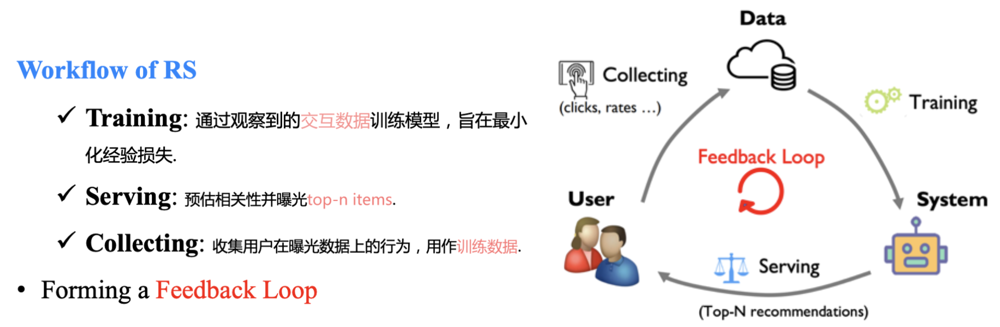
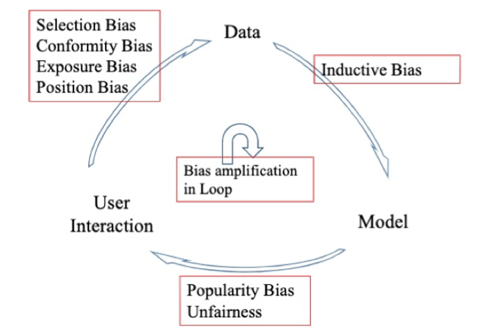

# Debias

## 背景

## Bias

Bias原因：

- 既是预测更是控制；既是球员又是裁判。
- 数据是观测数据不是无偏数据(missing-not-at-random,MNAR)
- FeedBack Loop

Bias危害：

- 信息茧房
- 学习到伪相关性 -> 用户兴趣有偏，不可解释等

### 用户→数据

- 选择偏差(Selection Bias)：用户选择评价的对像是有偏差的，通常倾向于给自己喜欢或者不喜欢以及非常好或非常不好的对象，表现在显示反馈中。
- 从众偏差(Conformity bias)：用户打分的分数倾向于和群体观点保持一致，表现在显示反馈中。
- 曝光偏差(Exposure Bias)：模型的训练数据都是曝光过的，未曝光的数据无法确定其标签，表现在显示和隐式反馈中。
- 位置偏差(Position Bias)：基于对推荐系统的信任，用户通常偏向选择位置靠前的item，而不考虑这些项目的实际相关性，因此发生交互的项目可能并不是高度和兴趣相关的，表现在隐式反馈中。

### 数据→模型

- 归纳偏差(inductive bias)：对模型的各种假设，用于提升泛化性，通常是有利的，例如我们常用的奥卡姆剃刀原理、CNN的局部性假设、RNN的时间依赖假设、注意力机制假设等等。

### 模型→用户

- 热度偏差(popularity bias)：热门的物品获得了比预期更高的热度，长尾物品得不到足够曝光、马太效应严重。
- 不公平性(Unfairness)：因数据不均匀导致对某些群体的推荐结果有偏，如种族歧歧视、性别歧视等。