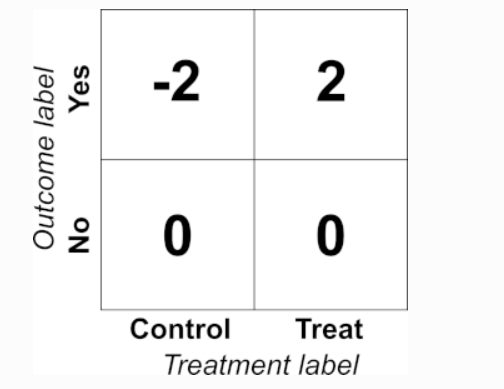
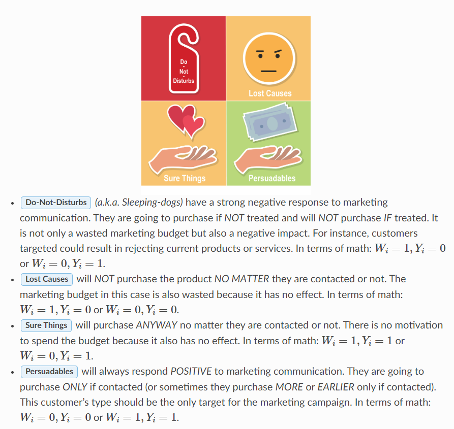

# Uplift 离线评估

## Variable Declaration

假设我们有一个数据集 $D=\left(Y_i^{o b s}, W_i, score_i\right).$  其中 $W$ 是用户所属组的标识，假如 $W_i=1$, 则这个人体在实验组；假如 $W_i=0$, 则这个人体在空白（对照）组。 $Y_i^{o b s}$ 是观测到的这个人的响应信号，比如在吃药和不吃药的问题中，响应信号可以是一周后病是否㾏愈。对于各类曲线评估指标的图像画图，需要数据集中每一项按照 uplift 得分（也就是 $score_i$ ）降序排列。也就是高 score 值的得分排在前面。这样定义排在前百分比 $\phi$ 的个体中，Treatment 组（$W_i=1$）的个体（共 $n_t$ ）中达到目标效应（$Y_i^{o b s}=1$）的个数记为 $n_{t,1}$ ,  Control组（$W_i=0$）的个体（共 $n_c$ ）中达到目标效应（$Y_i^{o b s}=1$）的个数记为 $n_{c,1}$ 。在集合 $D$ 中所有 Treatment 组个体个数为 $N_t$，所有Control组个体个数为 $N_c$。

## The Transformed Outcom

Our package by default implements the Transformed Outcome (Athey 2016) method, defined as:
$$
Y^*=Y \frac{W-p}{p(1-p)}
$$
where $Y^*$ is the Transformed Outcome, $Y$ is the outcome (1 or 0 ), $W$ indicates the presence of a treatment (1 or 0 ), and $p=P(W=1)$ (the treatment policy). When $p=0.5$, this amounts to labelling (treatment, outcome) pairs as follows:

The beauty of this transformation is that, in expectation,
$$
E\left[Y^*\right]=P(Y \mid W=1)-P(Y \mid W=0),
$$
or uplift. Any algorithm trained to predict $Y^*$, then, gives a prediction of uplift.

## Evaluation

### Cumulative Uplift Curve

对于累计 Uplift 曲线：纵坐标的值计算公式如下：
$$
\text { Uplift curve }(\phi)=\frac{n_{t, y=1}(\phi)}{n_{t}(\phi)}-\frac{n_{c, y=1}(\phi)}{n_{c}(\phi)}
$$

- 在`pylift`包中一般用`cuplift`标识，`uplift`标识和此计算方式一致，只是不是从0开始累积的，而是在每个bin中去计算平均值。在`scikit-uplift`包中对应 [sklift.metrics.uplift_curve](https://www.uplift-modeling.com/en/latest/api/metrics/uplift_curve.html)。

- 该曲线下方的面积就是常见的评估指标 **AUUC** ，在`scikit-uplift`包中对应 [sklift.metrics.uplift_auc_score](https://www.uplift-modeling.com/en/latest/api/metrics/uplift_auc_score.html)。

- 对于前 k 个个体计算出的Uplfit值记为`uplift@k`， 在`scikit-uplift`包中对应 [sklift.metrics.uplift_at_k](https://www.uplift-modeling.com/en/latest/api/metrics/uplift_at_k.html)。
- 加权平均 Uplift：它是百分位数的平均提升。权重是Treatment组的百分位大小，在`scikit-uplift`包中对应 [sklift.metrics.weighted_average_uplift](https://www.uplift-modeling.com/en/latest/api/metrics/weighted_average_uplift.html)。

---

Uplift Curve深度解读：

将前百分比 $\phi$ 的个体对应到第 $k$ 个个体上，前 $k$ 个个体计算的得到的 Uplift 值的物理意义：前 $k$ 个个体中**实验组产生的平均价值与对照组产生平均价值的差值。**

- 如果 uplift 预估值是完全随机数，那么每个分桶里面观察到的 uplift 结果应该都是相同的，所以 uplift curve 就是一条直线； 
- 如果 uplit 预估值非常准，也就是说横坐标上面的人群排序：最左侧是 **persuadables**，最右侧是 **sleeping dogs**，中间是 **sure thing 和 lost causes**；那么完美的 uplift curve 形状就是： 
  - 刚开始就会达到最高点，在有限的 persuadables 上面就可以拿到全部的 uplift； 
  - 中间持平，因为 sure thing 和 lost causes 不会带来任何 uplift； 
  - 最后会下降，因为 sleeping dogs 看到广告之后，反而不转化了； 

### Qini Curve

对于Qini曲线，纵坐标的值计算公式如下：
$$
\text { Qini curve }(\phi)=\frac{n_{t, y=1}(\phi)}{N_t}-\frac{n_{c, y=1}(\phi)}{N_c}
$$

- 在`pylift`包中一般用`qini`标识，在`scikit-uplift`包中对应 [sklift.metrics.qini_curve](https://www.uplift-modeling.com/en/latest/api/metrics/qini_curve.html)。

To evaluate $Q$, we predict the uplift for each row in our dataset. We then order the dataset from highest uplift to lowest uplift and evaluate the Qini curve as a function of the population targeted. The area between this curve and the $\mathrm{x}$-axis can be approximated by a Riemann sum on the $M$ data points:
$$
\text { Qini Curve Area }=\sum_{i=0}^{M-1} \frac{1}{2}\left(\text { Qini curve }\left(\phi_{i+1}\right)+\text { Qini curve }\left(\phi_i\right)\right)\left(\phi_{i+1}-\phi_i\right)
$$
where
$$
\phi_i=i / M
$$
and so
$$
\text { Qini Curve Area} =\sum_{i=0}^{M-1} \frac{1}{2}\left(\frac{n_{t, y=1}\left(\phi_{i+1}\right)-n_{t, y=1}\left(\phi_i\right)}{N_t}-\frac{n_{c, y=1}\left(\phi_{i+1}\right)-n_{c, y=1}\left(\phi_i\right)}{N_c}\right) \frac{1}{M}
$$
We then need to subtract off the randomized curve area which is given by:
$$
\text { Randomized Qini Area }=\frac{1}{2}\left(\frac{N_{t, y=1}}{N_t}-\frac{N_{c, y=1}}{N_c}\right)
$$
and so the Qini coefficient is:
$$
Q=\text { Qini Curve Area }-\text { Randomized Qini Area }
$$

- 在`scikit-uplift`包中对应 [sklift.metrics.qini_auc_score](https://www.uplift-modeling.com/en/latest/api/metrics/qini_auc_score.html)。

### Adjusted Qini curve

对于Adjusted Qini曲线，纵坐标的值计算公式如下：
$$
\operatorname{Adjusted} \operatorname{Qini}(\phi)=\frac{n_{t, 1}(\phi)}{N_t}-\frac{n_{c, 1}(\phi) n_t(\phi)}{n_c(\phi) N_t}
$$

- 在`pylift`包中一般用`aqini`标识。

### Cumulative Gains Curve

对于Cumulative Gains曲线，纵坐标的值计算公式如下：
$$
\text { Cumulative gain }(\phi)=\left(\frac{n_{t, 1}(\phi)}{n_t(\phi)}-\frac{n_{c, 1}(\phi)}{n_c(\phi)}\right)\left(n_t(\phi)+n_c(\phi)\right)
$$

- 在`pylift`包中一般用`cgains`标识。

### Balance Curve

每个bin内Treatment组大小与总组大小的比率：
$$
\operatorname{Balance}(\phi)=\frac{n_t(\phi)}{n_t(\phi)+n_c(\phi)}
$$

- 在`pylift`包中一般用`balance`标识。在`scikit-uplift`包中对应 [sklift.metrics.treatment_balance_curve](https://www.uplift-modeling.com/en/latest/api/metrics/treatment_balance_curve.html)。

---

### Precision in Estimation of Heterogeneous Effect (PEHE)

Ref: [Bayesian nonparametric modeling for causal inference](https://www.tandfonline.com/doi/pdf/10.1198/jcgs.2010.08162)
$$
PEHE =\frac{1}{N} \sum_{i=1}^N\left(\left(y_{i 1}-y_{i 0}\right)-\left(\hat{y}_{i 1}-\hat{y}_{i 0}\right)\right)^2
$$
where $y_1, y_0$ correspond to the true outcomes under $t=1$ and $t=0$, respectively, and $\hat{y}_1, \hat{y}_0$ correspond to the outcomes estimated by our model. 

## Reference

- [sklift.metrics — scikit-uplift 0.5.1 documentation (uplift-modeling.com)](https://www.uplift-modeling.com/en/latest/api/metrics/index.html)
- [Usage: evaluation — pylift 0.1.3 documentation](https://pylift.readthedocs.io/en/latest/evaluation.html)
- [弹性模型的评测指标AUUC - 知乎 (zhihu.com)](https://zhuanlan.zhihu.com/p/457689388)
- [增益模型（Uplift Model）的基础介绍 —— 估算ITE - 知乎 (zhihu.com)](https://zhuanlan.zhihu.com/p/425898510)
