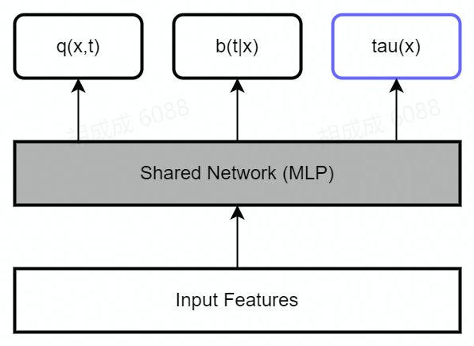
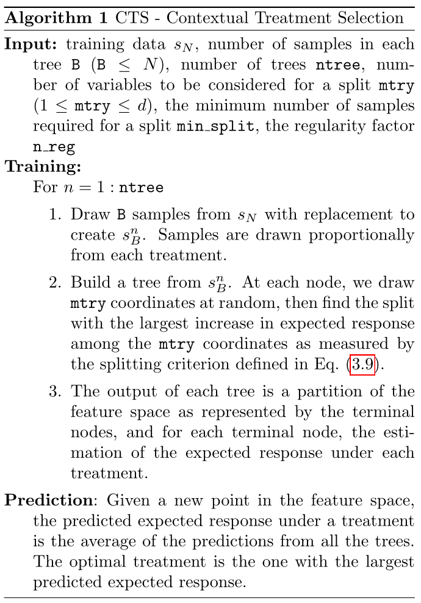

# Papers Reading

## Notations

我们假设观测到的数据为$$\{(X_i, T_i, Y_i) \stackrel{i.i.d.}{\sim} (X,T,Y), i=1, 2, \cdots, n\} $$，其中$$X_i $$表示特征，$$T_i $$一般是离散的treatment，学术界考虑较多的都是binary treatment，i.e. $$T_i=0/1 $$，为了通用性，我们假设$$T_i\in \{0,1,\cdots, k\} $$，$$Y_i $$表示一个scalar的response，常见指标为投放：是否点击/转化，激励：成本/收入/时长等。数据满足因果建模的三个条件。

- 用户$$x $$在干预$$t $$下的期望价值为：$$q(x,t) = E[Y|X=x, T=t] $$

- 用户$$x $$被分配到干预$$t $$的概率为：$$b(t|x) = P(T=t|X=x) $$

> 这个概率在causal文章里面一般被称为propensity score/vector，在bandits/rl文章里面被称为behavior policy，表示我们收集数据时所采用的策略。对于完全随机实验，$$b(t|x) = \frac{1}{k+1} $$。

## Meta Learner Algorithms

✔ [1] Künzel S R, Sekhon J S, Bickel P J, et al. [Metalearners for estimating heterogeneous treatment effects using machine learning](https://www.pnas.org/doi/epdf/10.1073/pnas.1804597116)[J]. Proceedings of the national academy of sciences, 2019, 116(10): 4156-4165.

- S-learner 
- T-learner
- X-learner

> 文章提出X-learner，并回顾了S-Learner和T-learner，实验仿真对比了三种方法的优劣。

✔ [2] Nie X, Wager S. [Quasi-oracle estimation of heterogeneous treatment effects](https://arxiv.org/pdf/1712.04912.pdf)[J]. Biometrika, 2021, 108(2): 299-319.

- R-learner

> 文章提出R-learner，针对该方法做了很多实验与尝试，并通过严密的数学推理证明一系列定理。

Code Example: [meta_learners_with_synthetic_data.ipynb](./Tools/causalml/meta_learners_with_synthetic_data.ipynb) | [meta_learners_with_synthetic_data_multiple_treatment.ipynb](./Tools/causalml/meta_learners_with_synthetic_data_multiple_treatment.ipynb)

---

✔ [3] Bang H, Robins J M. [Doubly robust estimation in missing data and causal inference models](https://www.math.mcgill.ca/dstephens/PSMMA/Articles/bang_robins_2005.pdf)[J]. Biometrics, 2005, 61(4): 962-973.

- Doubly Robust (DR) learner 

> 文章提出的DRL本质上是一种去偏方法
>
> 更多参考：
>
> - [因果推断笔记——DR ：Doubly Robust学习笔记（二十）_悟乙己的博客-CSDN博客](https://blog.csdn.net/sinat_26917383/article/details/122044767)
> - ⭐ [Doubly Robust Learning](https://econml.azurewebsites.net/spec/estimation/dr.html)

> - Response loss:
>
> $$\ell_1 = \frac{1}{n}\sum_{i=1}^n\ell(Y_i, q(X_i,T_i)) $$，$$\ell_2 = \frac{1}{n}\sum_{i=1}^n \log\{b(T_i|X_i)\} $$
>
> - IPW loss:
>
> $$\ell_{ipw} = \frac{1}{n}\sum_{i=1}^n\sum_{t=1}^k\left[{\color{red} \left\{ \frac{{\bf 1}(T_i=t)}{b(t|X_i)}-\frac{{\bf 1}(T_i=0)}{b(0|X_i)}\right\} Y_i } - \tau_t(X_i)\right]^2 $$ <- loss of transformation model
>
> - AIPW loss:
>
> $$\tilde{q}(X_i,t) = q(X_i,t) + \frac{{\bf1}(T_i=t)}{b(t|X_i)}[Y_i - q(X_i, t)] $$
>
> $$\ell_{aipw} = \frac{1}{n}\sum_{i=1}^n\sum_{t=1}^k\left[\tilde{q}(X_i,t) - \tilde{q}(X_i,0) - \tau_t(X_i)\right]^2 $$
>
> $$\ell_3 = \ell_{ipw}, \ell_{aipw} $$
>
> - $$\ell = \omega_1 \ell_1 + \omega_2 \ell_2 + \omega_3\ell_3 $$
>
> - 这里还可以再加一个loss：$$\ell(Y_i,\tilde{q}(X_i,T_i)) $$
>
> > 1. 由于$$b(\cdot|x) $$在分母，对于极端的观测数据，有可能表现不稳定
> >
> > 2. 对于binary response，可以限制$$\tau_t(\cdot)\in (-1,1) $$
> >
> > 3. 不能保range
>

Code Example: [Here](https://github.com/atrothman/Doubly_Robust_Estimation/blob/main/Doubly%20Robust%20Estimation.ipynb) | [dr_learner_with_synthetic_data.ipynb](./Tools/causalml/dr_learner_with_synthetic_data.ipynb)

---

✔ [4] Van Der Laan M J, [Rubin D. Targeted maximum likelihood learning](https://www.degruyter.com/document/doi/10.2202/1557-4679.1043/html)[J]. The international journal of biostatistics, 2006, 2(1).

- TMLE learner 

> 更多参考：
>
> - [TMLE方法｜Targeted Learning学习笔记（四） - 知乎 (zhihu.com)](https://zhuanlan.zhihu.com/p/411702805)
> - [Targeted Maximum Likelihood Estimation_clear-mind的博客-CSDN博客](https://blog.csdn.net/QAQchichong/article/details/117376993)
> - [KHstats - An Illustrated Guide to TMLE, Part I: Introduction and Motivation](https://www.khstats.com/blog/tmle/tutorial)

Code Example: [validation_with_tmle.ipynb](./Tools/causalml/validation_with_tmle.ipynb)

## Tree-based Algorithms

✔ [5] Radcliffe, Nicholas J., and Patrick D. Surry. "[Real-world uplift modelling with significance-based uplift trees](https://www.stochasticsolutions.com/pdf/sig-based-up-trees.pdf)." White Paper TR-2011-1, Stochastic Solutions (2011): 1-33.

- Uplift tree/random forests on KL divergence, Euclidean Distance, and Chi-Square 

> 倾向模型【propensity modelling】分类：
>
> - 渗透（或相似）模型【penetration (or lookalike) models】，旨在描述已经购买产品的客户。他们的使用是基于这样的假设，即与已经购买的人具有相似特征的人将成为良好的目标，这一假设在远未饱和的市场中往往具有最大的有效性；
> - 购买模型【purchase models】，旨在描述在最近历史时期购买过的客户。这些模型类似于渗透模型，但将注意力局限于最近的过去。因此，他们可以对整个产品购买周期中客户特征的变化更加敏感，从早期采用者到主流多数，再到落后者；
> - “响应”模型【response models】，旨在描述对某些（直接）营销活动（如直接邮件）作出明显“响应”的客户。有时，“响应者”的识别涉及优惠券或响应代码（“直接归因”），而在其他情况下，它只是基于客户在某个有限的时间窗口内收到通信和购买的组合（“直接归属”）响应模型通常被认为比渗透模型和购买模型更复杂，因为它们至少试图将购买结果与旨在刺激该活动的营销活动联系起来。

> 今天大多数有针对性的营销活动，即使是以增量影响为基础来衡量，也是以非增量模型为基础的。
>
> 文章提出了一种基于Significance-Based分裂二叉树的准则，具体看论文6.2节。

✔ [6] Zhao, Yan, Xiao Fang, and David Simchi-Levi. "[Uplift modeling with multiple treatments and general response types."](https://epubs.siam.org/doi/pdf/10.1137/1.9781611974973.66) Proceedings of the 2017 SIAM International Conference on Data Mining. Society for Industrial and Applied Mathematics, 2017.

- Uplift tree/random forests on Contextual Treatment Selection

Code Example: [uplift_trees_with_synthetic_data.ipynb](./Tools/causalml/uplift_trees_with_synthetic_data.ipynb) | [uplift_tree_visualization.ipynb](./Tools/causalml/uplift_tree_visualization.ipynb)

---

✔ [7] Athey, Susan, and Guido Imbens. "[Recursive partitioning for heterogeneous causal effects.](https://www.pnas.org/doi/epdf/10.1073/pnas.1510489113)" Proceedings of the National Academy of Sciences 113.27 (2016): 7353-7360.

- Causal Tree

> Causal Tree的cost function适用于outcome是连续值的场景。当outcome是离散值时，需要进行对 Variance penalty，Honest approach进行一些细节化的处理，最为重要的是计算Treatment和Outcome的分布距离计算方式。
>
> 更多参考：
>
> - [因果推断--Causal Tree - 知乎 (zhihu.com)](https://zhuanlan.zhihu.com/p/452830458)
> - [因果推断-Uplift Model：Causal Tree_JeffffWang的博客-CSDN博客](https://blog.csdn.net/JeffffWang/article/details/125990500)

Code Example: [causal_trees_with_synthetic_data.ipynb](./Tools/causalml/causal_trees_with_synthetic_data.ipynb) | [causal_trees_interpretation.ipynb](./Tools/causalml/causal_trees_interpretation.ipynb)

## Instrumental variables Algorithms

- 2-Stage Least Squares (2SLS)

[8] Kennedy, Edward H. "[Optimal doubly robust estimation of heterogeneous causal effects.](https://arxiv.org/pdf/2004.14497)" arXiv preprint arXiv:2004.14497 (2020).

- Doubly Robust (DR) IV 

## **Neural-network-based Algorithms**

[9] Louizos, Christos, et al. "[Causal effect inference with deep latent-variable models](https://proceedings.neurips.cc/paper/2017/file/94b5bde6de888ddf9cde6748ad2523d1-Paper.pdf)." arXiv preprint arXiv:1705.08821 (2017).

- CEVAE

[10] Shi, Claudia, David M. Blei, and Victor Veitch. "[Adapting neural networks for the estimation of treatment effects.](https://proceedings.neurips.cc/paper/2019/file/8fb5f8be2aa9d6c64a04e3ab9f63feee-Paper.pdf)" 33rd Conference on Neural Information Processing Systems (NeurIPS 2019), 2019.

- DragonNet 

