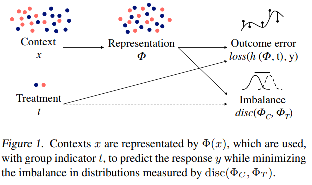
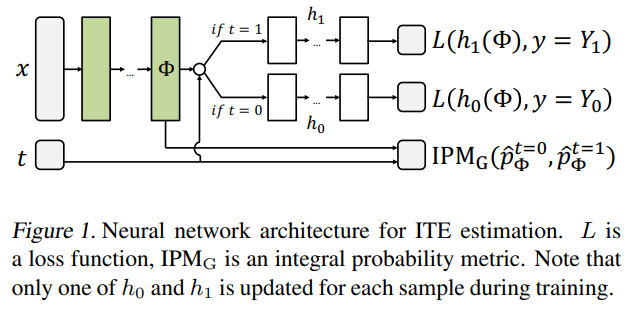
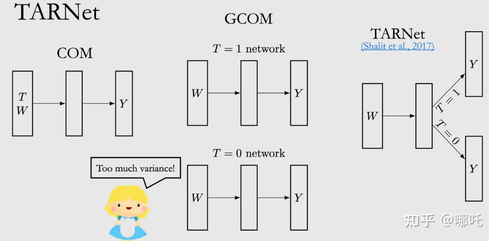
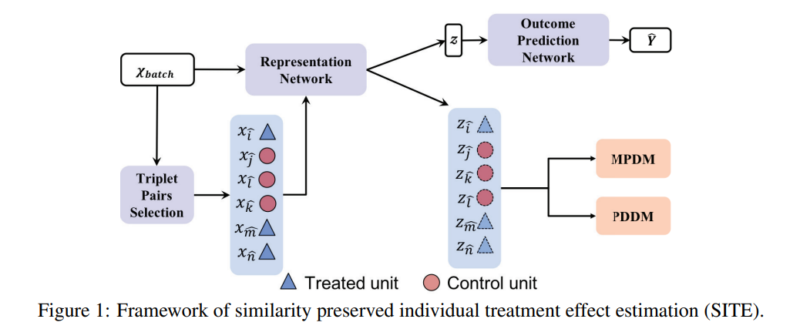
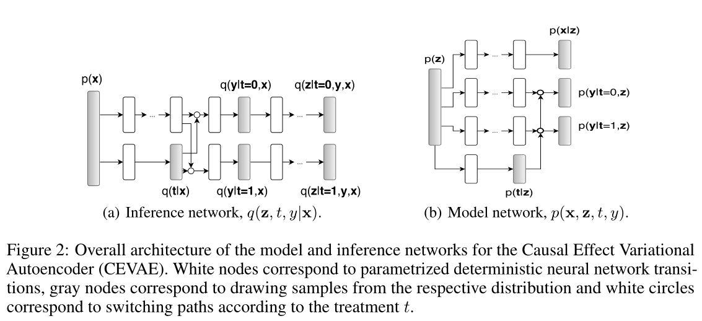
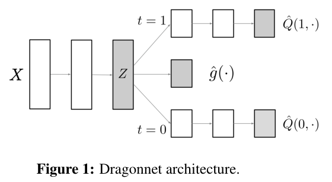
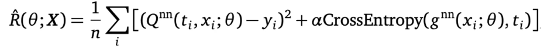

# Uplift Papers Reading

## Notations

我们假设观测到的数据为$$\{(X_i, T_i, Y_i) \stackrel{i.i.d.}{\sim} (X,T,Y), i=1, 2, \cdots, n\} $$，其中$$X_i $$表示特征，$$T_i $$一般是离散的treatment，学术界考虑较多的都是binary treatment，i.e. $$T_i=0/1 $$，为了通用性，我们假设$$T_i\in \{0,1,\cdots, k\} $$，$$Y_i $$表示一个scalar的response，常见指标为投放：是否点击/转化，激励：成本/收入/时长等。数据满足因果建模的三个条件。

- 用户$$x $$在干预$$t $$下的期望价值为：$$q(x,t) = E[Y|X=x, T=t] $$

- 用户$$x $$被分配到干预$$t $$的概率为：$$b(t|x) = P(T=t|X=x) $$

> 这个概率在causal文章里面一般被称为propensity score/vector，在bandits/rl文章里面被称为behavior policy，表示我们收集数据时所采用的策略。对于完全随机实验，$$b(t|x) = \frac{1}{k+1} $$。

注：'*'标论文为[Causal ML](https://causalml.readthedocs.io/en/latest/index.html)包中的方法对应的论文


## Meta Learner Algorithms

更多参考：⭐[Meta-Learners](https://econml.azurewebsites.net/spec/estimation/metalearners.html)

✔ *Künzel S R, Sekhon J S, Bickel P J, et al. [Metalearners for estimating heterogeneous treatment effects using machine learning](https://www.pnas.org/doi/epdf/10.1073/pnas.1804597116)[J]. Proceedings of the national academy of sciences, 2019, 116(10): 4156-4165.

- **S-learner** 
- **T-learner**
- **X-learner**

> 文章提出X-learner，并回顾了S-Learner和T-learner，实验仿真对比了三种方法的优劣。

✔ *Nie X, Wager S. [Quasi-oracle estimation of heterogeneous treatment effects](https://arxiv.org/pdf/1712.04912.pdf)[J]. Biometrika, 2021, 108(2): 299-319.

- **R-learner**

> 文章提出R-learner，针对该方法做了很多实验与尝试，并通过严密的数学推理证明一系列定理。

Code Example: [meta_learners_with_synthetic_data.ipynb](./Tools/causalml/meta_learners_with_synthetic_data.ipynb) | [meta_learners_with_synthetic_data_multiple_treatment.ipynb](./Tools/causalml/meta_learners_with_synthetic_data_multiple_treatment.ipynb)

---

✔ *Bang H, Robins J M. [Doubly robust estimation in missing data and causal inference models](https://www.math.mcgill.ca/dstephens/PSMMA/Articles/bang_robins_2005.pdf)[J]. Biometrics, 2005, 61(4): 962-973.

- **Doubly Robust (DR) learner** 

> 文章提出的DRL本质上是一种去偏方法，采用的PSM方法下的IPW方法，也称Augmented IPW。
>
> **ATE估计**：
> $$
> \text { ATE } =\frac{1}{N} \sum\left(\frac{\mathrm{T}_{\mathrm{i}}\left(\mathrm{Y}_{\mathrm{i}}-\hat{\mu}_1\left(\mathrm{X}_{\mathrm{i}}\right)\right)}{\hat{\mathrm{P}}\left(\mathrm{X}_{\mathrm{i}}\right)}+\hat{\mu}_1\left(\mathrm{X}_{\mathrm{i}}\right)\right)-\frac{1}{\mathrm{~N}} \sum\left(\frac{\left(1-\mathrm{T}_{\mathrm{i}}\right)\left(\mathrm{Y}_{\mathrm{i}}-\hat{\mu}_0\left(\mathrm{X}_{\mathrm{i}}\right)\right)}{1-\hat{\mathrm{P}}\left(\mathrm{X}_{\mathrm{i}}\right)}+\hat{\mu}_0\left(\mathrm{X}_{\mathrm{i}}\right)\right)
> $$
> 其中, $\hat{P}(\mathrm{x})$ 代表倾向性得分, $\hat{\mu_1}(\mathrm{x})$ 是对 $\mathrm{E}[\mathrm{Y} \mid \mathrm{X}, \mathrm{T}=1]$ 的估计, $\hat{\mu_0}(\mathrm{x})$ 是对 $\mathrm{E}[\mathrm{Y} \mid \mathrm{X}, \mathrm{T}=0]$ 的估计. 从公式上可以看到, 第一部分 计算 $\mathrm{E}\left[\mathrm{Y}_1\right]$, 第二部分计算 $\mathrm{E}\left[\mathrm{Y}_0\right]$.
>
> DRL的优点之一就是它只要求**在倾向性得分估计模型和outcome估计模型中，其中一种是准确的即可**,即 $\hat{P}(x)$ 或 $\hat{\mu}(x)$ 其中一种估计准确 即可。以 $\mathrm{E}\left[\mathrm{Y}_1\right]$ 为例:
> $$
> \hat{\mathrm{E}}\left[\mathrm{Y}_{\mathrm{H}}\right]=\frac{1}{\mathrm{~N}} \sum\left(\frac{\mathrm{T}_{\mathrm{i}}\left(\mathrm{Y}_{\mathrm{i}}-\hat{\mu}_1\left(\mathrm{X}_{\mathrm{i}}\right)\right)}{\hat{\mathrm{P}}\left(\mathrm{X}_{\mathrm{i}}\right)}+\hat{\mu}_{\mathrm{i}}\left(\mathrm{X}_{\mathrm{i}}\right)\right)
> $$
> 假设 $\hat{\mu_1}(\mathrm{x})$ 是正确的. 即使倾向性得分模型是错的，仍然有 $\mathrm{E}\left[\mathrm{T}_{\mathrm{i}}\left(\mathrm{Y}_{\mathrm{i}}-\hat{\mu}_1\left(\mathrm{X}_{\mathrm{i}}\right)\right)\right]=0$, 那么 $\left(\mathrm{E}\left[\mathrm{Y}_1\right]\right.$ 也就是正确的。同样地， $\mathrm{E}\left[\mathrm{Y}_0\right]$ 也 是如此。
>
> **CATE估计**：
>
> 第一阶段：
> - 使用X和T估计 $Y$ ，得到 $Y^{(t)}=g_t(X)+\epsilon_t$
> - 使用X估计 $T$ ，得到 $\operatorname{Pr}[T=\mathrm{t} \mid \mathrm{X}]=\mathrm{p}_{\mathrm{t}}(\mathrm{X})$
>   其中， $\mathrm{t}$ 表示Treatment，就是在实验组中进行回归建模。
>
> 第二阶段:
> $$
> \mathrm{Y}_{\mathrm{i}, \mathrm{t}}^{\mathrm{DR}}=\mathrm{g}_{\mathrm{t}}\left(\mathrm{X}_{\mathrm{i}}\right)+\frac{\mathrm{Y}_{\mathrm{i}}-\mathrm{g}_{\mathrm{t}}\left(\mathrm{X}_{\mathrm{i}}\right)}{\mathrm{pt}_{\mathrm{t}}\left(\mathrm{X}_{\mathrm{i}}\right)} \cdot 1 \mathrm{~T}_{\mathrm{i}}=\mathrm{t}
> $$
> 通过基于 $\mathrm{X}_{\mathrm{i}}$ 回归 $\mathrm{Y}_{\mathrm{i}, \mathrm{t}}^{\mathrm{DR}}-\mathrm{Y}_{\mathrm{i}, 0}^{\mathrm{DR}}$ 得到 $\theta_{\mathrm{t}}(\mathrm{X})$.
>
> 因此这里涉及到三个模型$g_t(X), p_t(X), \theta_t(X)$，EconML代码实例：
>
> ```python
> from econml.dr import DRLearner
> from sklearn.ensemble import GradientBoostingRegressor, GradientBoostingClassifier
> est = DRLearner(model_regression=GradientBoostingRegressor(),
>                 model_propensity=GradientBoostingClassifier(),
>                 model_final=GradientBoostingRegressor())
> est.fit(y, T, X=X, W=W)
> point = est.effect(X, T0=T0, T1=T1)
> ```
>
> 更多参考：
>
> - [因果推断笔记——DR ：Doubly Robust学习笔记（二十）_悟乙己的博客-CSDN博客](https://blog.csdn.net/sinat_26917383/article/details/122044767)
> - ⭐ [Doubly Robust Learning](https://econml.azurewebsites.net/spec/estimation/dr.html)


> Loss：
>
> - Response loss:
>
> $$\ell_1 = \frac{1}{n}\sum_{i=1}^n\ell(Y_i, q(X_i,T_i)) $$，$$\ell_2 = \frac{1}{n}\sum_{i=1}^n \log\{b(T_i|X_i)\} $$
>
> - IPW loss:
>
> $$\ell_{ipw} = \frac{1}{n}\sum_{i=1}^n\sum_{t=1}^k\left[{\color{red} \left\{ \frac{{\bf 1}(T_i=t)}{b(t|X_i)}-\frac{{\bf 1}(T_i=0)}{b(0|X_i)}\right\} Y_i } - \tau_t(X_i)\right]^2 $$ <- loss of transformation model
>
> - AIPW loss:
>
> $$\tilde{q}(X_i,t) = q(X_i,t) + \frac{{\bf1}(T_i=t)}{b(t|X_i)}[Y_i - q(X_i, t)] $$
>
> $$\ell_{aipw} = \frac{1}{n}\sum_{i=1}^n\sum_{t=1}^k\left[\tilde{q}(X_i,t) - \tilde{q}(X_i,0) - \tau_t(X_i)\right]^2 $$
>
> $$\ell_3 = \ell_{ipw}, \ell_{aipw} $$
>
> - $$\ell = \omega_1 \ell_1 + \omega_2 \ell_2 + \omega_3\ell_3 $$
>
> - 这里还可以再加一个loss：$$\ell(Y_i,\tilde{q}(X_i,T_i)) $$
>
> > 1. 由于$$b(\cdot|x) $$在分母，对于极端的观测数据，有可能表现不稳定
> >
> > 2. 对于binary response，可以限制$$\tau_t(\cdot)\in (-1,1) $$
> >
> > 3. 不能保range
>

Code Example: [Here](https://github.com/atrothman/Doubly_Robust_Estimation/blob/main/Doubly%20Robust%20Estimation.ipynb)

---

✔ *Van Der Laan M J, Rubin D. [Targeted maximum likelihood learning](https://www.degruyter.com/document/doi/10.2202/1557-4679.1043/html)[J]. The international journal of biostatistics, 2006, 2(1).

- **TMLE learner** 

> 更多参考：
>
> - [TMLE方法｜Targeted Learning学习笔记（四） - 知乎 (zhihu.com)](https://zhuanlan.zhihu.com/p/411702805)
> - [Targeted Maximum Likelihood Estimation_clear-mind的博客-CSDN博客](https://blog.csdn.net/QAQchichong/article/details/117376993)
> - [KHstats - An Illustrated Guide to TMLE, Part I: Introduction and Motivation](https://www.khstats.com/blog/tmle/tutorial)


Code Example: [validation_with_tmle.ipynb](./Tools/causalml/validation_with_tmle.ipynb)


## PSM (propensity score matching)

> 适用场景：没有实验环境，只有observational的数据，已知我们没有真正的平行时空，也就是对于每一个观察到的样本，他要不然t=0，要不然t=1，就是他要不然是发券的，要不然是不发券的，他不可能在同一时空下即发券又不发券。所以我们需要给每个样本找一个“对子”，就是和他极其像，除了treatment不同的。怎么找呢？

✔ Rosenbaum P R, Rubin D B. [The central role of the propensity score in observational studies for causal effects](https://www.stat.cmu.edu/~ryantibs/journalclub/rosenbaum_1983.pdf)[J]. Biometrika, 1983, 70(1): 41-55.

- **PSM**

> PSM的提出与理论基础
>
> 对于PSM (propensity score matching) 来说，他是greedy one-to-one matching，就是一定 要给每个instance找一个对象。首先他会计算一个propensity score $P(t \mid x)$ ，为咶呢? 因为他假 设treatment t是一个从某个分布中抽出来的随机变量，即 $t_i \sim P\left(t_i \mid x_i\right)$ 。这个propensity score就是计算given $\mathrm{x}$ ，他倾向于得到某种treatment的概率，也就是一个二分类的分数，一般这 个score用LR来拟合。得到propensity score后，我们给每个样本找一个与之treatment不同的对象 (通过propensity score得分最接近来找)。所以对于样本i，我们找到样本 s.t $\operatorname{argmin}_j \operatorname{dist}(i, j)=\left|P\left(t \mid x_i\right)-P\left(t \mid x_j\right)\right|$ 。然后ATE就是:
> $$
> \hat{\tau}=\frac{1}{n}\left[\sum_{i: t_i=1}\left(y_i-y_j\right)+\sum_{i: t_i=0}\left(y_j-y_i\right)\right]
> $$


✔ Austin P C. [An introduction to propensity score methods for reducing the effects of confounding in observational studies](https://www.ncbi.nlm.nih.gov/pmc/articles/PMC3144483/)[J]. Multivariate behavioral research, 2011, 46(3): 399-424.

> PSM综述，系统介绍了四种PSM方法：**Propensity score matching, Stratification (or subclassification) on the propensity score, Inverse probability of treatment weighting (IPTW) using the propensity score, and Covariate adjustment using the propensity score**。并详细介绍了**BALANCE DIAGNOSTICS**检验是否充分指定了倾向评分模型。
>
> 解读：[中文翻译](https://jackhcc.notion.site/An-Introduction-to-Propensity-Score-Methods-for-Reducing-the-Effects-of-Confounding-in-Observational-e4b847e1290f4bba8d25f212cce3b554)


✔ Hirano K, Imbens G W, Ridder G. [Efficient estimation of average treatment effects using the estimated propensity score](https://scholar.harvard.edu/imbens/files/efficient_estimation_of_average_treatment_effects_using_the_estimated_propensity_score.pdf)[J]. Econometrica, 2003, 71(4): 1161-1189.

- **IPTW**

> IPTW同样需要先计算倾向性评分（PS），通过PS赋予每个患者一个权重，试验组权重=1/PS，对照组权重=1/(1-PS)，这样子把每一个患者做了标准化PS加权处理后最终得到一个标准人群，在标准人群中试验组和对照组内部混杂分布趋于一致，也就是说此时两组疗效的不同可以归因为使用治疗方案的不同，两组可以进行比较了。相比较单纯的倾向性评分匹配（PSM），IPTW方法的优点是可以不损失样本量。
>
> 更多参考：[倾向性评分加权-IPTW（逆概率加权）-处理两组基线不平衡的好方法 (baidu.com)](https://baijiahao.baidu.com/s?id=1720986167494287077&wfr=spider&for=pc)


### Covariate Balancing Method

> 这类方法核心我理解在于给样本去重新赋权，即对sample进行re-weighting，IPTW也是这类的方法，只不过IPTW使用propensity score进行re-weighting，所以算进了propensity score的方法。re-weight之后的sample就可以直接通过ATE的公式用t=1的样本re-weight后的y减去t=0的样本re-weight后的y来做ATE的估计。

✔ Hainmueller J. [Entropy balancing for causal effects: A multivariate reweighting method to produce balanced samples in observational studies](https://web.stanford.edu/~jhain/Paper/PA2012.pdf)[J]. Political analysis, 2012, 20(1): 25-46.

- **Entropy Balancing (EB)**

> Hainmueller (2012) 构建了「熵平衡方法」 (Entropy Balancing)，使研究者能够同时控制处理组与对照组样本协变量多维平衡性，如同时考虑协变量的一阶矩、二阶矩、三阶矩和交叉矩等，进而最大程度上使两组样本在实现精确匹配。
>
> 需要强调的是，熵平衡方法并不能完全克服内生性问题。在实际工作中，研究者仍需搭配其他计量工具进行系统检验，以保证回归结果的稳健性和合理性。
>
> 在进行随机性实验时，研究者主要关注的结果是总体平均处理效应 (the Population Average Treament Effect on the Treated)，可以由以下公式表示:
> $$
> \tau=E[Y(1) \mid D=1]-E[Y(0) \mid D=1]
> $$
> 其中， $E[Y(1) \mid D=1]$ 表示处理组实验发生后的效应大小， $E[Y(0) \mid D=1]$ 表示处理组在没有发生实验后的效应大 小。
> 显然， $E[Y(0) \mid D=1]$ 是一个反事实指标，在现实中不可能存在对应的数据。为此，学者尽可能寻找与处理组协变量分布相似的对照组样本，来近似估计这一项。
> 目前，我们熟知的协变量匹配方法包括最近邻匹配 (NNM)、粗化精确匹配 (CEM)、倾向得分匹配 (PSM) 等。以倾向得分匹配为例， $E[Y(0) \mid D=1]$ 可以通过以下表达式计算得到:
> $$
> E[Y(0) \mid D=1]=\frac{\sum_{i \mid D=0} Y_i d_i}{\sum_{i \mid D=0} d_i}
> $$
> 其中， $d_i=\frac{p\left(x_i\right)}{1-p\left(x_i\right)} ， p_i$ 为倾向得分值。
> 不过，这些匹配方法面临的一个共同问题是：研究者无法保证联合并平衡所有协变量，难以避免倾向得分模型被错误指定的可能。为了解决这一问题，学者通常利 Logit 回归挑选可以通过平衡性检验的协变量组合。但是，这样做费时费力，同 时无法完全保证最终得到高水平的协变量组合。
> 在上述基础上，Hainmueller (2012) 推导出熵平衡方法，以熵权重 $\omega_i$ 代替 $d_i$ ，得到反事实指标 $E[Y(0) \mid D=1]$ 的表达 式如下所示:
> $$
> E[Y(0) \mid D=1]=\frac{\sum_{i \mid D=0} Y_i \omega_i}{\sum_{i \mid D=0} \omega_i}
> $$
> 权重 $\omega_i$ 通过以下公式决定:
> $$
> \min H\left(\omega_i\right)=\sum_{i \mid D=0} \omega_i \log \left(\omega_i / q_i\right)
> $$
> 其中， $q_i=1 / n ， n$ 表示对照组样本数量。 $\omega_i$ 具有一定约束条件，其核心思想是，给予对照组协变量增加一组矩约束，使其与处理组的协变量相平衡。矩约束包括均值 (一阶矩)、方差 (二阶矩) 和偏度 (三阶矩)。有关最小化熵距离和 $\omega_i$ 的相关数 理验证这里就不展开描述了，对此感兴趣可以自行阅读 Hainmueller 的相关文献。
>
> 更多参考：
>
> - [ebalance：基于熵平衡法的协变量平衡性检验| 连享会主页 (lianxh.cn)](https://www.lianxh.cn/news/e2c50283ba51b.html)


✔ Athey S, Imbens G W, Wager S. [Approximate residual balancing: debiased inference of average treatment effects in high dimensions](https://arxiv.org/pdf/1604.07125.pdf)[J]. Journal of the Royal Statistical Society: Series B (Statistical Methodology), 2018, 80(4): 597-623.

- **Approximate Residual Balancing (ARB)**

> 第一步也是通过计算样本权重使得一阶矩一致，第二步与 Doubly Robust 的思想一致，加入了回归模型，并在第三步结合了前两步的结果估计平均因果效应。只要样本权重的估计和反事实预测模型中有一个是对的，计算出的平均因果效应就是无偏的。


Imai K, Ratkovic M. [Covariate balancing propensity score](https://imai.fas.harvard.edu/research/files/CBPS.pdf)[J]. Journal of the Royal Statistical Society: Series B (Statistical Methodology), 2014, 76(1): 243-263.

- **Covariate Balancing Propensity Score (CBPS)**

> IPW方法的倾向得分其实是策略的倾向选择概率，但是选择性偏差带来的是样本之间其他相关变量分布的不平衡。所以使用逆倾向得分属于只考虑了策略的倾向选择概率，却用来平衡样本之间其他相关变量的分布。Covariate balancing propensity score (CBPS)，协变量平衡倾向得分方法被设计出来来同时衡量这两方面，来使倾向得分更准确。CBPS得到倾向得分的方式是求解下面的方程：
> $$
> \mathbb{E}\left[\frac{W_i \tilde{x}_i}{e\left(x_i ; \beta\right)}-\frac{\left(1-W_i\right) \tilde{x}_i}{1-e\left(x_i ; \beta\right)}\right]=0
> $$
> 更多参考：
>
> - [因果推断|反事实推断|经典论文解读|CBGPS模型-针对连续策略变量 - 知乎 (zhihu.com)](https://zhuanlan.zhihu.com/p/521837937)


## Tree-based Algorithms

更多参考：⭐[Forest Based Estimators](https://econml.azurewebsites.net/spec/estimation/forest.html)

✔ Piotr Rzepakowski and Szymon Jaroszewicz. [Decision trees for uplift modeling with single and multiple treatments](https://link.springer.com/content/pdf/10.1007/s10115-011-0434-0.pdf). *Knowl. Inf. Syst.*, 32(2):303–327, August 2012.

> **变量定义**
>
> 首先我们定义一些变量， $Y$ 是我们的目标变量， $A$ 是树模型里的树分裂的test (或者说splitting criteria)。然后我们这里的数据集是分成两组，一个叫treatment group $T$ ，一个叫control group C。
>
> **树分裂规则**
>
> 回想一般的决策树，我们的splitting criteria的选择是希望分裂前后的information gain最大，这 里同理。不过不同的是，我们希望的是分裂前后，treatment group的Y和control group的Y的分布差距的增益最大。即如果我们定义 $D(P: Q)$ 为一种度量 $P$ 和 $Q$ 的分布差异的方式 (divergence)，我们希望能maximize下面的公式:
> $$
> D_{\text {gain }}(A)=D\left(P^T(Y): P^C(Y) \mid A\right)-D\left(P^T(Y): P^C(Y)\right)
> $$
> 也就是我们希望build the tree such that the distributions in the treatment and control groups differ as much as possible [4]. 同理，和决策树 (C4.5)一样，这个gain也需要除以一个标准值来做一定的修正。
>
> 这里我们定义一下 $D(P: Q)$ 这个 divergence，可以是如下三种:
> $$
> \begin{aligned}
> & K L(P: Q)=\sum_i p_i \log \frac{p_i}{q_i} \\
> & E(P: Q)=\sum_i\left(p_i-q_i\right)^2 \\
> & \chi^2(P: Q)=\sum_i \frac{\left(p_i-q_i\right)^2}{q_i}
> \end{aligned}
> $$
> 也就是KL散度，欧式距离，和卡方散度。非常简单
>
> 最后我们定义一下 $D(P: Q \mid A)$ 这个conditional divergence。这里我们补充一下， $a$ 是 $A$ 的一种outcome， $N$ 是样本数， $N(a)$ 是按照 $A$ 分裂的结果是 $a$ 剩下的样本数，我们有
> $$
> \begin{aligned}
> & N=N^T+N^C \text { 和 } N(a)=N^T(a)+N^C(a) \text { 。 } \\
> & D\left(P^T(Y): P^C(Y) \mid A\right)=\sum_a \frac{N(a)}{N} D\left(P^T(Y \mid a): P^C(Y \mid a)\right)
> \end{aligned}
> $$
> **如何计算结果**
>
> 现在我们关注当这个树建好后，我们该如何对于一个新的样本去计算这个treatment effect呢? 首先现在的叶子节点都是subgroups of objects for which the treatment class distribution differs from control class distribution. 简单来讲，如果 $Y$ 取0和1，1是我们希望的结果，那么对于一个新样本，如果落到了叶子节点 $l$ 上， treatment effect就是 $P^T(Y=1 \mid l)-P^C(Y=1 \mid l)$ 。如果 $Y$ 是一个连续变量， treatment effect就是 $E^T(Y \mid l)-E^C(Y \mid l)$ ，也就是这个叶子节点上的treatment组Y的均值减去这个叶子节点上的 control组Y的均值。
> 如果control组是 $T=0$ ， treatment组是 $T=1$ ，最后的CATE用公式表达就是:
> $$
> \hat{\tau}(x)=\frac{1}{\left|i: T_i=1, X_i \in l\right|} \sum_{\left\{i: T_i=1, X_i \in l\right\}} Y_i-\frac{1}{\left|i: T_i=0, X_i \in l\right|} \sum_{\left\{i: T_i=0, X_i \in l\right\}} Y_i
> $$
> 论文中还提到一个有意思的观点，如果说我们执行这个treatment的成本是 $c$ ，每种 $Y=y$ 的利 润是 $v_y$ 。那么我们得到一个expected gain为
> $$
> -c+\sum_y v_y\left(P^T(y \mid l)-P^C(y \mid l)\right)
> $$
> 我们只需要这个值大于0，对于新样本，这个treatment就是可以执行的。
>
> 解读：[中文翻译](https://jackhcc.notion.site/Decision-trees-for-uplift-modeling-with-single-and-multiple-treatments-bd562112ec1649979a740cc8aee01610)


---

✔ *Radcliffe, Nicholas J., and Patrick D. Surry. "[Real-world uplift modelling with significance-based uplift trees](https://www.stochasticsolutions.com/pdf/sig-based-up-trees.pdf)." White Paper TR-2011-1, Stochastic Solutions (2011): 1-33.

- **Uplift tree/random forests on KL divergence, Euclidean Distance, and Chi-Square** 

> 倾向模型【propensity modelling】分类：
>
> - 渗透（或相似）模型【penetration (or lookalike) models】，旨在描述已经购买产品的客户。他们的使用是基于这样的假设，即与已经购买的人具有相似特征的人将成为良好的目标，这一假设在远未饱和的市场中往往具有最大的有效性；
> - 购买模型【purchase models】，旨在描述在最近历史时期购买过的客户。这些模型类似于渗透模型，但将注意力局限于最近的过去。因此，他们可以对整个产品购买周期中客户特征的变化更加敏感，从早期采用者到主流多数，再到落后者；
> - “响应”模型【response models】，旨在描述对某些（直接）营销活动（如直接邮件）作出明显“响应”的客户。有时，“响应者”的识别涉及优惠券或响应代码（“直接归因”），而在其他情况下，它只是基于客户在某个有限的时间窗口内收到通信和购买的组合（“直接归属”）响应模型通常被认为比渗透模型和购买模型更复杂，因为它们至少试图将购买结果与旨在刺激该活动的营销活动联系起来。
>
> 今天大多数有针对性的营销活动，即使是以增量影响为基础来衡量，也是以非增量模型为基础的。
>
> 文章提出了一种基于Significance-Based分裂二叉树的准则，具体看论文6.2节。


---

✔ *Zhao, Yan, Xiao Fang, and David Simchi-Levi. "[Uplift modeling with multiple treatments and general response types."](https://epubs.siam.org/doi/pdf/10.1137/1.9781611974973.66) Proceedings of the 2017 SIAM International Conference on Data Mining. Society for Industrial and Applied Mathematics, 2017.

- **Uplift tree/random forests on Contextual Treatment Selection**


Code Example: [uplift_trees_with_synthetic_data.ipynb](./Tools/causalml/uplift_trees_with_synthetic_data.ipynb) | [uplift_tree_visualization.ipynb](./Tools/causalml/uplift_tree_visualization.ipynb)

---

✔ *Athey, Susan, and Guido Imbens. "[Recursive partitioning for heterogeneous causal effects.](https://www.pnas.org/doi/epdf/10.1073/pnas.1510489113)" Proceedings of the National Academy of Sciences 113.27 (2016): 7353-7360.

- **Causal Tree**

> Causal Tree的cost function适用于outcome是连续值的场景。当outcome是离散值时，需要进行对 Variance penalty，Honest approach进行一些细节化的处理，最为重要的是计算Treatment和Outcome的分布距离计算方式。
>
> 更多参考：
>
> - [因果推断--Causal Tree - 知乎 (zhihu.com)](https://zhuanlan.zhihu.com/p/452830458)
> - [因果推断-Uplift Model：Causal Tree_JeffffWang的博客-CSDN博客](https://blog.csdn.net/JeffffWang/article/details/125990500)

Code Example: [causal_trees_with_synthetic_data.ipynb](./Tools/causalml/causal_trees_with_synthetic_data.ipynb) | [causal_trees_interpretation.ipynb](./Tools/causalml/causal_trees_interpretation.ipynb)

---

✔ Wager S , Athey S . [Estimation and Inference of Heterogeneous Treatment Effects using Random Forests](https://arxiv.org/pdf/1510.04342.pdf)[J]. Journal of the American Statal Association, 2018, 113(523):1228-1242.

- **Double-Sample Tree** | **Propensity Tree**

> 文章给出了Causal Forest建模的理论论证。


---


## Instrumental Variables Algorithms

> 一般不推荐使用IV方法，因为真正valid的工具变量非常难找，“只有上帝才能找到真正的IV”。
>
> 更多参考：⭐[Estimation Methods with Instruments](https://econml.azurewebsites.net/spec/estimation_iv.html)

✔ Angrist J D, Imbens G W, Rubin D B. [Identification of causal effects using instrumental variables](https://www.math.mcgill.ca/dstephens/AngristIV1996-JASA-Combined.pdf)[J]. Journal of the American statistical Association, 1996, 91(434): 444-455.

> 理论基础：文章给出了为什么IV是有效的论证。

---

✔ *Angrist J D, Imbens G W. [Two-Stage Least Squares Estimation of Average Causal Effects in Models With Variable Treatment Intensit](https://scholar.harvard.edu/imbens/files/wo-stage_least_squares_estimation_of_average_causal_effects_in_models_with_variable_treatment_intensity.pdf)[J]. Journal of the American statistical Association, 1995, 90(430): 431-442.

- **2-Stage Least Squares (2SLS)**

> 这个方法很有名，核心就是一个两阶段的模型，第一个阶段拟合iv的变化对t的影响，第二阶段拟合经过iv变化造成的t的变化对y的影响
>
> 更多参考：
>
> - [通俗理解：工具变量IV法VS两阶段最小二乘法2SLS - 知乎 (zhihu.com)](https://zhuanlan.zhihu.com/p/502792401)

---

✔ *Kennedy, Edward H. "[Optimal doubly robust estimation of heterogeneous causal effects.](https://arxiv.org/pdf/2004.14497)" arXiv preprint arXiv:2004.14497 (2020).

- **Doubly Robust (DR) IV** 

> 文章对DRL在IV上的应用详细介绍和理论的证明，并给附加了R代码。
>

Code Example: [dr_learner_with_synthetic_data.ipynb](./Tools/causalml/dr_learner_with_synthetic_data.ipynb)

---

✔ Hartford J, Lewis G, Leyton-Brown K, et al. [Deep IV: A flexible approach for counterfactual prediction](http://proceedings.mlr.press/v70/hartford17a/hartford17a.pdf)[C]//International Conference on Machine Learning. PMLR, 2017: 1414-1423.

- **Deep IV**

> DeepIV程序有两个阶段：第一个阶段的密度估计程序，以估计F(p|x,z)，第二个阶段优化损失函数。【具体看论文】
>
> 解读：[中文翻译](https://jackhcc.notion.site/Deep-IV-A-flexible-approach-for-counterfactual-prediction-16f464a1d8964dcc8980c385be4f92e7)

Code Example：[Here](https://github.com/jhartford/DeepIV)


## **Neural-network-based Algorithms**

✔ Johansson, Fredrik D., Shalit, Uri, and Sontag, David. [Learning representations for counterfactual inference](https://www.tandfonline.com/doi/pdf/10.1080/01621459.1996.10476902). In *Proceed- ings of the 33rd International Conference on Machine Learn- ing (ICML)*, 2016.

- **BNN/BLR**

> 这个方法严格来说是不一定是深度学习的方法，只不过其中要学习的representation是可以用神经网络学习的，如果是用神经网络学习的，就叫做BNN (balancing neural network)，否则直接用balancing re-weight的方法叫BLR (balancing linear regression)。
>
> 那我们首先来说这个balancing，是要balance什么? 我们不难发现，大多数用observational data做因果的论文都存在一个balance样本的步骤。因为我们是无法对于同一个样本同时观察到他 factual和counterfactual的结果的，所以我们一般只有factual的样本， counterfactual是我们需要去推断的。那么问题来了，回想起因果最好做的随机对照实验 (RCT)，这种实验的treatment t的分配和feature X是独立的，即 $t \perp X$ 。而在observational study的领域，这种treatment的分配其实并不是随机的，也不是和feature独立的，比方说我们在研究优惠券对转化率的 uplift的时候，其实observational数据里确实CTR预估出转化率高的用户更有可能得到treatment，这时候 $t \not X$ 。这也就导致factual和counterfactual的数据分布往往是不一致的。所以我们就希望能 balance数据使得这两个分布尽可能接近。其实这也可以理解为在解决有unobserved confounder的一个情况，因为这就可以理解为我们有一些不可控的变量会同时影响着 $t$ 和 $y$ 。
>
> Hidden confounder其实是为了满足在Potential Outcome Framework这个框架中的一个假设，即ignorability (unconfoundedness)。他的意思是假设全部的confounder都在feature $X$ 中且是observed，加入全部confounder在一个set $s \in X$ ，我们有 $y \perp t \mid s$ ，这是最理想的情况。如果这个时候我们还有一些confounder并不在可以observed的 $X$ 里会出现啥情况呢，那这个条件就会失效，一旦失效就很难用这个框架了。所以很多论文都其实都是通过深度学习来解决当不满足 ignorability假设时怎么办。
>
> 我们令factual的分布为 $P^F$ 和 $P^{C F}$ ，所以我们希望他们的discrepancy distance尽量小。在讲模型之前，这里我们首先做一个定义，这篇文章对于任意样本 $i$ ，给他找了一个近似的"counterfactual" $j(i) ， j(i)$ 定义如下: $j(i)=\operatorname{argmin}_{j \in\{1, \ldots, n\} \text { s.t.t }_j=1-t_i} d\left(x_j, x_i\right)$ 。 $d()$ 作为一个 distance measurement， $j(i)$ 也就是和 $i$ 的treatment相反的样本里， feature和 $i$ 最像的。
>
> 
>
> 模型根据上面这个网络来训练。具体怎么做呢? x就是全部的训练样本， $x$ 会先经过一个表征网络 $\Phi()$ ，得到一个表征后的 $\Phi(x)$ ，然后通过一个线性函数 $h()$ ，这个函数输入是 $\Phi(x)$ 和 $t$ ，输出是 $y$ 。这就是网络的全部啦，看上去很简单对吧，那么这个网络用什么损失来训练呢? 这就是重点了:
> $$
> \begin{aligned}
> & L(\Phi, h)=\frac{1}{n} \sum_{i=1}^n\left|h\left(\Phi\left(x_i\right), t_i\right)-y_i\right|+\gamma * \frac{1}{n} \sum_{i=1}^n\left|h\left(\Phi\left(x_i\right), 1-t_i\right)-y_{j(i)}\right|+\alpha \\
> & * \operatorname{disc}\left(\hat{P}_{\Phi}^F, \hat{P}_{\Phi}^{C F}\right)
> \end{aligned}
> $$
> 第一项是factual error，就是对factual的样本拟合出来的 $h\left(\Phi\left(x_i\right), t_i\right)$ 和真实的 $y$ 尽可能接近， 就是一般神经网络的目的。第二项是counterfactual error，就是对"counterfactual"的样本，比如对于样本 $i$ ，他的counterfactual是 $j(i)$ ，则 $i$ 在 $1-t_i$ 情况下预测出来的
> $\hat{y}_i=h\left(\Phi\left(x_i\right), 1-t_i\right)$ 要和他的counterfactual的真实 $y_{j(i)}$ 足够接近。第三项是重点，就是对上面说到的分布做一个修正，希望用 $\Phi$ 表征后的分布在factual和counterfactual上面尽量相同。 这个分布的计算可以看论文，也是用到上面的概念。也就是这个表征就是用来balance分布的。
> 注意这个方法是一个two-stage minimization，**上面这个loss只用来找到最优的 $\Phi$ ，训练好这个 $\Phi$ 后，还有一个训练回归方程 $h$ 的步骤，loss就是一个均方误差加一个正则项**，比较简单不赘述。最后输出最优的 $\Phi$ 和 $h$ 。预测时候，对于 $x$ ，通过改变 $t$ ，就可以用这个网络得到两个不同的值，然后相减得到最后的CATE/ITE/uplift。

---

✔ V. Chernozhukov, D. Chetverikov, M. Demirer, E. Duflo, C. Hansen, and a. W. Newey. [Double Machine Learning for Treatment and Causal Parameters](https://arxiv.org/pdf/1608.00060.pdf). *ArXiv e-prints*, July 2016.

- **DML**

> DML模型分为以下三个步骤：
> 步骤一. 用任意 ML模型拟合Y和T得到残差 $\tilde{Y}, \tilde{T}$
> $$
> \begin{aligned}
> & \tilde{Y}=Y-l(x) \quad \text { where } l(x)=E(Y \mid x) \\
> & \tilde{T}=T-m(x) \quad \text { where } m(x)=E(T \mid x) \\
> &
> \end{aligned}
> $$
> 步骤二. 对 $\tilde{Y}, \tilde{T}$ 用任意 $\mathbf{M L}$ 模型拟合 $\hat{\theta}$
> $\theta(X)$ 的拟合可以是参数模型也可以是非参数模型，参数模型可以直接拟合。而非参数模型因为只接受输入和输出所以需要再做如下变换，模型Target变为 $\frac{\bar{Y}}{\bar{T}}$ ，样 本权重为 $\tilde{T}^2$
> $$
> \begin{aligned}
> & \tilde{Y}=\theta(x) \tilde{T}+\epsilon \\
> & \operatorname{argmin} E\left[(\tilde{Y}-\theta(x) \cdot \tilde{T})^2\right] \\
> & E\left[(\tilde{Y}-\theta(x) \cdot \tilde{T})^2\right]=E\left(\tilde{T}^2\left(\frac{\tilde{Y}}{\tilde{T}}-\theta(x)\right)^2\right)
> \end{aligned}
> $$
> 步骤三. Cross-fitting
> DML保证估计无偏很重要的一步就是Cross-fitting，用来降低overfitting带来的估计偏差。先把总样本分成两份：样本 1 ，样本 2 。先用样本1估计残差，样本2 估计 $\hat{\theta}^1$ ，再用样本2估计残差，样本1估计 $\hat{\theta}^2$ ，取平均得到最终的估计。当然也可以进一步使用K-Fold来增加估计的稳健性。
> $$
> \begin{aligned}
> & sample_1, sample_2=sample\_split \\
> & \theta=\hat{\theta}^1+\hat{\theta}^2 \\
> &
> \end{aligned}
> $$
> **使用DML估计ATE**：
>
> 具体到因果推断的例子上，我们只关心Treatment T 对 outcome Y的影响，因此我们可以首先使用X回归T，得到一个T的残差（实际T - 预测T），然后使用X回归Y，得到一个Y的残差（实际Y - 预测Y），最后使用T的残差回归Y的残差，估计的参数即我们想要的ATE。
> $$
> \begin{aligned}
> & (Y-(Y \sim X)) \sim(T-(T \sim X)) \\
> & Y_i-E\left[Y_i \mid X_i\right]=\tau \cdot\left(T_i-E\left[T_i \mid X_i\right]\right)+\epsilon
> \end{aligned}
> $$
>
> 具体的DML方法也就出来了，其核心思想即分别用机器学习算法基于X预测T和Y，然后使用T的残差回归Y的残差：
> $$
> Y_i-\hat{M}_y\left(X_i\right)=\tau \cdot\left(T_i-\hat{M}_t\left(X_i\right)\right)+\epsilon
> $$
> **使用DML估计CATE**：
>
> 同样地，我们首先基于X使用ML获得T的残差和Y的残差，之后使用lr拟合残差，不同的是，这次我们把X和T的交互项加进来，即：
> $$
> \begin{aligned}
> & Y_i-M_y\left(X_i\right)=\tau\left(X_i\right) \cdot\left(T_i-M_t\left(X_i\right)\right)+\epsilon_i \\
> & \tilde{Y}_i=\alpha+\beta_1 \tilde{T}_i+\boldsymbol{\beta}_2 \boldsymbol{X}_{\boldsymbol{i}} \tilde{T}_i+\epsilon_i
> \end{aligned}
> $$
> 更多参考：
>
> - [因果推断笔记——DML ：Double Machine Learning案例学习（十六） - 知乎 (zhihu.com)](https://zhuanlan.zhihu.com/p/429839492)
> - [AB实验人群定向HTE模型4 - Double Machine Learning - 风雨中的小七 - 博客园 (cnblogs.com)](https://www.cnblogs.com/gogoSandy/p/12285168.html)
>
> - ⭐[Double Machine Learning](https://econml.azurewebsites.net/spec/estimation/dml.html)
> - ⭐[Dynamic Double Machine Learning](https://econml.azurewebsites.net/spec/estimation/dynamic_dml.html)


---

✔ Shalit, Uri, Fredrik D. Johansson, and David Sontag. "[Estimating individual treatment effect: generalization bounds and algorithms.](http://proceedings.mlr.press/v70/shalit17a/shalit17a.pdf)" arXiv preprint arXiv:1606.03976 (2016).

- **TARNet/CFR**



> 这里模型也是一个two-stage的模型（但是end-to-end的哦，上一个方法是完全两阶段分开训 练)。第一阶段叫做representation network: 拟合一个representation $\Phi(x)$ ；第二阶段叫做 hypothesis network，是有一个分叉，对于 $\mathrm{t}=1$ 的样本，通过一个 $h_1(\Phi)$ 的网络来拟合，对于 $\mathrm{t}=0$ 的样本，通过一个 $h_0(\Phi)$ 的网络来拟合。这样做相较于上一个方法的优点是什么呢? 1. 这里 $\Phi(x)$ 和 $h(\Phi)$ 都用NN可以拟合nonlinear的关系，2. 这个方法学到的表征可以是高维的。因为 承接表征的网络 $h$ 也是NN而不是线性方程。3. 比起简单的把 $\Phi$ 和 $t$ concat起来作为一个网络， 当 $\Phi$ 是高维的时候，这样做可以增加 $t$ 对 $h$ 的影响，不至于被淹没。这里注意，这种两头的模型，在每次训练时，每个样本只会走一头，也就是只有一头的参数被update，必如 $\mathrm{t}=1$ 的样本训练时只会update $h_1$ 这个网络。
>
> 

Code Example：[Here](https://github.com/clinicalml/cfrnet)

---

✔ Yao, Liuyi, Sheng Li, Yaliang Li, Mengdi Huai, Jing Gao, and Aidong Zhang. "[Representation Learning for Treatment Effect Estimation from Observational Data](https://proceedings.neurips.cc/paper/2018/file/a50abba8132a77191791390c3eb19fe7-Paper.pdf)." In Advances in Neural Information Processing Systems, pp. 2638-2648. 2018.

- **SITE**



> 解读：[中文翻译](https://jackhcc.notion.site/Representation-Learning-for-Treatment-Effect-Estimation-from-Observational-Data-7b26f95ac7c447219853151ceddf5ade)


---

✔ Schwab, Patrick, Lorenz Linhardt, and Walter Karlen. "[Perfect match: A simple method for learning representations for counterfactual inference with neural networks.](https://arxiv.org/pdf/1810.00656)" arXiv preprint arXiv:1810.00656 (2018)

- **Perfect Match**

> TARNet在Multi Treatment下的类比设计。
>
> 解读：[中文翻译](https://jackhcc.notion.site/Perfect-match-A-simple-method-for-learning-representations-for-counterfactual-inference-with-neural-e3da2a584d394822b5f7c93ff954d9b4)

Code Example：[Here](https://github.com/d909b/perfect_match)

---

✔ *Louizos, Christos, et al. "[Causal effect inference with deep latent-variable models](https://proceedings.neurips.cc/paper/2017/file/94b5bde6de888ddf9cde6748ad2523d1-Paper.pdf)." arXiv preprint arXiv:1705.08821 (2017).

- **CEVAE**



> 更多参考：[大白话谈因果系列文章（四）估计uplift--深度学习方法 - 知乎 (zhihu.com)](https://zhuanlan.zhihu.com/p/398938743)
>
> 解读：[中文翻译](https://jackhcc.notion.site/Causal-effect-inference-with-deep-latent-variable-models-69338659519e464ba47a45fac07ec0fe)

Code Example: [cevae_example.ipynb](./Tools/causalml/cevae_example.ipynb) | [Here](https://github.com/AMLab-Amsterdam/CEVAE) | [Torch](https://github.com/rik-helwegen/CEVAE_pytorch)

---

✔ *Shi, Claudia, David M. Blei, and Victor Veitch. "[Adapting neural networks for the estimation of treatment effects.](https://proceedings.neurips.cc/paper/2019/file/8fb5f8be2aa9d6c64a04e3ab9f63feee-Paper.pdf)" 33rd Conference on Neural Information Processing Systems (NeurIPS 2019), 2019.

- **DragonNet** 



> 解读：[中文翻译](https://jackhcc.notion.site/Adapting-neural-networks-for-the-estimation-of-treatment-effects-c67696e232ac4979b6978c576c4654a4)
>
> 更多参考：[因果推断深度学习工具箱 - Adapting Neural Networks for the Estimation of Treatment Effects - 简书 (jianshu.com)](https://www.jianshu.com/p/6368d118c06e)
>
> 

Code Example: [dragonnet_example.ipynb](./Tools/causalml/dragonnet_example.ipynb) | [Here](https://github.com/claudiashi57/dragonnet)


## Continuous Treatment Effect

> 上述所说的都是二元或离散型Treatment的uplift模型，或者说各种treatment effect的估计其实都focus在binary的情况，比如我们讨论发券不发券的因果效应， treatment T就是一个二元的， $T=1$ 表示发券， $T=0$ 表示不发。如果现在我们的问题变为发折扣率为多少的券带来的因果效应，这就变成了一个multi-valued或者continuous的问题了，如果你的折扣率只有比如10个档， 那这就是multi-valued的问题，如果折扣率可以取0-1之间的任意一个值，那就是continuous的问 题了。即我们研究的因果效应是 $E\left[Y \mid T=t_0\right]-E\left[Y \mid T=t_1\right]$ ，其中T是一个continuous的变量。具体而言，我们研究的是heterogeneous/individual continuous treatment effect，也就是对每个individual的treatment effect估计，具体表达如下
> $$
> E\left[Y \mid T=t_0, X\right]-E\left[Y \mid T=t_1, X\right]
> $$


✔ Imbens G, Hirano K. [The Propensity Score with Continuous Treatments](http://rogosateaching.com/somgen290/cc_9.pdf). 2004.

- **GPS (generalized propensity score)**

> 这篇文章是Hirano大神在04年的一个方法，文章是把binary情况下常用的propensity score的方 法应用到了continuous的场景下。回忆binary情况下的propensity score等于 $P(T=1 \mid X)$ ，然后通 过propensity score的构建，可以满足一个weak unconfoundedness的假设。接下来我来介绍一 下这个方法。首先我们假设 $T_i \mid X_i \sim N\left(\beta_0+\beta_1 X_i, \sigma^2\right)$ ，有了这个假设之后，我们可以根据数据，用极大似然估计来解出一个通用的 $\left(\hat{\sigma}, \hat{\beta_0}, \hat{\beta_1}\right)$ ，于是在continuous的情况下，对于任意的 $T_i, X_i$ ，我们就可以算出这个propensity score，这里也叫generalized propensity score
> $$
> \hat{R}_i=\hat{R}\left(T_i, X_i\right)=\frac{1}{\sqrt{2 \pi \hat{\sigma}^2}} \exp \left(-\frac{1}{2 \hat{\sigma}^2}\left(T_i-\hat{\beta}_0-\hat{\beta}_1 X_i\right)^2\right)
> $$
> 于是我们以 $R_i$ 和 $T_i$ 作为自变量，去预测 $Y_i$ ，这里原论文是构造了一个带2次项和交叉项的回归 模型，即
> $$
> E[Y \mid T, R]=\alpha_0+\alpha_1 T+\alpha_2 T^2+\alpha_3 R+\alpha_4 R^2+\alpha_5 T R
> $$
> 然后我们通过ols或者任意解回归的方法，可以估出来 $\left(\hat{\alpha_0}, \hat{\alpha_1}, \hat{\alpha_2}, \hat{\alpha_3}, \hat{\alpha_4}, \hat{\alpha_5}\right)$ 。最后对于任意一个新样本， $\left(X=X_i, T=T_i\right)$ ，我们可以估出来他的Y预测值，然后通过改变不同的T值， 来估计因果效应，也就是heterogeneous/individual continuous treatment effect
> $$
> \begin{aligned}
> & Y\left(T=\widehat{T_i, X}=X_i\right)=\hat{\alpha_0}+\hat{\alpha_1} T_i+\hat{\alpha_2} T_i^2+\hat{\alpha_3} \hat{R}\left(T_i, X_i\right)+\hat{\alpha_4} \hat{R}\left(T_i, X_i\right)^2 \\
> & +\hat{\alpha_5} T_i \hat{R}\left(T_i, X_i\right)
> \end{aligned}
> $$
> 当然，你也可以估计某个 $T=t$ 下的average treatment effect，就是把所有X情况下的结果平均起 来。
> 这个方法可以理解为通过纳入generalized propensity score项进入dose-response模型 (T和Y的响应方程)，消除了因为confounder带来的bias，也就是 $X \perp 1\{T=t\} \mid R(t, X)$ ，这个和标准的propensity score的用途是一样的，所以把generalized propensity score纳入最后的doseresponse方程，就能让这个方程做到unconfoundedness，也就是通过这个公式推出来的因果效应是真正的因果。


---

✔ Chernozhukov V, Chetverikov D, Demirer M, et al. Double/debiased machine learning for treatment and structural parameters[J]. 2018.

- **LinearDML**：DML即double machine learning应该是一个很常用的方法。

> 首先这个方法和上面的方法一样，都是two-stage的方法，不同的是上面方法第一步是拟合propensity score，这个方法第一步是拟合两个残差模型，也就是用任意的机器学习模型，先拟合Y和T，各自拟合，并得到残差。
> $$
> \begin{aligned}
> & M 1: \tilde{Y}=Y-\hat{Y}(X) \\
> & M 2: \tilde{T}=Y-\hat{T}(X)
> \end{aligned}
> $$
> 这里的 $\tilde{Y}$ 和 $\tilde{T}$ 就是拟合出来的残差， $\hat{Y}$ 和 $\hat{T}$ 可以用任意机器学习模型拟合。然后我们得到残差模型之后，理论上我们的treatment effect $\theta(X)$ 可以通过fit一个简单的回归模型 $\tilde{Y}=\theta(X) \tilde{T}$ 得到。因为其实残差就是变化量，所以天然的 $\theta(X)$ 就是对两个残差量的关系描述，也就是因果效应。现在问题来了，就是我们怎么求 $\theta(X)$ 。这不是一个参数，而是一个和X有关的方程。
> 如果我们用最小二乘法来解这个问题，即我们想要最小化 $\operatorname{argmin}_{\theta(X)}(\tilde{Y}-\theta(X) \tilde{T})^2$ 。对其 求一阶导等于0，我们可以得到 $\hat{\theta}(X)=\frac{\tilde{Y}}{\tilde{T}}$ ，于是对 $\hat{\theta}(X)$ 的拟合可以以 $\frac{\tilde{Y}}{\tilde{T}}$ 作为label来拟 合，假设我们用一个一元回归来拟合， $\theta(X)=\alpha X=\frac{\tilde{Y}}{\tilde{T}}$ ，整理左右两边即可得到
> $$
> M 3: \alpha \tilde{T} X=\tilde{Y}
> $$
> 对这个M3可以拟合出一个 $\hat{\alpha}$ ，保留下来。预测的时候，我们根据公式可以推出
> $$
> \begin{aligned}
> & \tilde{Y}=\hat{\theta}(X) \tilde{T} \\
> & Y-\hat{Y}(X)=\hat{\theta}(X)(T-\hat{T}(X)) \\
> & Y=\hat{Y}(X)+\hat{\theta}(X)(T-\hat{T}(X))
> \end{aligned}
> $$
> 对于样本 $\left(X_i, T_i\right)$ ，预测的Y值如下:
> $$
> \hat{Y}\left(X_i\right)+\hat{\alpha} * X_i *\left(T_i-\hat{T}\left(X_i\right)\right)
> $$
> 这个方法本质也是做了一个假设，就是通过两个残差模型，把T和Y中与X有关的东西都移除掉，残 差和X都是蒸饺的，然后拿干净的残差来拟合treatment effect，这样也是一种满足 unconfoundedness的方法，也就是把confounder X的影响都剔除了。
> 这个方法在实际使用的时候，加上cross-fitting的效果是最好的。


---

✔ Athey S, Tibshirani J, Wager S. Generalized random forests[J]. The Annals of Statistics, 2019, 47(2): 1148-1178.

- **GRF (generalized random forest)**

> 这个方法和上面的LinearDML的第一阶段残差模型是完全一样的，目的也是一样的。差别在于第二阶段的拟合。首先第一阶段还是拟合出两个残差模型，用任意的机器学习模型。
> $$
> \begin{aligned}
> & M 1: \tilde{Y}=Y-\hat{Y}(X) \\
> & M 2: \tilde{T}=Y-\hat{T}(X)
> \end{aligned}
> $$
> 第二阶段则比较复杂，他相当于在文章介绍了一种广义的随机森林算法，只不过用来计算 treatment effect是包含于里面的其中一种应用，我们熟知的CART回归也是包含于里面的一种应用。
>
> **变量定义**
>
> 我们先做几个定义，因为这个方法非常复杂。假设我们有一个target $O$ ，你可以把它理解为一种损失函数，这个 $O$ 和我们要拟合的参数 $\theta$ 和 $\nu$ 有关，我们希望拟合出来的 $\theta$ 和 $\nu$ 最小化这个损失，只不过我们这个损失是根据样本加权的。即:
> $$
> (\hat{\theta}(x), \hat{\nu}(x))=\operatorname{argmin}_{\theta, \nu}\left\{\left\|\sum_{i=1}^n \alpha_i(x) \psi_{\theta, \nu}\left(O_i\right)\right\|\right\}
> $$
> 这里 $\alpha_i(x)$ 可以表示为训练数据 $X_i$ 和 test point $\mathrm{x}$ 的相似程度。
> 现在假设我们有了一个随机森林，里面一共有B课树，对于树 $\mathrm{b} ， L_b(x)$ 表示在树b上和样本x同处一个叶子节点的样本集合。那么会有如下对权重的定义:
> $$
> \begin{aligned}
> & \alpha_{b i}(x)=\frac{1\left(\left\{i \in L_b(x)\right\}\right)}{\left|L_b(x)\right|} \\
> & \alpha_i(x)=\frac{1}{B} \sum_{b=1}^B \alpha_{b i}(x)
> \end{aligned}
> $$
> 这个很好理解，就是对于test point x，一个训练样本和他的相似度是看在随机森林里他们俩在同一个叶子节点的次数多不多，越多越像，越像最后算损失的时候权重越大。
>
> **从CART说起**
>
> 上面看起来有点抽象，我们套到用随机森林做回归的例子来看，如果我们用随机森林做回归问题， 随机森林里面的每个树都是一颗CART回归树。假设我们上面的 $O=Y-\hat{\mu}(x)$ ，参数就只有一 个 $\backslash m u$ 要拟合，于是我们带进去上面的公式，我们希望
> $$
> \begin{aligned}
> & \operatorname{argmin}_\mu\left\{\left\|\sum_{i=1}^n \alpha_i(x) \psi_\mu\left(Y_i-\hat{\mu}(x)\right)\right\|\right\} \\
> & \operatorname{argmin}_\mu\left\{\left\|\sum_{i=1}^n \frac{1}{B} \sum_{b=1}^B \alpha_{b i}(x) \psi_\mu\left(Y_i-\hat{\mu}(x)\right)\right\|\right\}
> \end{aligned}
> $$
> 求解出来可以得到最优的 $\hat{\mu}(x)$ :
> $$
> \hat{\mu}(x)=\frac{1}{B} \sum_{b=1}^B \frac{\sum_{\left\{: X_i \in L_b(x)\right\}} Y_i}{\left|L_b(x)\right|}
> $$
> 这个是啥，其实就是每棵树里和预测样本同在一个叶子节点上的样本的Y的均值，然后再把这些均 值在所有树上求均值，所以我们可以得到结论，最常用的随机森林做回归的方法就包含在这个GRF 框架里。
>
> **DML by GRF**
>
> 所以现在我们再用GRF来解决heterogeneous/individual continuous treatment effect的问题。 我们把 $O$ 定义为 $\psi_{\theta(x), \nu(x)}\left(O_i\right)=Y_i-\theta\left(x_i\right) T_i-\nu\left(x_i\right), \theta\left(x_i\right)$ 是 heterogeneous/individual continuous treatment effect， $\nu\left(x_i\right)$ 是一个noise term。现在假 设我们 somehow建了一颗树，那我们可以直接把第一阶段拟合出来的Y和T的残差带入上面的式 子，对test point $x$ 求出他的heterogeneous/individual continuous treatment effect。即：
> $$
> (\hat{\theta}(x), \hat{\nu}(x))=\operatorname{argmin}_{\theta, \nu}\left\{\left\|\sum_{i=1}^n \alpha_i(x) \psi_{\theta, \nu}\left(\tilde{Y}_i-\theta\left(x_i\right) \tilde{T}_i-\nu\left(x_i\right)\right)\right\|\right\}
> $$
> 然后再根据LinearDML里的那个最后预测的式子，加一个noise term，就可以得到最后的预测。
>
> 所以剩下的唯一问题就是这个树是咋建的，比如CART里就是通过gini作为splitting criteria。这里呢，论文推导了一下，要想最小化误差，等价于最大化分裂前后的 $\theta$ 的heterogeneity。即假设分 裂后的两个子节点是 $C_1$ 和 $C_2$ ，我们希望可以最大化:
> $$
> \Delta\left(C_1, C_2\right)=n_{C_1} n_{C_2} / n_P^2 *\left(\hat{\theta}_{C_1}(J)-\hat{\theta}_{C_2}(J)\right)^2
> $$
> 这里 $n_{C_1}$ 是 $C_1$ 上的样本数， $\hat{\theta}_{C_1}(J)$ 是在 $C_1$ 解出的最优treatment effect。具体为什么等价，大家可以看原论文，用了几个近似。然后上面的式子实际在计算的时候又比较复杂，所以论文又做了简化，最大化上面式子等价于最大化下面的式子:
> $$
> \begin{aligned}
> & \tilde{\Delta}\left(C_1, C_2\right)=\sum_{j=1}^2 \frac{1}{\left|\left\{i: X_i \in C_j\right\}\right|}\left(\sum_{\left\{i: X_i \in C_j\right\}} \rho_i\right)^2 \\
> & \text { where }: \rho_i=-\xi^T A_P^{-1} \psi_{\hat{\theta}, \hat{\nu}}\left(O_i\right) \\
> & \text { where }: A_P=\frac{1}{\left|i: X_i \in P\right|} \sum_{\left\{i: X_i \in P\right\}} \nabla \psi_{\hat{\theta_P}, \hat{\nu_P}}\left(O_i\right)
> \end{aligned}
> $$
> 即在parent node $\mathrm{P}$ 上，我们计算出 $\hat{\theta}_P, \hat{\nu}_P, A_P$ ，得到 $\rho_i$ ，然后再最大化这个splitting criteria。
> 他和普通的DML我理解最大的区别一个是在求解treatment effect的时候考虑了训练样本的权重， 相当于一个加权的loss，另一个是加了一个noise term。