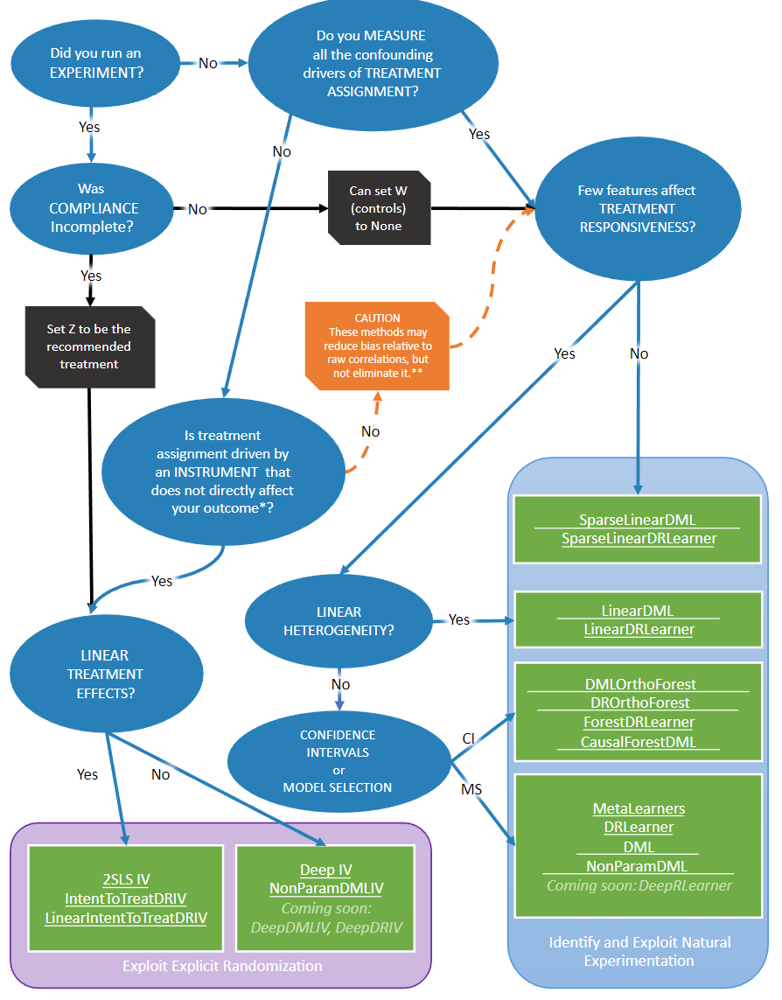

# Econ-ML

> [Doc](https://econml.azurewebsites.net/)

## Installation

Install the latest release from [PyPI](https://pypi.org/project/econml/):

```
pip install econml
```

To install from source, see [For Developers](https://github.com/microsoft/EconML#for-developers) section below.


## Get Start

### Estimation Methods

#### Double Machine Learning (aka RLearner)


  * Linear final stage

  ```Python
  from econml.dml import LinearDML
  from sklearn.linear_model import LassoCV
  from econml.inference import BootstrapInference

  est = LinearDML(model_y=LassoCV(), model_t=LassoCV())
  ### Estimate with OLS confidence intervals
  est.fit(Y, T, X=X, W=W) # W -> high-dimensional confounders, X -> features
  treatment_effects = est.effect(X_test)
  lb, ub = est.effect_interval(X_test, alpha=0.05) # OLS confidence intervals

  ### Estimate with bootstrap confidence intervals
  est.fit(Y, T, X=X, W=W, inference='bootstrap')  # with default bootstrap parameters
  est.fit(Y, T, X=X, W=W, inference=BootstrapInference(n_bootstrap_samples=100))  # or customized
  lb, ub = est.effect_interval(X_test, alpha=0.05) # Bootstrap confidence intervals
  ```

  * Sparse linear final stage

  ```Python
  from econml.dml import SparseLinearDML
  from sklearn.linear_model import LassoCV

  est = SparseLinearDML(model_y=LassoCV(), model_t=LassoCV())
  est.fit(Y, T, X=X, W=W) # X -> high dimensional features
  treatment_effects = est.effect(X_test)
  lb, ub = est.effect_interval(X_test, alpha=0.05) # Confidence intervals via debiased lasso
  ```

  * Generic Machine Learning last stage

  ```Python
  from econml.dml import NonParamDML
  from sklearn.ensemble import RandomForestRegressor, RandomForestClassifier

  est = NonParamDML(model_y=RandomForestRegressor(),
                    model_t=RandomForestClassifier(),
                    model_final=RandomForestRegressor(),
                    discrete_treatment=True)
  est.fit(Y, T, X=X, W=W) 
  treatment_effects = est.effect(X_test)
  ```

#### Dynamic Double Machine Learning

  ```Python
from econml.panel.dml import DynamicDML
# Use defaults
est = DynamicDML()
# Or specify hyperparameters
est = DynamicDML(model_y=LassoCV(cv=3), 
                 model_t=LassoCV(cv=3), 
                 cv=3)
est.fit(Y, T, X=X, W=None, groups=groups, inference="auto")
# Effects
treatment_effects = est.effect(X_test)
# Confidence intervals
lb, ub = est.effect_interval(X_test, alpha=0.05)
  ```

#### Causal Forests

  ```Python
from econml.dml import CausalForestDML
from sklearn.linear_model import LassoCV
# Use defaults
est = CausalForestDML()
# Or specify hyperparameters
est = CausalForestDML(criterion='het', n_estimators=500,       
                      min_samples_leaf=10, 
                      max_depth=10, max_samples=0.5,
                      discrete_treatment=False,
                      model_t=LassoCV(), model_y=LassoCV())
est.fit(Y, T, X=X, W=W)
treatment_effects = est.effect(X_test)
# Confidence intervals via Bootstrap-of-Little-Bags for forests
lb, ub = est.effect_interval(X_test, alpha=0.05)
  ```


#### Orthogonal Random Forests

  ```Python
from econml.orf import DMLOrthoForest, DROrthoForest
from econml.sklearn_extensions.linear_model import WeightedLasso, WeightedLassoCV
# Use defaults
est = DMLOrthoForest()
est = DROrthoForest()
# Or specify hyperparameters
est = DMLOrthoForest(n_trees=500, min_leaf_size=10,
                     max_depth=10, subsample_ratio=0.7,
                     lambda_reg=0.01,
                     discrete_treatment=False,
                     model_T=WeightedLasso(alpha=0.01), model_Y=WeightedLasso(alpha=0.01),
                     model_T_final=WeightedLassoCV(cv=3), model_Y_final=WeightedLassoCV(cv=3))
est.fit(Y, T, X=X, W=W)
treatment_effects = est.effect(X_test)
# Confidence intervals via Bootstrap-of-Little-Bags for forests
lb, ub = est.effect_interval(X_test, alpha=0.05)
  ```


#### Meta-Learners

  * XLearner

  ```Python
  from econml.metalearners import XLearner
  from sklearn.ensemble import GradientBoostingClassifier, GradientBoostingRegressor

  est = XLearner(models=GradientBoostingRegressor(),
                propensity_model=GradientBoostingClassifier(),
                cate_models=GradientBoostingRegressor())
  est.fit(Y, T, X=np.hstack([X, W]))
  treatment_effects = est.effect(np.hstack([X_test, W_test]))

  # Fit with bootstrap confidence interval construction enabled
  est.fit(Y, T, X=np.hstack([X, W]), inference='bootstrap')
  treatment_effects = est.effect(np.hstack([X_test, W_test]))
  lb, ub = est.effect_interval(np.hstack([X_test, W_test]), alpha=0.05) # Bootstrap CIs
  ```

  * SLearner

  ```Python
  from econml.metalearners import SLearner
  from sklearn.ensemble import GradientBoostingRegressor

  est = SLearner(overall_model=GradientBoostingRegressor())
  est.fit(Y, T, X=np.hstack([X, W]))
  treatment_effects = est.effect(np.hstack([X_test, W_test]))
  ```

  * TLearner

  ```Python
  from econml.metalearners import TLearner
  from sklearn.ensemble import GradientBoostingRegressor

  est = TLearner(models=GradientBoostingRegressor())
  est.fit(Y, T, X=np.hstack([X, W]))
  treatment_effects = est.effect(np.hstack([X_test, W_test]))
  ```

#### Doubly Robust Learners 

* Linear final stage

```Python
from econml.dr import LinearDRLearner
from sklearn.ensemble import GradientBoostingRegressor, GradientBoostingClassifier

est = LinearDRLearner(model_propensity=GradientBoostingClassifier(),
                      model_regression=GradientBoostingRegressor())
est.fit(Y, T, X=X, W=W)
treatment_effects = est.effect(X_test)
lb, ub = est.effect_interval(X_test, alpha=0.05)
```

* Sparse linear final stage

```Python
from econml.dr import SparseLinearDRLearner
from sklearn.ensemble import GradientBoostingRegressor, GradientBoostingClassifier

est = SparseLinearDRLearner(model_propensity=GradientBoostingClassifier(),
                            model_regression=GradientBoostingRegressor())
est.fit(Y, T, X=X, W=W)
treatment_effects = est.effect(X_test)
lb, ub = est.effect_interval(X_test, alpha=0.05)
```

* Nonparametric final stage

```Python
from econml.dr import ForestDRLearner
from sklearn.ensemble import GradientBoostingRegressor, GradientBoostingClassifier

est = ForestDRLearner(model_propensity=GradientBoostingClassifier(),
                      model_regression=GradientBoostingRegressor())
est.fit(Y, T, X=X, W=W) 
treatment_effects = est.effect(X_test)
lb, ub = est.effect_interval(X_test, alpha=0.05)
```

#### Double Machine Learning with Instrumental Variables

* Orthogonal instrumental variable learner

```Python
from econml.iv.dml import OrthoIV

est = OrthoIV(projection=False, 
              discrete_treatment=True, 
              discrete_instrument=True)
est.fit(Y, T, Z=Z, X=X, W=W)
treatment_effects = est.effect(X_test)
lb, ub = est.effect_interval(X_test, alpha=0.05) # OLS confidence intervals
```

* Nonparametric double machine learning with instrumental variable

```Python
from econml.iv.dml import NonParamDMLIV

est = NonParamDMLIV(projection=False, 
                    discrete_treatment=True, 
                    discrete_instrument=True)
est.fit(Y, T, Z=Z, X=X, W=W) # no analytical confidence interval available
treatment_effects = est.effect(X_test)
```


#### Doubly Robust Machine Learning with Instrumental Variables

* Linear final stage

```Python
from econml.iv.dr import LinearDRIV

est = LinearDRIV(discrete_instrument=True, discrete_treatment=True)
est.fit(Y, T, Z=Z, X=X, W=W)
treatment_effects = est.effect(X_test)
lb, ub = est.effect_interval(X_test, alpha=0.05) # OLS confidence intervals
```

* Sparse linear final stage

```Python
from econml.iv.dr import SparseLinearDRIV

est = SparseLinearDRIV(discrete_instrument=True, discrete_treatment=True)
est.fit(Y, T, Z=Z, X=X, W=W)
treatment_effects = est.effect(X_test)
lb, ub = est.effect_interval(X_test, alpha=0.05) # Debiased lasso confidence intervals
```

* Nonparametric final stage

```Python
from econml.iv.dr import ForestDRIV

est = ForestDRIV(discrete_instrument=True, discrete_treatment=True)
est.fit(Y, T, Z=Z, X=X, W=W)
treatment_effects = est.effect(X_test)
# Confidence intervals via Bootstrap-of-Little-Bags for forests
lb, ub = est.effect_interval(X_test, alpha=0.05) 
```

* Linear intent-to-treat (discrete instrument, discrete treatment)

```Python
from econml.iv.dr import LinearIntentToTreatDRIV
from sklearn.ensemble import GradientBoostingRegressor, GradientBoostingClassifier

est = LinearIntentToTreatDRIV(model_y_xw=GradientBoostingRegressor(),
                              model_t_xwz=GradientBoostingClassifier(),
                              flexible_model_effect=GradientBoostingRegressor())
est.fit(Y, T, Z=Z, X=X, W=W)
treatment_effects = est.effect(X_test)
lb, ub = est.effect_interval(X_test, alpha=0.05) # OLS confidence intervals
```

#### Deep Instrumental Variables

```Python
import keras
from econml.iv.nnet import DeepIV

treatment_model = keras.Sequential([keras.layers.Dense(128, activation='relu', input_shape=(2,)),
                                    keras.layers.Dropout(0.17),
                                    keras.layers.Dense(64, activation='relu'),
                                    keras.layers.Dropout(0.17),
                                    keras.layers.Dense(32, activation='relu'),
                                    keras.layers.Dropout(0.17)])
response_model = keras.Sequential([keras.layers.Dense(128, activation='relu', input_shape=(2,)),
                                  keras.layers.Dropout(0.17),
                                  keras.layers.Dense(64, activation='relu'),
                                  keras.layers.Dropout(0.17),
                                  keras.layers.Dense(32, activation='relu'),
                                  keras.layers.Dropout(0.17),
                                  keras.layers.Dense(1)])
est = DeepIV(n_components=10, # Number of gaussians in the mixture density networks)
             m=lambda z, x: treatment_model(keras.layers.concatenate([z, x])), # Treatment model
             h=lambda t, x: response_model(keras.layers.concatenate([t, x])), # Response model
             n_samples=1 # Number of samples used to estimate the response
             )
est.fit(Y, T, X=X, Z=Z) # Z -> instrumental variables
treatment_effects = est.effect(X_test)
```


## ⭐Problem Setup and API Design

- 👉[问题设置和 API 设计 — econml 0.14.0 文档](https://econml.azurewebsites.net/spec/api.html)👈


## Library Flow Chart



**EXPERIMENT**

您是否明确地随机化了目标受众的治疗？

**COMPLIANCE**

实验中的每个人都接受了他们被分配的治疗吗？例如 如果您对加入忠诚度计划的因果效应感兴趣，一个有用的实验可能会 随机向一些客户发送一封电子邮件，提示他们加入该计划。只有其中一些 目标客户将加入忠诚度计划，因此合规性并不完美。在医疗 实验，患者每周来到办公室并接受一种新药或 安慰剂，对指定组的依从性可能是完美的。

**TREATMENT ASSIGNMENT**

如果治疗不是实验的结果（即对照），将有多种原因人们接受了治疗。假设您对分钟的因果效应感兴趣 每周运动量（治疗变量）对体脂百分比（结果）的影响。有些人 运动时间比其他人多。这样做的原因（控制）可能包括具有更灵活的功能 工作时间表或更注重健康。其中一些控制可能是混杂因素（即 它们也直接影响结果）。在这个例子中，更注重健康可能是 混杂因素（它影响营养，影响身体脂肪），而具有更灵活的 工作时间表可能不是。这个泡沫中提出的问题是，是否所有混杂的控制 在数据中测量。

**Can set W**

如果你运行一个实验，就不必担心混淆。包含在对照集将有助于提高较小样本中的估计效率，但不是必需的确定因果效应。

**CAUTION**

当所有混杂因素都可以测量时，偏差就会消除。

**Set Z to intended treatment**

在不完全依从的情况下，指定治疗类别的指标不等同于实际接受治疗的指标。如果您对以下因素的因果效应感兴趣治疗，你应该用分配作为治疗的工具，而不是简单地治疗分配作为治疗本身。

**TREATMENT RESPONSIVENESS**

许多估计器仅在一小组指定特征 X 下表现良好，这些特征 X 会影响用户对治疗的反应。如果您还不知道哪几个功能可能合理影响用户的响应，使用我们的稀疏估计器之一，它可以处理大型功能集和惩罚他们以发现与治疗效果异质性最相关的特征。

**INSTRUMENT**

一些估计器通过仅考虑给定其他数据特征的治疗强度变化是有条件随机的。这变异的子集由工具驱动，这通常是某种随机化（即早期的实验或彩票）。

**LINEAR TREATMENT EFFECTS**

一些估计器强加了结果是治疗的线性函数的假设。这些估计器还可以估计治疗与结果之间的非线性关系，如果关系的结构是已知的，并且可以加法分离（例如，线性函数可以包括治疗和连续治疗的治疗平方）。这些线性函数还可以包括治疗之间的指定相互作用。但是，这些估计器无法估计治疗与结果之间完全灵活的非参数关系（例如，关系不能由森林建模）。

**LINEAR HETEROGENEITY**

CATE 函数确定用户对治疗的反应大小如何因用户而异特征。一些估计器强加了效应大小是用户特征的线性函数的假设。

**CONFIDENCE INTERVALS/MODEL SELECTION**

MetaLearner和DRLearner估计器在所有阶段提供任何ML估计模型的选择 并允许通过交叉验证进行模型选择。这增强了灵活性，但因为样本数据用于在模型之间进行选择无法计算诚实的分析置信度间隔。此外，大多数 ML 估计方法都会出于正则化目的引入偏差，因此以最佳方式平衡偏差和方差。因此，基于这种偏倚估计的置信区间将无效。对于这些模型，仍然可以构建自举置信区间， 但是这个过程很慢，在小样本中可能不准确，这些间隔只能捕获 方差，但不是模型的偏差。


## Detailed estimator comparison

| Estimator                                                    | TreatmentType | RequiresInstrument | Delivers Conf.Intervals | LinearTreatment | LinearHeterogeneity | MulitpleOutcomes | MultipleTreatments | High-DimensionalFeatures |
| ------------------------------------------------------------ | ------------- | ------------------ | ----------------------- | --------------- | ------------------- | ---------------- | ------------------ | ------------------------ |
| [`SieveTSLS`](https://econml.azurewebsites.net/_autosummary/econml.iv.sieve.SieveTSLS.html#econml.iv.sieve.SieveTSLS) | Any           | Yes                |                         | Yes             | Assumed             | Yes              | Yes                |                          |
| [`DeepIV`](https://econml.azurewebsites.net/_autosummary/econml.iv.nnet.DeepIV.html#econml.iv.nnet.DeepIV) | Any           | Yes                |                         |                 |                     | Yes              | Yes                |                          |
| [`SparseLinearDML`](https://econml.azurewebsites.net/_autosummary/econml.dml.SparseLinearDML.html#econml.dml.SparseLinearDML) | Any           |                    | Yes                     | Yes             | Assumed             | Yes              | Yes                | Yes                      |
| [`SparseLinearDRLearner`](https://econml.azurewebsites.net/_autosummary/econml.dr.SparseLinearDRLearner.html#econml.dr.SparseLinearDRLearner) | Categorical   |                    | Yes                     |                 | Projected           |                  | Yes                | Yes                      |
| [`LinearDML`](https://econml.azurewebsites.net/_autosummary/econml.dml.LinearDML.html#econml.dml.LinearDML) | Any           |                    | Yes                     | Yes             | Assumed             | Yes              | Yes                |                          |
| [`LinearDRLearner`](https://econml.azurewebsites.net/_autosummary/econml.dr.LinearDRLearner.html#econml.dr.LinearDRLearner) | Categorical   |                    | Yes                     |                 | Projected           |                  | Yes                |                          |
| [`CausalForestDML`](https://econml.azurewebsites.net/_autosummary/econml.dml.CausalForestDML.html#econml.dml.CausalForestDML) | Any           |                    | Yes                     | Yes             |                     | Yes              | Yes                | Yes                      |
| [`ForestDRLearner`](https://econml.azurewebsites.net/_autosummary/econml.dr.ForestDRLearner.html#econml.dr.ForestDRLearner) | Categorical   |                    | Yes                     |                 |                     |                  | Yes                | Yes                      |
| [`DMLOrthoForest`](https://econml.azurewebsites.net/_autosummary/econml.orf.DMLOrthoForest.html#econml.orf.DMLOrthoForest) | Any           |                    | Yes                     | Yes             |                     |                  | Yes                | Yes                      |
| [`DROrthoForest`](https://econml.azurewebsites.net/_autosummary/econml.orf.DROrthoForest.html#econml.orf.DROrthoForest) | Categorical   |                    | Yes                     |                 |                     |                  | Yes                | Yes                      |
| [metalearners](https://econml.azurewebsites.net/reference.html#metalearners-api) | Categorical   |                    |                         |                 |                     | Yes              | Yes                | Yes                      |
| [`DRLearner`](https://econml.azurewebsites.net/_autosummary/econml.dr.DRLearner.html#econml.dr.DRLearner) | Categorical   |                    |                         |                 |                     |                  | Yes                | Yes                      |
| [`DML`](https://econml.azurewebsites.net/_autosummary/econml.dml.DML.html#econml.dml.DML) | Any           |                    |                         | Yes             | Assumed             | Yes              | Yes                | Yes                      |
| [`NonParamDML`](https://econml.azurewebsites.net/_autosummary/econml.dml.NonParamDML.html#econml.dml.NonParamDML) | 1-d/Binary    |                    |                         | Yes             |                     | Yes              |                    | Yes                      |
| [`OrthoIV`](https://econml.azurewebsites.net/_autosummary/econml.iv.dml.OrthoIV.html#econml.iv.dml.OrthoIV) | Any           | Yes                | Yes                     | Yes             | Assumed             | Yes              | Yes                |                          |
| [`DMLIV`](https://econml.azurewebsites.net/_autosummary/econml.iv.dml.DMLIV.html#econml.iv.dml.DMLIV) | Any           | Yes                |                         | Yes             | Assumed             | Yes              | Yes                | Yes                      |
| [`NonParamDMLIV`](https://econml.azurewebsites.net/_autosummary/econml.iv.dml.NonParamDMLIV.html#econml.iv.dml.NonParamDMLIV) | 1-d/Binary    | Yes                |                         | Yes             |                     | Yes              |                    | Yes                      |
| [`DRIV`](https://econml.azurewebsites.net/_autosummary/econml.iv.dr.DRIV.html#econml.iv.dr.DRIV) | 1-d/Binary    | Yes                | Yes                     | Yes             |                     |                  |                    | Yes                      |
| [`LinearDRIV`](https://econml.azurewebsites.net/_autosummary/econml.iv.dr.LinearDRIV.html#econml.iv.dr.LinearDRIV) | 1-d/Binary    | Yes                | Yes                     | Yes             | Projected           |                  |                    |                          |
| [`SparseLinearDRIV`](https://econml.azurewebsites.net/_autosummary/econml.iv.dr.SparseLinearDRIV.html#econml.iv.dr.SparseLinearDRIV) | 1-d/Binary    | Yes                | Yes                     | Yes             | Projected           |                  |                    | Yes                      |
| [`ForestDRIV`](https://econml.azurewebsites.net/_autosummary/econml.iv.dr.ForestDRIV.html#econml.iv.dr.ForestDRIV) | 1-d/Binary    | Yes                | Yes                     | Yes             |                     |                  |                    | Yes                      |
| [`IntentToTreatDRIV`](https://econml.azurewebsites.net/_autosummary/econml.iv.dr.IntentToTreatDRIV.html#econml.iv.dr.IntentToTreatDRIV) | Binary        | Yes                | Ye                      | Yes             |                     |                  |                    | Yes                      |
| [`LinearIntentToTreatDRIV`](https://econml.azurewebsites.net/_autosummary/econml.iv.dr.LinearIntentToTreatDRIV.html#econml.iv.dr.LinearIntentToTreatDRIV) | Binary        | Yes                | Yes                     | Yes             | Projected           |                  |                    |                          |

**Treatment Type**

Some estimators can only estimate effects of particular kinds of treatments. *Discrete* treatments can be described by a finite number of comprehensive categories (for example, group A received a 10% discount on product 1, group B received a 10% discount on product 2, group C received no discounts). *Binary* treatments are a special case of discrete treatments with only two categories. *Continuous* treatments can take on any value along the number line (for example, minutes of exercise per week).

**Requires Instrument**

Some estimators identify the causal effect of a treatment by considering only a subset of the variation in treatment intensity that is conditionally random given other data features. This subset of the variation is driven by an instrument, which is usually some kind of randomization (i.e. an earlier experiment or a lottery). See the Instrumental Variable Regression section for more information on picking a good instrument.

**Delivers Confidence Intervals**

Many estimators can deliver analytic confidence intervals for the final treatment effects. These confidence intervals correctly adjust for the reuse of data across multiple stages of estimation. EconML cannot deliver analytic confidence intervals in cases where this multi-stage estimation is too complex or for estimators such as the MetaLearners that trade honest confidence intervals for model selection and regularization. In these cases it is still possible to get bootstrap confidence intervals, but this process is slow and may not be statistically valid.

**Linear Treatment**

Some estimators impose the assumption that the outcome is a linear function of the treatment. These estimators can also estimate a non-linear relationship between a treatment and the outcome if the structure of the relationship is known and additively separable (for example, the linear function could include both treatment and treatment-squared for continuous treatments). These linear functions can also include specified interactions between treatments. However, these estimators cannot estimate a fully flexible non-parametric relationship between treatments and the outcome (for example, the relationship cannot be modeled by a forest).

**Linear Heterogeneity**

The CATE function determines how the size of a user’s response to the treatment varies by user features. Some estimators impose the *assumption* that effect size is a linear function of user features. A few models estimate a more flexible relationship between effect size and user features and then *project* that flexible function onto a linear model. This second approach delivers a better-fitting linear approximation of a non-linear relationship, but is less efficient in cases where you are confident assuming the true relationship is linear. Finally, some estimation models allow a fully flexible relationship between effect size and user features with no linearity structure.

**Multiple Outcomes**

Some estimation models allow joint estimation of the effects of treatment(s) on multiple outcomes. Other models only accommodate a single outcome.

**Multiple Treatments**

Some estimation models allow joint estimation of the effects of multiple treatments on outcome(s). Other models only accommodate a single treatment.

**High-Dimensional Features**

Many estimators only behave well with a small set of specified features, X, that affect the size of a user’s response to the treatment. If you do not already know which few features might reasonably affect the user’s response, use one of our sparse estimators that can handle large feature sets and penalize them to discover the features that are most correlated with treatment effect heterogeneity.


## ⭐Estimation Methods under Unconfoundedness

- 👉[Here](https://econml.azurewebsites.net/spec/estimation.html)👈


## Estimation Methods with Instruments

- 👉[Here](https://econml.azurewebsites.net/spec/estimation_iv.html)👈


## Estimation Methods for Dynamic Treatment Regimes

- 👉[Here](https://econml.azurewebsites.net/spec/estimation_dynamic.html)👈


## Inference

### Bootstrap Inference

Every estimator can provide bootstrap based confidence intervals by passing or (see [`BootstrapInference`](https://econml.azurewebsites.net/_autosummary/econml.inference.BootstrapInference.html#econml.inference.BootstrapInference)). These intervals are calculated by training multiple versions of the original estimator on bootstrap subsamples with replacement. Then the intervals are calculated based on the quantiles of the estimate distribution across the multiple clones. See also [`BootstrapEstimator`](https://econml.azurewebsites.net/_autosummary/econml.inference._bootstrap.html#econml.inference._bootstrap.BootstrapEstimator) for more details on this.`inference='bootstrap'``inference=BootstrapInference(n_bootstrap_samples=100, n_jobs=-1)`

For instance:

```python
from econml.dml import NonParamDML
from sklearn.ensemble import RandomForestRegressor
est = NonParamDML(model_y=RandomForestRegressor(n_estimators=10, min_samples_leaf=10),
                            model_t=RandomForestRegressor(n_estimators=10, min_samples_leaf=10),
                            model_final=RandomForestRegressor(n_estimators=10, min_samples_leaf=10))
est.fit(y, t, X=X, W=W, inference='bootstrap')
point = est.const_marginal_effect(X)
lb, ub = est.const_marginal_effect_interval(X, alpha=0.05)
```

### OLS Inference

For estimators where the final stage CATE estimate is based on an Ordinary Least Squares regression, then we offer normality-based confidence intervals by default (leaving the setting unchanged), or by explicitly setting , or dependent on the estimator one can alter the covariance type calculation via or . See [`StatsModelsInference`](https://econml.azurewebsites.net/_autosummary/econml.inference.StatsModelsInference.html#econml.inference.StatsModelsInference) and [`StatsModelsInferenceDiscrete`](https://econml.azurewebsites.net/_autosummary/econml.inference.StatsModelsInferenceDiscrete.html#econml.inference.StatsModelsInferenceDiscrete) for more details. This for instance holds for the [`LinearDML`](https://econml.azurewebsites.net/_autosummary/econml.dml.LinearDML.html#econml.dml.LinearDML) and the [`LinearDRLearner`](https://econml.azurewebsites.net/_autosummary/econml.dr.LinearDRLearner.html#econml.dr.LinearDRLearner), e.g.:`inference='auto'``inference='statsmodels'``inference=StatsModelsInference(cov_type='HC1)``inference=StatsModelsInferenceDiscrete(cov_type='HC1)`

```python
from econml.dml import LinearDML
from sklearn.ensemble import RandomForestRegressor
est = LinearDML(model_y=RandomForestRegressor(n_estimators=10, min_samples_leaf=10),
                             model_t=RandomForestRegressor(n_estimators=10, min_samples_leaf=10))
est.fit(y, t, X=X, W=W)
point = est.const_marginal_effect(X)
lb, ub = est.const_marginal_effect_interval(X, alpha=0.05)
from econml.dr import LinearDRLearner
from sklearn.ensemble import RandomForestRegressor, RandomForestClassifier
est = LinearDRLearner(model_regression=RandomForestRegressor(n_estimators=10, min_samples_leaf=10),
                      model_propensity=RandomForestClassifier(n_estimators=10, min_samples_leaf=10))
est.fit(y, t, X=X, W=W)
point = est.effect(X)
lb, ub = est.effect_interval(X, alpha=0.05)
```

This inference is enabled by our [`StatsModelsLinearRegression`](https://econml.azurewebsites.net/_autosummary/econml.sklearn_extensions.linear_model.StatsModelsLinearRegression.html#econml.sklearn_extensions.linear_model.StatsModelsLinearRegression) extension to the scikit-learn [`LinearRegression`](https://scikit-learn.org/stable/modules/generated/sklearn.linear_model.LinearRegression.html#sklearn.linear_model.LinearRegression).

### Debiased Lasso Inference

For estimators where the final stage CATE estimate is based on a high dimensional linear model with a sparsity constraint, then we offer confidence intervals using the debiased lasso technique. This for instance holds for the [`SparseLinearDML`](https://econml.azurewebsites.net/_autosummary/econml.dml.SparseLinearDML.html#econml.dml.SparseLinearDML) and the [`SparseLinearDRLearner`](https://econml.azurewebsites.net/_autosummary/econml.dr.SparseLinearDRLearner.html#econml.dr.SparseLinearDRLearner). You can enable such intervals by default (leaving the setting unchanged), or by explicitly setting , e.g.:`inference='auto'``inference='debiasedlasso'`

```python
from econml.dml import SparseLinearDML
from sklearn.ensemble import RandomForestRegressor
est = SparseLinearDML(model_y=RandomForestRegressor(n_estimators=10, min_samples_leaf=10),
                                   model_t=RandomForestRegressor(n_estimators=10, min_samples_leaf=10))
est.fit(y, t, X=X, W=W)
point = est.const_marginal_effect(X)
lb, ub = est.const_marginal_effect_interval(X, alpha=0.05)
from econml.dr import SparseLinearDRLearner
from sklearn.ensemble import RandomForestRegressor, RandomForestClassifier
est = SparseLinearDRLearner(model_regression=RandomForestRegressor(n_estimators=10, min_samples_leaf=10),
                            model_propensity=RandomForestClassifier(n_estimators=10, min_samples_leaf=10))
est.fit(y, t, X=X, W=W)
point = est.effect(X)
lb, ub = est.effect_interval(X, alpha=0.05)
```

This inference is enabled by our implementation of the [`DebiasedLasso`](https://econml.azurewebsites.net/_autosummary/econml.sklearn_extensions.linear_model.DebiasedLasso.html#econml.sklearn_extensions.linear_model.DebiasedLasso) extension to the scikit-learn [`Lasso`](https://scikit-learn.org/stable/modules/generated/sklearn.linear_model.Lasso.html#sklearn.linear_model.Lasso).

### Subsampled Honest Forest Inference

For estimators where the final stage CATE estimate is a non-parametric model based on a Random Forest, we offer confidence intervals via the bootstrap-of-little-bags approach (see [[Athey2019\]](https://econml.azurewebsites.net/spec/references.html#athey2019)) for estimating the uncertainty of an Honest Random Forest. This for instance holds for the [`CausalForestDML`](https://econml.azurewebsites.net/_autosummary/econml.dml.CausalForestDML.html#econml.dml.CausalForestDML) and the [`ForestDRLearner`](https://econml.azurewebsites.net/_autosummary/econml.dr.ForestDRLearner.html#econml.dr.ForestDRLearner). Such intervals are enabled by leaving inference at its default setting of or by explicitly setting , e.g.:`'auto'``inference='blb'`

```python
from econml.dml import CausalForestDML
from sklearn.ensemble import RandomForestRegressor
est = CausalForestDML(model_y=RandomForestRegressor(n_estimators=10, min_samples_leaf=10),
                      model_t=RandomForestRegressor(n_estimators=10, min_samples_leaf=10))
est.fit(y, t, X=X, W=W)
point = est.const_marginal_effect(X)
lb, ub = est.const_marginal_effect_interval(X, alpha=0.05)
from econml.dr import ForestDRLearner
from sklearn.ensemble import RandomForestRegressor, RandomForestClassifier
est = ForestDRLearner(model_regression=RandomForestRegressor(n_estimators=10, min_samples_leaf=10),
                      model_propensity=RandomForestClassifier(n_estimators=10, min_samples_leaf=10))
est.fit(y, t, X=X, W=W)
point = est.effect(X)
lb, ub = est.effect_interval(X, alpha=0.05)
```

This inference is enabled by our implementation of the [`RegressionForest`](https://econml.azurewebsites.net/_autosummary/econml.grf.RegressionForest.html#econml.grf.RegressionForest) extension to the scikit-learn [`RandomForestRegressor`](https://scikit-learn.org/stable/modules/generated/sklearn.ensemble.RandomForestRegressor.html#sklearn.ensemble.RandomForestRegressor).

### OrthoForest Bootstrap of Little Bags Inference

For the Orthogonal Random Forest estimators (see [`DMLOrthoForest`](https://econml.azurewebsites.net/_autosummary/econml.orf.DMLOrthoForest.html#econml.orf.DMLOrthoForest), [`DROrthoForest`](https://econml.azurewebsites.net/_autosummary/econml.orf.DROrthoForest.html#econml.orf.DROrthoForest)), we provide confidence intervals built via the bootstrap-of-little-bags approach ([[Athey2019\]](https://econml.azurewebsites.net/spec/references.html#athey2019)). This technique is well suited for estimating the uncertainty of the honest causal forests underlying the OrthoForest estimators. Such intervals are enabled by leaving inference at its default setting of or by explicitly setting , e.g.:`'auto'``inference='blb'`

```python
from econml.orf import DMLOrthoForest
from econml.sklearn_extensions.linear_model import WeightedLasso
est = DMLOrthoForest(n_trees=10,
                     min_leaf_size=3,
                     model_T=WeightedLasso(alpha=0.01),
                     model_Y=WeightedLasso(alpha=0.01))
est.fit(y, t, X=X, W=W)
point = est.const_marginal_effect(X)
lb, ub = est.const_marginal_effect_interval(X, alpha=0.05)
```


## Interpretability

Our package offers multiple interpretability tools to better understand the final model CATE.

### Tree Interpreter

Tree Interpreter provides a presentation-ready summary of the key features that explain the biggest differences in responsiveness to an intervention.

[`SingleTreeCateInterpreter`](https://econml.azurewebsites.net/_autosummary/econml.cate_interpreter.SingleTreeCateInterpreter.html#econml.cate_interpreter.SingleTreeCateInterpreter) trains a single shallow decision tree for the treatment effect θ(X) you learned from any of our available CATE estimators on a small set of feature X that you are interested to learn heterogeneity from. The model will split on the cutoff points that maximize the treatment effect difference in each leaf. Finally each leaf will be a subgroup of samples that respond to a treatment differently from other leaves.

For instance:

```python
from econml.cate_interpreter import SingleTreeCateInterpreter
from econml.dml import LinearDML
est = LinearDML()
est.fit(y, t, X=X, W=W)
intrp = SingleTreeCateInterpreter(include_model_uncertainty=True, max_depth=2, min_samples_leaf=10)
# We interpret the CATE model's behavior based on the features used for heterogeneity
intrp.interpret(est, X)
# Plot the tree
intrp.plot(feature_names=['A', 'B', 'C'], fontsize=12)
```

### Policy Interpreter

Policy Interpreter offers similar functionality but taking cost into consideration.

Instead of fitting a tree to learn groups that have a different treatment effect, [`SingleTreePolicyInterpreter`](https://econml.azurewebsites.net/_autosummary/econml.cate_interpreter.SingleTreePolicyInterpreter.html#econml.cate_interpreter.SingleTreePolicyInterpreter) tries to split the samples into different treatment groups. So in the case of binary treatments it tries to create sub-groups such that all samples within the group have either all positive effect or all negative effect. Thus it tries to separate responders from non-responders, as opposed to trying to find groups that have different levels of response.

This way you can construct an interpretable personalized policy where you treat the groups with a postive effect and don’t treat the group with a negative effect. Our policy tree provides the recommended treatment at each leaf node.

For instance:

```python
from econml.cate_interpreter import SingleTreePolicyInterpreter
# We find a tree-based treatment policy based on the CATE model
# sample_treatment_costs is the cost of treatment. Policy will treat if effect is above this cost.
intrp = SingleTreePolicyInterpreter(risk_level=None, max_depth=2, min_samples_leaf=1,min_impurity_decrease=.001)
intrp.interpret(est, X, sample_treatment_costs=0.02)
# Plot the tree
intrp.plot(feature_names=['A', 'B', 'C'], fontsize=12)
```

### SHAP

[SHAP](https://shap.readthedocs.io/en/latest/) is a popular open source library for interpreting black-box machine learning models using the Shapley values methodology (see e.g. [[Lundberg2017\]](https://econml.azurewebsites.net/spec/references.html#lundberg2017)).

Similar to how black-box predictive machine learning models can be explained with SHAP, we can also explain black-box effect heterogeneity models. This approach provides an explanation as to why a heterogeneous causal effect model produced larger or smaller effect values for particular segments of the population. Which were the features that lead to such differentiation? This question is easy to address when the model is succinctly described, such as the case of linear heterogneity models, where one can simply investigate the coefficients of the model. However, it becomes hard when one starts using more expressive models, such as Random Forests and Causal Forests to model effect hetergoeneity. SHAP values can be of immense help to understand the leading factors of effect hetergoeneity that the model picked up from the training data.

Our package offers seamless integration with the SHAP library. Every CATE estimator has a method shap_values, which returns the SHAP value explanation of the estimators output for every treatment and outcome pair. These values can then be visualized with the plethora of visualizations that the SHAP library offers. Moreover, whenever possible our library invokes fast specialized algorithms from the SHAP library, for each type of final model, which can greatly reduce computation times.

For instance:

```python
import shap
from econml.dml import LinearDML
est = LinearDML()
est.fit(y, t, X=X, W=W)
shap_values = est.shap_values(X)
# local view: explain hetergoeneity for a given observation
ind=0
shap.plots.force(shap_values["Y0"]["T0"][ind], matplotlib=True)
# global view: explain hetergoeneity for a sample of dataset
shap.summary_plot(shap_values['Y0']['T0'])
```


## Module Reference

- 👉[Here](https://econml.azurewebsites.net/reference.html#)👈

### CATE Estimators

#### Double Machine Learning (DML)

| [`econml.dml.DML`](https://econml.azurewebsites.net/_autosummary/econml.dml.DML.html#econml.dml.DML)(*, model_y, model_t, model_final) | The base class for parametric Double ML estimators.          |
| ------------------------------------------------------------ | ------------------------------------------------------------ |
| [`econml.dml.LinearDML`](https://econml.azurewebsites.net/_autosummary/econml.dml.LinearDML.html#econml.dml.LinearDML)(*[, model_y, model_t, ...]) | The Double ML Estimator with a low-dimensional linear final stage implemented as a statsmodel regression. |
| [`econml.dml.SparseLinearDML`](https://econml.azurewebsites.net/_autosummary/econml.dml.SparseLinearDML.html#econml.dml.SparseLinearDML)(*[, model_y, ...]) | A specialized version of the Double ML estimator for the sparse linear case. |
| [`econml.dml.CausalForestDML`](https://econml.azurewebsites.net/_autosummary/econml.dml.CausalForestDML.html#econml.dml.CausalForestDML)(*[, model_y, ...]) | A Causal Forest [[cfdml1\]](https://econml.azurewebsites.net/_autosummary/econml.dml.CausalForestDML.html#cfdml1) combined with double machine learning based residualization of the treatment and outcome variables. |
| [`econml.dml.NonParamDML`](https://econml.azurewebsites.net/_autosummary/econml.dml.NonParamDML.html#econml.dml.NonParamDML)(*, model_y, model_t, ...) | The base class for non-parametric Double ML estimators, that can have arbitrary final ML models of the CATE. |
| [`econml.dml.KernelDML`](https://econml.azurewebsites.net/_autosummary/econml.dml.KernelDML.html#econml.dml.KernelDML)([model_y, model_t, ...]) | A specialized version of the linear Double ML Estimator that uses random fourier features. |

#### Doubly Robust (DR)

| [`econml.dr.DRLearner`](https://econml.azurewebsites.net/_autosummary/econml.dr.DRLearner.html#econml.dr.DRLearner)(*[, model_propensity, ...]) | CATE estimator that uses doubly-robust correction techniques to account for covariate shift (selection bias) between the treatment arms. |
| ------------------------------------------------------------ | ------------------------------------------------------------ |
| [`econml.dr.LinearDRLearner`](https://econml.azurewebsites.net/_autosummary/econml.dr.LinearDRLearner.html#econml.dr.LinearDRLearner)(*[, ...]) | Special case of the [`DRLearner`](https://econml.azurewebsites.net/_autosummary/econml.dr.DRLearner.html#econml.dr.DRLearner) where the final stage is a Linear Regression on a low dimensional set of features. |
| [`econml.dr.SparseLinearDRLearner`](https://econml.azurewebsites.net/_autosummary/econml.dr.SparseLinearDRLearner.html#econml.dr.SparseLinearDRLearner)(*[, ...]) | Special case of the [`DRLearner`](https://econml.azurewebsites.net/_autosummary/econml.dr.DRLearner.html#econml.dr.DRLearner) where the final stage is a Debiased Lasso Regression. |
| [`econml.dr.ForestDRLearner`](https://econml.azurewebsites.net/_autosummary/econml.dr.ForestDRLearner.html#econml.dr.ForestDRLearner)(*[, ...]) | Instance of DRLearner with a [`RegressionForest`](https://econml.azurewebsites.net/_autosummary/econml.grf.RegressionForest.html#econml.grf.RegressionForest) as a final model, so as to enable non-parametric inference. |

#### Meta-Learners

| [`econml.metalearners.XLearner`](https://econml.azurewebsites.net/_autosummary/econml.metalearners.XLearner.html#econml.metalearners.XLearner)(*, models[, ...]) | Meta-algorithm proposed by Kunzel et al. that performs best in settings |
| ------------------------------------------------------------ | ------------------------------------------------------------ |
| [`econml.metalearners.TLearner`](https://econml.azurewebsites.net/_autosummary/econml.metalearners.TLearner.html#econml.metalearners.TLearner)(*, models[, ...]) | Conditional mean regression estimator.                       |
| [`econml.metalearners.SLearner`](https://econml.azurewebsites.net/_autosummary/econml.metalearners.SLearner.html#econml.metalearners.SLearner)(*, overall_model) | Conditional mean regression estimator where the treatment assignment is taken as a feature in the ML model. |
| [`econml.metalearners.DomainAdaptationLearner`](https://econml.azurewebsites.net/_autosummary/econml.metalearners.DomainAdaptationLearner.html#econml.metalearners.DomainAdaptationLearner)(*, ...) | Meta-algorithm that uses domain adaptation techniques to account for |

#### Orthogonal Random Forest (ORF)

| [`econml.orf.DMLOrthoForest`](https://econml.azurewebsites.net/_autosummary/econml.orf.DMLOrthoForest.html#econml.orf.DMLOrthoForest)(*[, n_trees, ...]) | OrthoForest for continuous or discrete treatments using the DML residual on residual moment function. |
| ------------------------------------------------------------ | ------------------------------------------------------------ |
| [`econml.orf.DROrthoForest`](https://econml.azurewebsites.net/_autosummary/econml.orf.DROrthoForest.html#econml.orf.DROrthoForest)(*[, n_trees, ...]) | OrthoForest for discrete treatments using the doubly robust moment function. |

### Instrumental Variable CATE Estimators

#### Double Machine Learning (DML) IV

| [`econml.iv.dml.OrthoIV`](https://econml.azurewebsites.net/_autosummary/econml.iv.dml.OrthoIV.html#econml.iv.dml.OrthoIV)(*[, model_y_xw, ...]) | Implementation of the orthogonal/double ml method for CATE estimation with IV as described in section 4.2: |
| ------------------------------------------------------------ | ------------------------------------------------------------ |
| [`econml.iv.dml.DMLIV`](https://econml.azurewebsites.net/_autosummary/econml.iv.dml.DMLIV.html#econml.iv.dml.DMLIV)(*[, model_y_xw, ...]) | The base class for parametric DMLIV estimators to estimate a CATE. |
| [`econml.iv.dml.NonParamDMLIV`](https://econml.azurewebsites.net/_autosummary/econml.iv.dml.NonParamDMLIV.html#econml.iv.dml.NonParamDMLIV)(*[, model_y_xw, ...]) | The base class for non-parametric DMLIV that allows for an arbitrary square loss based ML method in the final stage of the DMLIV algorithm. |

#### Doubly Robust (DR) IV

| [`econml.iv.dr.DRIV`](https://econml.azurewebsites.net/_autosummary/econml.iv.dr.DRIV.html#econml.iv.dr.DRIV)(*[, model_y_xw, ...]) | The DRIV algorithm for estimating CATE with IVs.             |
| ------------------------------------------------------------ | ------------------------------------------------------------ |
| [`econml.iv.dr.LinearDRIV`](https://econml.azurewebsites.net/_autosummary/econml.iv.dr.LinearDRIV.html#econml.iv.dr.LinearDRIV)(*[, model_y_xw, ...]) | Special case of the [`DRIV`](https://econml.azurewebsites.net/_autosummary/econml.iv.dr.DRIV.html#econml.iv.dr.DRIV) where the final stage is a Linear Regression. |
| [`econml.iv.dr.SparseLinearDRIV`](https://econml.azurewebsites.net/_autosummary/econml.iv.dr.SparseLinearDRIV.html#econml.iv.dr.SparseLinearDRIV)(*[, ...]) | Special case of the [`DRIV`](https://econml.azurewebsites.net/_autosummary/econml.iv.dr.DRIV.html#econml.iv.dr.DRIV) where the final stage is a Debiased Lasso Regression. |
| [`econml.iv.dr.ForestDRIV`](https://econml.azurewebsites.net/_autosummary/econml.iv.dr.ForestDRIV.html#econml.iv.dr.ForestDRIV)(*[, model_y_xw, ...]) | Instance of DRIV with a [`RegressionForest`](https://econml.azurewebsites.net/_autosummary/econml.grf.RegressionForest.html#econml.grf.RegressionForest) as a final model, so as to enable non-parametric inference. |
| [`econml.iv.dr.IntentToTreatDRIV`](https://econml.azurewebsites.net/_autosummary/econml.iv.dr.IntentToTreatDRIV.html#econml.iv.dr.IntentToTreatDRIV)(*[, ...]) | Implements the DRIV algorithm for the intent-to-treat A/B test setting |
| [`econml.iv.dr.LinearIntentToTreatDRIV`](https://econml.azurewebsites.net/_autosummary/econml.iv.dr.LinearIntentToTreatDRIV.html#econml.iv.dr.LinearIntentToTreatDRIV)(*[, ...]) | Implements the DRIV algorithm for the Linear Intent-to-Treat A/B test setting |

#### DeepIV

| [`econml.iv.nnet.DeepIV`](https://econml.azurewebsites.net/_autosummary/econml.iv.nnet.DeepIV.html#econml.iv.nnet.DeepIV)(*, n_components, m, h, ...) | The Deep IV Estimator (see http://proceedings.mlr.press/v70/hartford17a/hartford17a.pdf). |
| ------------------------------------------------------------ | ------------------------------------------------------------ |
|                                                              |                                                              |

#### Sieve Methods

| [`econml.iv.sieve.SieveTSLS`](https://econml.azurewebsites.net/_autosummary/econml.iv.sieve.SieveTSLS.html#econml.iv.sieve.SieveTSLS)(*, t_featurizer, ...) | Non-parametric instrumental variables estimator.             |
| ------------------------------------------------------------ | ------------------------------------------------------------ |
| [`econml.iv.sieve.HermiteFeatures`](https://econml.azurewebsites.net/_autosummary/econml.iv.sieve.HermiteFeatures.html#econml.iv.sieve.HermiteFeatures)(degree[, ...]) | Featurizer that returns(unscaled) Hermite function evaluations. |
| [`econml.iv.sieve.DPolynomialFeatures`](https://econml.azurewebsites.net/_autosummary/econml.iv.sieve.DPolynomialFeatures.html#econml.iv.sieve.DPolynomialFeatures)([...]) | Featurizer that returns the derivatives of [`PolynomialFeatures`](https://scikit-learn.org/stable/modules/generated/sklearn.preprocessing.PolynomialFeatures.html#sklearn.preprocessing.PolynomialFeatures) features in a way that's compatible with the expectations of [`SieveTSLS`](https://econml.azurewebsites.net/_autosummary/econml.iv.sieve.SieveTSLS.html#econml.iv.sieve.SieveTSLS)'s dt_featurizer parameter. |


### Estimators for Panel Data

#### Dynamic Double Machine Learning

| [`econml.panel.dml.DynamicDML`](https://econml.azurewebsites.net/_autosummary/econml.panel.dml.DynamicDML.html#econml.panel.dml.DynamicDML)(*[, model_y, ...]) | CATE estimator for dynamic treatment effect estimation. |
| ------------------------------------------------------------ | ------------------------------------------------------- |
|                                                              |                                                         |

### Policy Learning

| [`econml.policy.DRPolicyForest`](https://econml.azurewebsites.net/_autosummary/econml.policy.DRPolicyForest.html#econml.policy.DRPolicyForest)(*[, ...]) | Policy learner that uses doubly-robust correction techniques to account for covariate shift (selection bias) between the treatment arms. |
| ------------------------------------------------------------ | ------------------------------------------------------------ |
| [`econml.policy.DRPolicyTree`](https://econml.azurewebsites.net/_autosummary/econml.policy.DRPolicyTree.html#econml.policy.DRPolicyTree)(*[, ...]) | Policy learner that uses doubly-robust correction techniques to account for covariate shift (selection bias) between the treatment arms. |
| [`econml.policy.PolicyForest`](https://econml.azurewebsites.net/_autosummary/econml.policy.PolicyForest.html#econml.policy.PolicyForest)([n_estimators, ...]) | Welfare maximization policy forest.                          |
| [`econml.policy.PolicyTree`](https://econml.azurewebsites.net/_autosummary/econml.policy.PolicyTree.html#econml.policy.PolicyTree)(*[, criterion, ...]) | Welfare maximization policy tree.                            |

### CATE Interpreters

| [`econml.cate_interpreter.SingleTreeCateInterpreter`](https://econml.azurewebsites.net/_autosummary/econml.cate_interpreter.SingleTreeCateInterpreter.html#econml.cate_interpreter.SingleTreeCateInterpreter)(*) | An interpreter for the effect estimated by a CATE estimator  |
| ------------------------------------------------------------ | ------------------------------------------------------------ |
| [`econml.cate_interpreter.SingleTreePolicyInterpreter`](https://econml.azurewebsites.net/_autosummary/econml.cate_interpreter.SingleTreePolicyInterpreter.html#econml.cate_interpreter.SingleTreePolicyInterpreter)(*) | An interpreter for a policy estimated based on a CATE estimation |

### CATE Scorers

| [`econml.score.RScorer`](https://econml.azurewebsites.net/_autosummary/econml.score.RScorer.html#econml.score.RScorer)(*, model_y, model_t[, ...]) | Scorer based on the RLearner loss. Fits residual models at fit time and calculates residuals of the evaluation data in a cross-fitting manner::. |
| ------------------------------------------------------------ | ------------------------------------------------------------ |
| [`econml.score.EnsembleCateEstimator`](https://econml.azurewebsites.net/_autosummary/econml.score.EnsembleCateEstimator.html#econml.score.EnsembleCateEstimator)(*, ...) | A CATE estimator that represents a weighted ensemble of many CATE estimators. |


### Generalized Random Forests

| [`econml.grf.CausalForest`](https://econml.azurewebsites.net/_autosummary/econml.grf.CausalForest.html#econml.grf.CausalForest)([n_estimators, ...]) | A Causal Forest [[cf1\]](https://econml.azurewebsites.net/_autosummary/econml.grf.CausalForest.html#cf1). |
| ------------------------------------------------------------ | ------------------------------------------------------------ |
| [`econml.grf.CausalIVForest`](https://econml.azurewebsites.net/_autosummary/econml.grf.CausalIVForest.html#econml.grf.CausalIVForest)([n_estimators, ...]) | A Causal IV Forest [[cfiv1\]](https://econml.azurewebsites.net/_autosummary/econml.grf.CausalIVForest.html#cfiv1). |
| [`econml.grf.RegressionForest`](https://econml.azurewebsites.net/_autosummary/econml.grf.RegressionForest.html#econml.grf.RegressionForest)([n_estimators, ...]) | An implementation of a subsampled honest random forest regressor on top of an sklearn regression tree. |
| [`econml.grf.MultiOutputGRF`](https://econml.azurewebsites.net/_autosummary/econml.grf.MultiOutputGRF.html#econml.grf.MultiOutputGRF)(estimator) | Simple wrapper estimator that enables multiple outcome labels for all the grf estimators that only accept a single outcome. |
| [`econml.grf.LinearMomentGRFCriterion`](https://econml.azurewebsites.net/_autosummary/econml.grf.LinearMomentGRFCriterion.html#econml.grf.LinearMomentGRFCriterion) | A criterion class that estimates local parameters defined via linear moment equations of the form. |
| [`econml.grf.LinearMomentGRFCriterionMSE`](https://econml.azurewebsites.net/_autosummary/econml.grf.LinearMomentGRFCriterionMSE.html#econml.grf.LinearMomentGRFCriterionMSE) |                                                              |
| [`econml.grf._base_grf.BaseGRF`](https://econml.azurewebsites.net/_autosummary/econml.grf._base_grf.BaseGRF.html#econml.grf._base_grf.BaseGRF)([n_estimators, ...]) | Base class for Genearlized Random Forests for solving linear moment equations of the form. |
| [`econml.grf._base_grftree.GRFTree`](https://econml.azurewebsites.net/_autosummary/econml.grf._base_grftree.GRFTree.html#econml.grf._base_grftree.GRFTree)(*[, ...]) | A tree of a Generalized Random Forest [grftree1]. This method should be used primarily through the BaseGRF forest class and its derivatives and not as a standalone estimator. It fits a tree that solves the local moment equation problem::. |

### Scikit-Learn Extensions

#### Linear Model Extensions

| [`econml.sklearn_extensions.linear_model.DebiasedLasso`](https://econml.azurewebsites.net/_autosummary/econml.sklearn_extensions.linear_model.DebiasedLasso.html#econml.sklearn_extensions.linear_model.DebiasedLasso)([...]) | Debiased Lasso model.                                        |
| ------------------------------------------------------------ | ------------------------------------------------------------ |
| [`econml.sklearn_extensions.linear_model.MultiOutputDebiasedLasso`](https://econml.azurewebsites.net/_autosummary/econml.sklearn_extensions.linear_model.MultiOutputDebiasedLasso.html#econml.sklearn_extensions.linear_model.MultiOutputDebiasedLasso)([...]) | Debiased MultiOutputLasso model.                             |
| [`econml.sklearn_extensions.linear_model.SelectiveRegularization`](https://econml.azurewebsites.net/_autosummary/econml.sklearn_extensions.linear_model.SelectiveRegularization.html#econml.sklearn_extensions.linear_model.SelectiveRegularization)(...) | Estimator of a linear model where regularization is applied to only a subset of the coefficients. |
| [`econml.sklearn_extensions.linear_model.StatsModelsLinearRegression`](https://econml.azurewebsites.net/_autosummary/econml.sklearn_extensions.linear_model.StatsModelsLinearRegression.html#econml.sklearn_extensions.linear_model.StatsModelsLinearRegression)([...]) | Class which mimics weighted linear regression from the statsmodels package. |
| [`econml.sklearn_extensions.linear_model.StatsModelsRLM`](https://econml.azurewebsites.net/_autosummary/econml.sklearn_extensions.linear_model.StatsModelsRLM.html#econml.sklearn_extensions.linear_model.StatsModelsRLM)([...]) | Class which mimics robust linear regression from the statsmodels package. |
| [`econml.sklearn_extensions.linear_model.WeightedLasso`](https://econml.azurewebsites.net/_autosummary/econml.sklearn_extensions.linear_model.WeightedLasso.html#econml.sklearn_extensions.linear_model.WeightedLasso)([...]) | Version of sklearn Lasso that accepts weights.               |
| [`econml.sklearn_extensions.linear_model.WeightedLassoCV`](https://econml.azurewebsites.net/_autosummary/econml.sklearn_extensions.linear_model.WeightedLassoCV.html#econml.sklearn_extensions.linear_model.WeightedLassoCV)([...]) | Version of sklearn LassoCV that accepts weights.             |
| [`econml.sklearn_extensions.linear_model.WeightedMultiTaskLassoCV`](https://econml.azurewebsites.net/_autosummary/econml.sklearn_extensions.linear_model.WeightedMultiTaskLassoCV.html#econml.sklearn_extensions.linear_model.WeightedMultiTaskLassoCV)([...]) | Version of sklearn MultiTaskLassoCV that accepts weights.    |
| [`econml.sklearn_extensions.linear_model.WeightedLassoCVWrapper`](https://econml.azurewebsites.net/_autosummary/econml.sklearn_extensions.linear_model.WeightedLassoCVWrapper.html#econml.sklearn_extensions.linear_model.WeightedLassoCVWrapper)(...) | Helper class to wrap either WeightedLassoCV or WeightedMultiTaskLassoCV depending on the shape of the target. |

#### Model Selection Extensions

| [`econml.sklearn_extensions.model_selection.GridSearchCVList`](https://econml.azurewebsites.net/_autosummary/econml.sklearn_extensions.model_selection.GridSearchCVList.html#econml.sklearn_extensions.model_selection.GridSearchCVList)(...) | An extension of GridSearchCV that allows for passing a list of estimators each with their own parameter grid and returns the best among all estimators in the list and hyperparameter in their corresponding grid. |
| ------------------------------------------------------------ | ------------------------------------------------------------ |
| [`econml.sklearn_extensions.model_selection.WeightedKFold`](https://econml.azurewebsites.net/_autosummary/econml.sklearn_extensions.model_selection.WeightedKFold.html#econml.sklearn_extensions.model_selection.WeightedKFold)([...]) | K-Folds cross-validator for weighted data.                   |
| [`econml.sklearn_extensions.model_selection.WeightedStratifiedKFold`](https://econml.azurewebsites.net/_autosummary/econml.sklearn_extensions.model_selection.WeightedStratifiedKFold.html#econml.sklearn_extensions.model_selection.WeightedStratifiedKFold)([...]) | Stratified K-Folds cross-validator for weighted data.        |

### Inference

#### Inference Results

| [`econml.inference.NormalInferenceResults`](https://econml.azurewebsites.net/_autosummary/econml.inference.NormalInferenceResults.html#econml.inference.NormalInferenceResults)(d_t, ...) | Results class for inference assuming a normal distribution.  |
| ------------------------------------------------------------ | ------------------------------------------------------------ |
| [`econml.inference.EmpiricalInferenceResults`](https://econml.azurewebsites.net/_autosummary/econml.inference.EmpiricalInferenceResults.html#econml.inference.EmpiricalInferenceResults)(...) | Results class for inference with an empirical set of samples. |
| [`econml.inference.PopulationSummaryResults`](https://econml.azurewebsites.net/_autosummary/econml.inference.PopulationSummaryResults.html#econml.inference.PopulationSummaryResults)(...) | Population summary results class for inferences.             |

#### Inference Methods

| [`econml.inference.BootstrapInference`](https://econml.azurewebsites.net/_autosummary/econml.inference.BootstrapInference.html#econml.inference.BootstrapInference)([...]) | Inference instance to perform bootstrapping.                 |
| ------------------------------------------------------------ | ------------------------------------------------------------ |
| [`econml.inference.GenericModelFinalInference`](https://econml.azurewebsites.net/_autosummary/econml.inference.GenericModelFinalInference.html#econml.inference.GenericModelFinalInference)() | Inference based on predict_interval of the model_final model. |
| [`econml.inference.GenericSingleTreatmentModelFinalInference`](https://econml.azurewebsites.net/_autosummary/econml.inference.GenericSingleTreatmentModelFinalInference.html#econml.inference.GenericSingleTreatmentModelFinalInference)() | Inference based on predict_interval of the model_final model. |
| [`econml.inference.LinearModelFinalInference`](https://econml.azurewebsites.net/_autosummary/econml.inference.LinearModelFinalInference.html#econml.inference.LinearModelFinalInference)() | Inference based on predict_interval of the model_final model. |
| [`econml.inference.StatsModelsInference`](https://econml.azurewebsites.net/_autosummary/econml.inference.StatsModelsInference.html#econml.inference.StatsModelsInference)([cov_type]) | Stores statsmodels covariance options.                       |
| [`econml.inference.GenericModelFinalInferenceDiscrete`](https://econml.azurewebsites.net/_autosummary/econml.inference.GenericModelFinalInferenceDiscrete.html#econml.inference.GenericModelFinalInferenceDiscrete)() | Assumes estimator is fitted on categorical treatment and a separate generic model_final is used to fit the CATE associated with each treatment. |
| [`econml.inference.LinearModelFinalInferenceDiscrete`](https://econml.azurewebsites.net/_autosummary/econml.inference.LinearModelFinalInferenceDiscrete.html#econml.inference.LinearModelFinalInferenceDiscrete)() | Inference method for estimators with categorical treatments, where a linear in X model is used for the CATE associated with each treatment. |
| [`econml.inference.StatsModelsInferenceDiscrete`](https://econml.azurewebsites.net/_autosummary/econml.inference.StatsModelsInferenceDiscrete.html#econml.inference.StatsModelsInferenceDiscrete)([...]) | Special case where final model is a StatsModelsLinearRegression |


### Solutions

#### Causal Analysis

| [`econml.solutions.causal_analysis.CausalAnalysis`](https://econml.azurewebsites.net/_autosummary/econml.solutions.causal_analysis.CausalAnalysis.html#econml.solutions.causal_analysis.CausalAnalysis)(...) | Note: this class is experimental and the API may evolve over our next few releases. |
| ------------------------------------------------------------ | ------------------------------------------------------------ |
|                                                              |                                                              |

### Integration with DoWhy

| [`econml.dowhy.DoWhyWrapper`](https://econml.azurewebsites.net/_autosummary/econml.dowhy.DoWhyWrapper.html#econml.dowhy.DoWhyWrapper)(cate_estimator) | A wrapper class to allow user call other methods from dowhy package through EconML. |
| ------------------------------------------------------------ | ------------------------------------------------------------ |
|                                                              |                                                              |

### Utilities

| [`econml.utilities`](https://econml.azurewebsites.net/_autosummary/econml.utilities.html#module-econml.utilities) | Utility methods. |
| ------------------------------------------------------------ | ---------------- |
|                                                              |                  |

### Private Module Reference

| [`econml._ortho_learner`](https://econml.azurewebsites.net/_autosummary/econml._ortho_learner.html#module-econml._ortho_learner) | Orthogonal Machine Learning is a general approach to estimating causal models by formulating them as minimizers of some loss function that depends on auxiliary regression models that also need to be estimated from data. |
| ------------------------------------------------------------ | ------------------------------------------------------------ |
| [`econml._cate_estimator`](https://econml.azurewebsites.net/_autosummary/econml._cate_estimator.html#module-econml._cate_estimator) | Base classes for all CATE estimators.                        |
| [`econml.dml._rlearner`](https://econml.azurewebsites.net/_autosummary/econml.dml._rlearner.html#module-econml.dml._rlearner) | The R Learner is an approach for estimating flexible non-parametric models of conditional average treatment effects in the setting with no unobserved confounders. |
| [`econml.inference._bootstrap`](https://econml.azurewebsites.net/_autosummary/econml.inference._bootstrap.html#module-econml.inference._bootstrap) | Bootstrap sampling.                                          |
