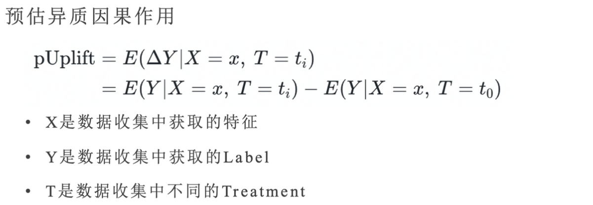
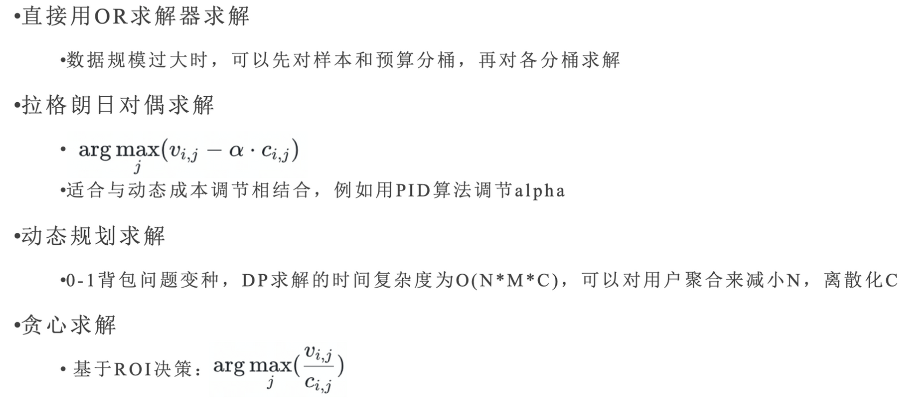
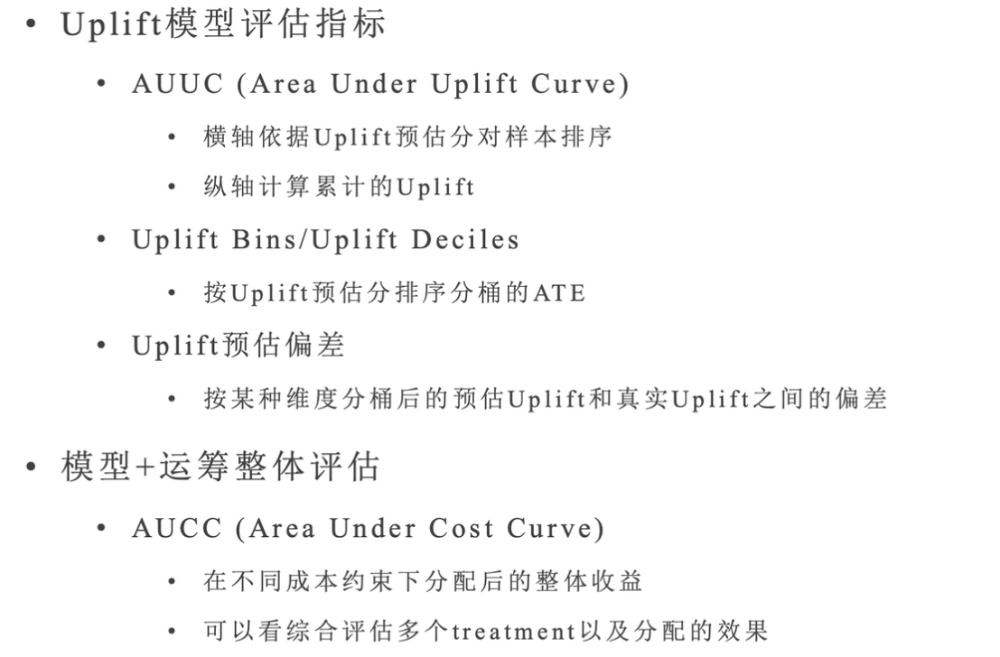
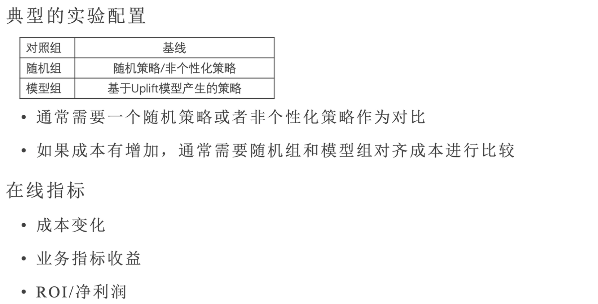
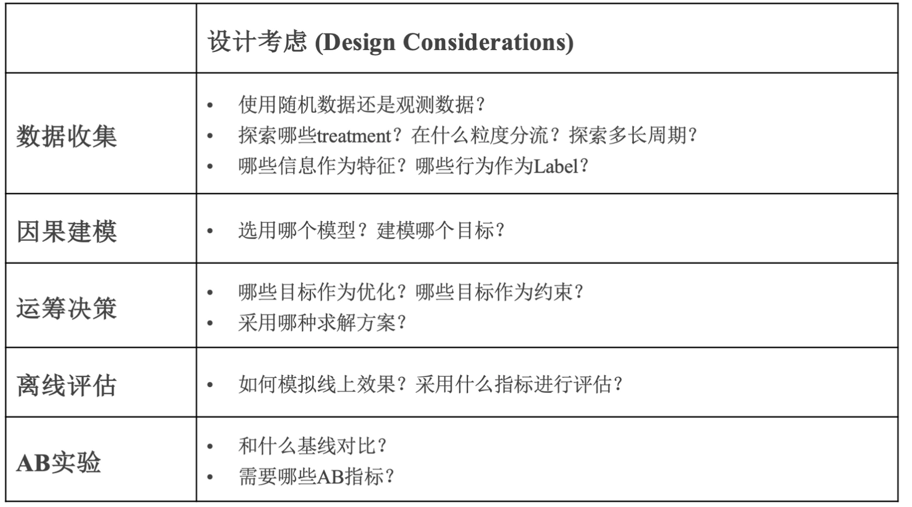

# Uplift Modeling

## 激励应用简介

- 激励：是指一件可以驱使一个人做某件事或以某种方式行事的东西
- 激励业务：通过给予用户一定的奖励，引导用户完成指定动作（任务），为产品带来收益

### 激励玩法

- 拉新：裂变拉新
- 促活：签到、新手任务、看视频得金币
- 变现：激励广告、电商补贴、直播激励
- 渗透：投稿、社交、搜索、跨端导量

### **激励场景应用因果推断的机会和挑战**

- 天然实验场：有机会做大规模随机实验

  - 多数场景可以做一定流量的随机实验
  - 数据量充足，可以比较准确地评估ATE

  - 激励场景的Treatment对用户的影响更加直接，更有区分度

- 个性化：更加关注异质因果效应(HTE)
  - 拥有海量的数据和特征，有可能进行细粒度的HTE估计，但是难度远超ATE
  - 个体粒度缺少Ground Truth，难以评估和Debug

## 问题定义

- **约束**：给出一定的预算/资源限制
- **目标**：最大化整体的指定业务指标
- **决策**：为每个用户分配什么样的激励选项(Treatment)
  - 可以是有无某种激励
  - 也可以是几种不同的激励形式
  - 还可以是一些离散的激励数值

## 基本流程

- 数据收集
- Uplift建模
- 运筹决策
- 离线评估
- AB实验

### 数据收集

尽量采用随机实验的数据，实在没有再用观测数据。

### Uplift 建模

### 运筹决策

**线性规划的统一化形式**：

$$\max_{x_{ij}}\sum_{i=1}^N\sum_{j=1}^{M}x_{ij}v_{ij}\\ s.t. \sum_{j=1}^{M} x_{ij}=1, \forall i\\ \sum_{i=1}^{N}\sum_{j=1}^{M}x_{ij}c_{ij}\leq B\\ 0\leq x_{ij}\leq 1, \forall i,j$$

- N个用户，M种Treatment
- B为成本总预算
- $$v_{ij}$$ 和 $$c_{ij}$$通常是Uplift模型预估出来的成本和收益的增量
- $$x_{ij}$$ 是需要求解的treatment分配变量

求解方案：

### 离线评估

### AB实验

## 总结

